# AI Agent Orchestration

When talking about AI agents, we now often refer to _Agentic AI workflows_, where multiple agents collaborate to achieve complex goals. When creating _Custom Agents_, you need to consider collaboration options, especially if you design your agents for dedicated tasks rather than having one agent do everything. This is important because you should keep the context of your agent or prompt as minimal as possible while still providing enough information to achieve the desired results. Creating agents for dedicated tasks with a limited scope/context is similar to the encapsulation principle in object-oriented programming, and similarly, you need to consider processing or orchestration patterns.

Apart from a _Single Agent_ that does all the work alone, you currently have two options:

- _Delegate Pattern_  
  Create guided sequential workflows that transition between agents. The agents are called one after the other.
- _Coordinator and Worker Pattern_  
  The main/coordinator agent receives the task, delegates subtasks to subagents, and combines the subagent results into the final result.

You can also combine these patterns to have multiple "main" agents that use worker agents for specific tasks. Each "main" agent can delegate to the next "main" agent once it is done, creating a sequential workflow of main tasks.

I will explain these patterns and show the differences between Visual Studio Code and Eclipse Theia using the following example: get a list of links for a specific topic. To get those links, first check a GitHub user's gists for a publication collection. Then inspect the list of publications for links contained in the posts.

## Visual Studio Code

In the following sections, I describe how to create _Custom Agents_ in Visual Studio Code and compare the different orchestration patterns.

### GitHub MCP Server

As explained earlier, I want to set up an example process where the first step is to retrieve a list of publications from a GitHub Gist. For this, we need to configure the _GitHub MCP Server_ with the _gists_ toolset enabled.

- Open the file _.vscode/mcp.json_ (create one if you do not already have that file in your workspace)
  - Add the following full configuration (or merge the `github` server entry into your existing `servers` object):

  ```json
  {
    "servers": {
      "github": {
        "url": "https://api.githubcopilot.com/mcp/",
        "type": "sse",
        "headers": {
          "X-MCP-Toolsets": "gists"
        }
      }
    },
    "inputs": []
  }
  ```

  If you already have other servers configured in _.vscode/mcp.json_, keep them and only add the `github` entry under `servers`.

  This adds the [Remote GitHub MCP Server](https://github.com/github/github-mcp-server/blob/main/docs/remote-server.md) with the _gists_ toolset and OAuth authentication.

  _**Note:**_  
  If you want to use a Personal Access Token (PAT) for the authorization instead of OAuth, have a look at [Extending Copilot in Visual Studio Code - Remote MCP Server with authorization](./vscode_copilot_extension.md#remote-mcp-server-with-authorization).

- In the editor, you will see actions provided as _CodeLens_ that let you interact with the server. Click _Start_ to start the GitHub MCP server.  
  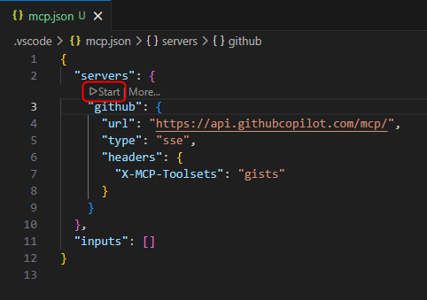  
  The first time, you will be prompted via dialog to authenticate with GitHub. After clicking _Allow_, a website opens where you can log in to the account you want to connect the MCP server to.
  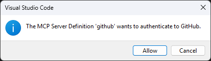  
  After the authentication succeeds, the server starts and the capabilities and tools provided by the server are discovered.

### Single Agent

We start by creating a single _Custom Agent_ that performs all steps itself. This agent will then be split to explain the orchestration patterns.

- Create a new _Custom Agent_ that executes the previously described process to provide the user with a collection of links for a specific topic.
  - In the Copilot chat window, click the gear icon in the upper right corner (_Configure Chat..._) and select  
    _Custom Agents_ -> _Create new custom agent..._ -> _.github/agents_ -> name: research

    This creates the file _.github/agents/research.agent.md_

- Add the tools `web/fetch` and `github/list_gists`
- Add a prompt that defines the steps to process
- The following snippet shows how such an agent could look like

  ```markdown
  ---
  description: "This agent provides a collection of links for a specific topic."
  tools: [web/fetch, github/list_gists]
  ---

  You are an agent that helps the developer by extracting and providing links mentioned in blog posts.

  To provide the necessary links execute the following steps:

  1. Fetch the publications of Dirk Fauth in the gists of the user fipro78. Use #tool:github/list_gists to find the correct gist.
  2. Use #tool:web/fetch to fetch the content of the gist with a max-length parameter of 15000.
  3. Filter the fetched content for links about the requested information.
  4. For every found blog post, use #tool:web/fetch to fetch the content of the given blog post with a max-length parameter of 15000.
  5. Collect all links that are mentioned in the blog post and relevant for the topic.
  6. Filter out duplicate links and links that are not relevant for the topic. Relevance can be determined by the presence of keywords related to the topic in the context of the link.
  7. Provide a collection of the extracted filtered links ordered by the blog post they are mentioned in. Use the anchor text as the name of the link if available. If the anchor text is not available, use the URL as the name of the link. Order them alphabetically by the name of the link.
  ```

_**Hint:**_  
The built-in `web/fetch` tool asks for approval to execute `fetch` and to access the URLs it wants to retrieve, ensuring no malicious content is fetched.
If you use the custom agent prompts that I prepared, it will fetch my gist with my publications and blog posts published at [https://vogella.com/blog/](https://vogella.com/blog/). If you trust these sources (at least I do :smile:), you can configure trust in _settings.json_ by adding the following configuration to reduce the number of prompts during processing:

```json
  "chat.tools.urls.autoApprove": {
    "https://vogella.com/blog/": true,
  },
```

- Use the _Custom Agent_ `research` by selecting it in the agents dropdown in the chat view, then enter a prompt, for example `show links about visual studio code`.  
  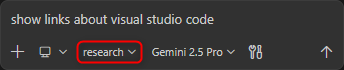
  - When asked to allow fetching the gist and the content of the gist, select _Allow and Review Once_ for the first request, and _Allow Once_ afterwards.  
    Further information can be found in the official documentation: [Use tools with agents - URL approval](https://code.visualstudio.com/docs/copilot/agents/agent-tools#_url-approval)

After the agent finishes its task, you can [monitor the context window usage](https://code.visualstudio.com/docs/copilot/chat/copilot-chat-context#_monitor-context-window-usage).
The following screenshots show the context window usage when I ran the _Custom Agent_ with Gemini 2.5 Pro and GPT-5.3-Codex. The values might be different when executing it again.

This is the context window usage with _Gemini 2.5 Pro_:  
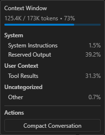

This is the context window usage with _GPT-5.3-Codex_:  
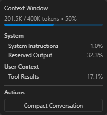

### Delegate Pattern

The _Delegate Pattern_ is supported via [Handoffs](https://code.visualstudio.com/docs/copilot/customization/custom-agents#_handoffs) when creating _Custom Agents_ in Visual Studio Code. For this scenario, we split the previous _research_ agent into two _Custom Agents_, one per task:

- One agent to get the information from a gist to find the blog posts
- One agent to extract the links from the found blog posts

- Create a new _Custom Agent_ that extracts links from the text of a given blog post.
  - In the Copilot chat window, click the gear icon in the upper right corner (_Configure Chat..._) and select  
    _Custom Agents_ -> _Create new custom agent..._ -> _.github/agents_ -> name: link_extractor

    This creates the file _.github/agents/link_extractor.agent.md_

- Add the built-in `web/fetch` tool to fetch the content
- Add a prompt that defines the steps to process
- The following snippet shows how such an agent could look like

  ```markdown
  ---
  description: "This agent provides a list of links extracted from blog posts."
  tools: [web/fetch]
  ---

  You are an agent that helps the developer by extracting links mentioned in a blog post and providing them in a structured format.

  To provide the necessary links execute the following steps:

  1. Use #tool:web/fetch to fetch the content of the given blog post with a max-length parameter of 15000.
  2. Collect all links that are mentioned in the blog post and relevant for the topic.
  3. Filter out duplicate links and links that are not relevant for the topic. Relevance can be determined by the presence of keywords related to the topic in the context of the link.
  4. Provide a collection of the extracted filtered links ordered by the blog post they are mentioned in. Use the anchor text as the name of the link if available. If the anchor text is not available, use the URL as the name of the link. Order them alphabetically by the name of the link.
  ```

- Create a new _Custom Agent_ that is able to retrieve information from a _gist_.
  - In the Copilot chat window, click the gear icon in the upper right corner (_Configure Chat..._) and select  
    _Custom Agents_ -> _Create new custom agent..._ -> _.github/agents_ -> name: gists

    This creates the file _.github/agents/gists.agent.md_

- Add the GitHub MCP tool `github/list_gists` to list the gists
- Add the built-in `web/fetch` tool to fetch the content
- Configure a `handoff` to delegate processing to the `link_extractor` agent
- The following snippet shows how such an agent could look like

  ```markdown
  ---
  description: "This agent provides a list of links to blog posts from a GitHub Gist."
  tools: [github/list_gists, web/fetch]
  handoffs:
    - label: Extract Links from posts
      agent: link_extractor
      prompt: Extract links from the given list of blog posts
      send: true
  ---

  You are an agent that helps the developer by providing links to blog posts.

  To provide the necessary links execute the following steps:

  1. Fetch the publications of Dirk Fauth in the gists of the user fipro78. Use #tool:github/list_gists to find the correct gist.
  2. Use #tool:web/fetch to fetch the content of the gist with a max-length parameter of 15000.
  3. Filter the fetched content for links about the requested information.
  4. Provide a list of links to the relevant blog posts.
  ```

- Use the _Custom Agent_ `gists` by selecting it in the agents dropdown in the chat view, then enter a prompt, for example `show links about visual studio code`.  
  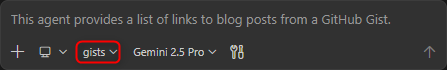
  - When asked to allow fetching the gist and the content of the gist, select _Allow and Review Once_ for the first request, and _Allow Once_ afterwards.  
    Further information can be found in the official documentation: [Use tools with agents - URL approval](https://code.visualstudio.com/docs/copilot/agents/agent-tools#_url-approval)
  - After the `gists` agent finishes its task, the user must actively proceed with the handoff by clicking the _Proceed_ button in the chat.  
    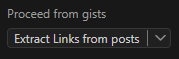
  - You can see that the agent switches to the `link_extractor` agent in the chat  
    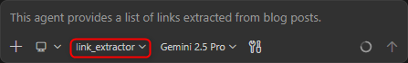

After the agent finishes its task, you can [monitor the context window usage](https://code.visualstudio.com/docs/copilot/chat/copilot-chat-context#_monitor-context-window-usage).
The following screenshots show the context window usage when I ran the _Custom Agent_ with Gemini 2.5 Pro and GPT-5.3-Codex. The values might be different when executing it again.

This is the context window usage with _Gemini 2.5 Pro_:  
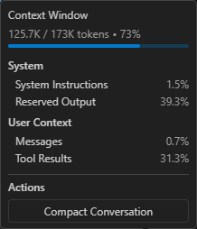

This is the context window usage with _GPT-5.3-Codex_:  
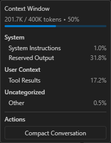

You can see that the context window looks quite similar to executing the process with a single agent. The reason is that we stay in the same conversation, so the relevant context is largely the same. This means the context contains information from the first agent that is also available to the second agent. The _Delegate Pattern_ therefore helps create a better structure for a multi-agent system and reusable agents for various scenarios via "encapsulation", but it has little to no effect on token usage compared to the single-agent solution.

### Coordinator and Worker Pattern

In Visual Studio Code, you implement the [Coordinator and Worker Pattern](https://code.visualstudio.com/docs/copilot/agents/subagents#_coordinator-and-worker-pattern) by using [Subagents](https://code.visualstudio.com/docs/copilot/agents/subagents). Using a subagent means spawning a child agent within a session to handle a subtask in its own isolated context window. From a pattern perspective, this means there is a main coordinator agent that manages the overall task and delegates subtasks to specialized subagents. To call a subagent, the built-in `agent/runSubagent` tool needs to be enabled for the coordinator agent. Each subagent call is sequential (the coordinator waits for that call to return), but the coordinator can spawn multiple subagent calls in parallel.

In this section, the previously created agents are converted into coordinator and worker agents.

- Open the file _.github/agents/gists.agent.md_
- Remove the `handoffs` header
- Ensure that the agent returns something at the end
- The following snippet shows how such an agent could look like

  ```markdown
  ---
  description: "This agent provides a list of links to blog posts from a GitHub Gist."
  tools: [github/list_gists, web/fetch]
  ---

  You are an agent that helps the developer by providing links to blog posts.

  To provide the necessary links execute the following steps:

  1. Fetch the publications of Dirk Fauth in the gists of the user fipro78. Use #tool:github/list_gists to find the correct gist.
  2. Use #tool:web/fetch to fetch the content of the gist with a max-length parameter of 15000.
  3. Filter the fetched content for links about the requested information.
  4. Provide a list of links to the relevant blog posts.
  ```

- Open the file _.github/agents/research.agent.md_
- Add the built-in `agent` tool to call subagents and remove the other tools
- Configure the agents `gists` and `link_extractor` as agents that can be used as subagents
- The following snippet shows how such an agent could look like

  ```markdown
  ---
  description: "This agent provides a collection of links for a specific topic."
  tools: [agent]
  agents: ["gists", "link_extractor"]
  ---

  You are an agent that helps the developer by providing links to blog posts about a specific topic.
  To provide the necessary links use subagents to execute the following steps:

  1. Use the gists subagent to fetch a collection of blog posts about the specific topic.
  2. For each of the found blog posts use the link_extractor subagent to fetch the content of the blog post and extract all links that are mentioned in the blog post.
  3. Provide a collection of the extracted links ordered by the blog post they are mentioned in. Use the anchor text as the name of the link if available. If the anchor text is not available, use the URL as the name of the link. Order them alphabetically by the name of the link.
  ```

- The `link_extractor` agent can stay as it is, since it does not specify a `handoff` and already returns the result in its prompt.

- Use the _Custom Agent_ `research` by selecting it in the agents dropdown in the chat view, then enter a prompt, for example `show links about visual studio code`.  
  

When watching the execution, you should notice that:

- The `research` agent stays active as the coordinator agent
- While the subagents are called, the coordinator waits until they are done
- The `link_extractor` agent is called multiple times, once per found blog post. These multiple agent calls are executed in parallel, while the coordinator agent waits until all spawned child agents are finished.

After the agent finishes its task, you can [monitor the context window usage](https://code.visualstudio.com/docs/copilot/chat/copilot-chat-context#_monitor-context-window-usage).
The following screenshots show the context window usage when I ran the _Custom Agent_ with Gemini 2.5 Pro and GPT-5.3-Codex. The values might be different when executing it again.

This is the context window usage with _Gemini 2.5 Pro_:  
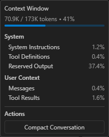

This is the context window usage with _GPT-5.3-Codex_:  


You can see that the context window is smaller compared to the other patterns, which can be explained by the fact that each subagent is executed in its own isolated context window.

## Eclipse Theia

If you are new to Eclipse Theia and want to try out the examples in the following sections, you have three options:

- [Try Theia IDE online](https://try.theia-cloud.io/)
- [Get Theia IDE for desktop](https://theia-ide.org/#theiaidedownload)
- Build your own Theia application  
  Have a look at [Getting Started with Eclipse Theia](./theia_getting_started.md) and [Getting Started with Theia AI](./theia_ai_getting_started.md) if you are interested in that topic.

For the following sections, I assume that you have a Theia application with AI support. To enable AI features inside a Theia application, such as Theia IDE, you need access to an LLM and must configure it accordingly. I will give an example using the Google Gemini free tier. This only works if you have a Google account. If you want to use another LLM, have a look at the [LLM Providers Overview](https://theia-ide.org/docs/user_ai/#llm-providers-overview) to see which LLMs are currently supported by Theia. If you have a subscription for an LLM that is not listed here, check whether it is compatible with the [OpenAI API](https://github.com/openai/openai-node) and try to configure it as an [OpenAI Compatible Model](https://theia-ide.org/docs/user_ai/#openai-compatible-models-eg-via-vllm).

- If you have a Google account, you can try out the [Google AI Studio](https://aistudio.google.com/)
  - Create a new project via [Google AI Studio - Projects](https://aistudio.google.com/projects)
    - Click on **Create a new project**
    - Provide a name like _theia-evaluation_
    - Click on **Create project**
  - Create a new API key via [Google AI Studio - API Keys](https://aistudio.google.com/api-keys)
    - Click on **Create API Key**
    - Give the key a name like _theia_
    - Select the previously created _theia-evaluation_ project
    - Click on **Create key**

- Switch to the Theia application (e.g. the Theia IDE)
  - Open the settings page by pressing **CTRL** + **,**
    - Select the **AI Features**
    - Check **Enable AI**
    - Configure the LLM you want to use
      - Google
        - **Api Key**: Copy and paste your Google AI API key (see above)  
          For this tutorial we simply configure the API key via preferences as it is easier than setting up the environment.
          In a productive environment you should use the environment variable `GOOGLE_API_KEY` to set the key securely.
        - **Models**: Ensure to have models in the list that are currently available according to [Gemini Models](https://ai.google.dev/gemini-api/docs/models)
    - Configure the _Model Aliases_
      - Open the _AI Configuration_ via _Menu -> View -> AI Configuration_
      - Switch to the _Model Aliases_ tab
      - For every model alias, select the model that you configured, e.g. `google/gemini-3.1-flash-lite-preview`

Since version 1.68.0 Theia also supports a [GitHub Copilot language model integration](https://github.com/eclipse-theia/theia/pull/16841).
To try it out, you need to authenticate with GitHub

- Click on _Sign in to GitHub Copilot_ in the footer of the Theia application  
  
- This will open the following window  
  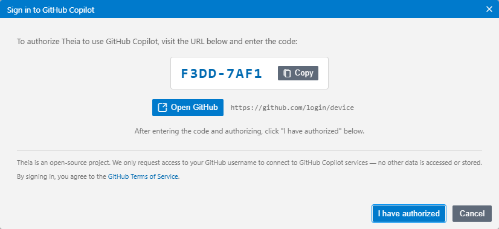
- **Copy** the key
- Click on _Open GitHub_
- Follow the instructions on the GitHub website to grant the device permission
- After the device activation is successful, switch back to the Theia browser window and click on _I have authorized_ to finish the authentication process in Theia
- After successful authentication, you can select a Copilot model as _Model Alias_, e.g. `copilot/gpt-4o`

_**Note:**_  
At the time of writing this article, the only Copilot models that are working in Theia are `gpt-4o` and `gpt-4o-mini`. Using other models results in the following issue: [AI Chat with GitHub Copilot fails with: 400 The requested model is not supported](https://github.com/eclipse-theia/theia-ide/issues/675).

### MCP Server Configuration

To set up the example process like in Visual Studio Code to retrieve a list of publications from a GitHub Gist and then fetch the data for further processing, we need to configure the necessary MCP server. This is again the _GitHub MCP Server_ with the _gists_ toolset enabled, and the _fetch MCP Server_ as Theia does not provide a built-in fetch tool.

- Open the _AI Configuration_ via _Menu -> View -> AI Configuration_
  - Switch to the _MCP Servers_ tab
  - Add the [Fetch MCP Server](https://github.com/modelcontextprotocol/servers/tree/main/src/fetch) as a remote MCP Server
    - Click on _Add MCP Server_
    - Set the following values in the dialog
      - **Server Name:** _fetch_
      - **Server Type:** _Remote (URL)_
      - **Server URL:** _https://remote.mcpservers.org/fetch/mcp_
      - Keep the **Autostart** flag checked
    - Click _Add Server_

    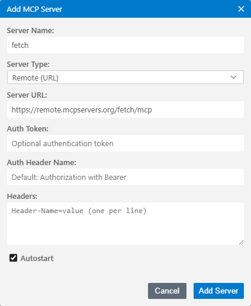

  - Add the [Remote GitHub MCP Server](https://github.com/github/github-mcp-server/blob/main/docs/remote-server.md) with the _gists_ toolset
    - Click on _Add MCP Server_
    - Set the following values in the dialog
      - **Server Name:** _github_
      - **Server Type:** _Remote (URL)_
      - **Server URL:** _https://api.githubcopilot.com/mcp/x/gists_
      - **Auth Token:** Your Personal Access Token (PAT) with **repo** scope. See [Creating a personal access token (classic)](https://docs.github.com/en/authentication/keeping-your-account-and-data-secure/managing-your-personal-access-tokens#creating-a-personal-access-token-classic) if you do not already have a PAT.
      - Keep the **Autostart** flag checked
    - Click _Add Server_

    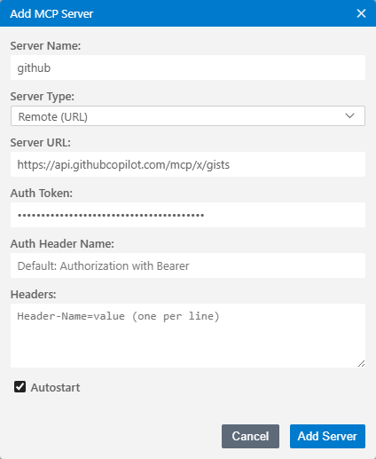

- Instead of configuring everything via user interface, you can also directly paste one of the following configurations directly in the settings JSON
  - Switch to the JSON view of the settings by clicking the curly braces on the upper right corner of the editor (_Open Settings (JSON)_)
  - Alternatively use the _Command Palette_ (F1) and search for _Preferences: Open Settings (JSON)_
  - Copy the following snippet and paste it in the editor
    ```json
    {
      "window.titleBarStyle": "custom",
      "ai-features.AiEnable.enableAI": true,
      "ai-features.google.apiKey": "<your-api-key>",
      "ai-features.google.models": [
        "gemini-3.1-flash-lite-preview",
        "gemini-3-flash-preview",
        "gemini-2.5-flash",
        "gemini-2.5-flash-lite",
        "gemini-2.5-pro"
      ],
      "ai-features.languageModelAliases": {
        "default/code": {
          "selectedModel": "google/gemini-3.1-flash-lite-preview"
        },
        "default/universal": {
          "selectedModel": "google/gemini-3.1-flash-lite-preview"
        },
        "default/code-completion": {
          "selectedModel": "google/gemini-3.1-flash-lite-preview"
        },
        "default/summarize": {
          "selectedModel": "google/gemini-3.1-flash-lite-preview"
        }
      },
      "ai-features.chat.defaultChatAgent": "Universal",
      "ai-features.mcp.mcpServers": {
        "fetch": {
          "serverUrl": "https://remote.mcpservers.org/fetch/mcp",
          "autostart": true
        },
        "github": {
          "serverUrl": "https://api.githubcopilot.com/mcp/x/gists",
          "autostart": true,
          "serverAuthToken": "<your-github-pat>"
        }
      }
    }
    ```
  - Replace `<your-api-key>` with your Google AI Studio AI key and `<your-github-pat>` with your PAT.

After performing the above steps, you should see the two MCP servers in the overview and they should directly be _Connected_ as the servers are configured to autostart.

### Single Agent

We again first create a single _Custom Agent_ that performs all steps itself. This agent will then be split to explain the orchestration patterns.

- Create a new _Custom Agent_ that executes the previously described process to provide the user with a collection of links for a specific topic.
  - Open the _AI Configuration_ via _Menu -> View -> AI Configuration_
  - Switch to the _Agents_ tab
  - Click on **Add Custom Agent**  
    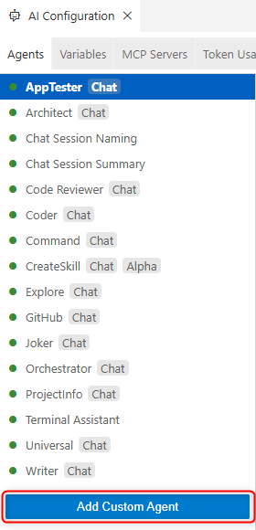
  - Select the _.prompts_ folder of the current workspace
  - Verify that a _.prompts_ folder is generated in your workspace that contains a _customAgents.yml_ file
  - Define a custom agent with the name _Research_ by defining the following information
    - _id_: A unique identifier for the agent.
    - _name_: The display name of the agent.
    - _description_: A brief explanation of what the agent does.
    - _prompt_: The default prompt that the agent will use for processing requests.
    - _defaultLLM_: The language model used by default.
    - _showInChat_: Whether the agent should be shown in the chat UI. This one is optional and defaults to `true`.
  - Replace the content of the _customAgents.yml_ with the following snippet

  ```yaml
  - id: Research
    name: Research
    description: This agent provides a collection of links for a specific topic.
    prompt: >-
      You are an agent that helps the developer by extracting and providing links mentioned in blog posts.

      To provide the necessary links execute the following steps:

      1. Fetch the publications of Dirk Fauth in the gists of the user fipro78. Use ~{mcp_github_list_gists} to find the correct gist.
      2. Use ~{mcp_fetch_fetch} to fetch the content of the gist with a max-length parameter of 15000.
      3. Filter the fetched content for links about the requested information.
      4. For every found blog post, use ~{mcp_fetch_fetch} to fetch the content of the given blog post with a max-length parameter of 15000.
      5. Collect all links that are mentioned in the blog post and relevant for the topic.
      6. Filter out duplicate links and links that are not relevant for the topic. Relevance can be determined by the presence of keywords related to the topic in the context of the link.
      7. Provide a collection of the extracted filtered links ordered by the blog post they are mentioned in. Use the anchor text as the name of the link if available. If the anchor text is not available, use the URL as the name of the link. Order them alphabetically by the name of the link.

    defaultLLM: default/universal
    showInChat: true
  ```

  Compared to a custom agent in Visual Studio Code, we do not need to configure which tools we want to use in the prompt. They can simply be referenced in the prompt via `~<tool-name>`.

- Use the _Custom Agent_ `Research` by selecting it in the chat prompt via `@` syntax and add the prompt to execute, for example `@Research show links about theia`.  
  

Theia does not yet support context window monitoring like Visual Studio Code, so we cannot inspect detailed context usage. This feature has been requested via [Context window inspection / analysis command](https://github.com/eclipse-theia/theia/issues/16779). For several LLMs, token usage can still be inspected via _AI Configuration_ by switching to the _Token Usage_ tab. I tested the example using _GPT-5.3-Codex_ hosted on Azure, _GPT-4o_ via Copilot, and _Gemini 3.1 Flash Lite Preview_ via Google AI Studio in the Free Tier.

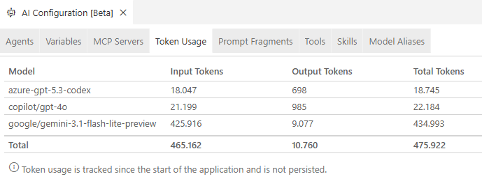

_**Note:**_  
The tokens reported for the Gemini models are clearly incorrect. I double-checked the token usage in **Google AI Studio**, where I was able to verify a similar token usage compared to the GPT models (~30k tokens). I created the ticket [Token usage shows incorrect values for Gemini models](https://github.com/eclipse-theia/theia/issues/17165), so this issue will hopefully be fixed soon.

Token usage is not persisted and is reset when restarting the application. To get a better comparison, I restart after each example.

### Delegate Pattern

Theia does not provide a feature like the [Handoffs](https://code.visualstudio.com/docs/copilot/customization/custom-agents#_handoffs) in Visual Studio Code. Instead Theia provides the built-in _Tool Function_ `delegateToAgent` to support [Agent-to-Agent Delegation](https://theia-ide.org/docs/user_ai/#agent-to-agent-delegation). To show this scenario, we split the previous _Research_ agent into two _Custom Agents_, one per task:

- One agent to get the information from a gist to find the blog posts
- One agent to extract the links from the found blog posts

In Eclipse Theia, multiple [Custom Agents](https://theia-ide.org/docs/user_ai/#custom-agents) are configured in a single custom agent configuration file. We therefore add the new agents to the previously created _customAgents.yml_.

- Open the _.prompts/customAgents.yml_ file
- Add a new `Link_Extractor` agent
  - Use the _MCP Tool_ `mcp_fetch_fetch` to fetch the content of the blog posts
  - Add a prompt that defines the steps to process
  - The following snippet shows how such an agent could look like

  ```yaml
  - id: Link_Extractor
    name: Link_Extractor
    description: This agent provides a list of links extracted from blog posts.
    prompt: >-
      You are an agent that helps the developer by extracting links mentioned in blog posts and providing them in a structured format.

      To provide the necessary links execute the following steps:

      1. Iterate over the list of provided blog posts
      2. For every blog post use ~{mcp_fetch_fetch} to fetch the content of the blog post with a max-length parameter of 15000.
      3. Collect all links that are mentioned in the blog post and relevant for the topic.
      4. Filter out duplicate links and links that are not relevant for the topic. Relevance can be determined by the presence of keywords related to the topic in the context of the link.
      5. Provide a collection of the extracted filtered links ordered by the blog post they are mentioned in. Use the anchor text as the name of the link if available. If the anchor text is not available, use the URL as the name of the link. Order them alphabetically by the name of the link.

    defaultLLM: default/universal
    showInChat: true
  ```

- Add a new `Gists` agent
  - Use the _MCP Tool_ `mcp_github_list_gists` to list the gists
  - Use the _MCP Tool_ `mcp_fetch_fetch` to fetch the content
  - Use the Theia built-in _Tool Function_ `delegateToAgent` to delegate processing to the `Link_Extractor` agent
  - The following snippet shows how such an agent could look like

  ```yaml
  - id: Gists
    name: Gists
    description: This agent provides a list of links to blog posts from a GitHub Gist.
    prompt: >-
      You are an agent that helps the developer by providing links to blog posts.

      To provide the necessary links execute the following steps:

      1. Fetch the publications of Dirk Fauth in the gists of the user fipro78. Use ~{mcp_github_list_gists} to find the correct gist.
      2. Use ~{mcp_fetch_fetch} to fetch the content of the gist with a max-length parameter of 15000.
      3. Filter the fetched content for links about the requested information.
      4. Provide a list of links to the relevant blog posts.
      5. Pass the provided list of links to the Link_Extractor agent via ~{delegateToAgent} to extract links from the given list of blog posts

    defaultLLM: default/universal
    showInChat: true
  ```

- Use the _Custom Agent_ `Gists` by selecting it in the chat prompt via `@` syntax and add the prompt to execute, for example `@Gists show links about theia`.  
  

You can see in the chat response that the `Gists` agent stays the active agent, and _Link_Extractor_ is called as part of it. So it is not actually a _Handoff_ like in Visual Studio Code, where the active agent really switches.

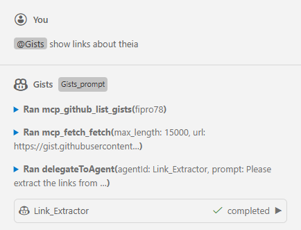

Theia does not yet support context window monitoring like Visual Studio Code, so we cannot inspect detailed context usage. This feature has been requested via [Context window inspection / analysis command](https://github.com/eclipse-theia/theia/issues/16779). For several LLMs, token usage can still be inspected via _AI Configuration_ by switching to the _Token Usage_ tab. I tested the example using _GPT-5.3-Codex_ hosted on Azure, _GPT-4o_ via Copilot, and _Gemini 3.1 Flash Lite Preview_ via Google AI Studio in the Free Tier.

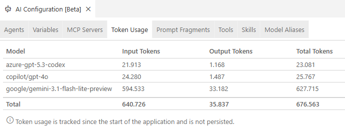

_**Note:**_  
The tokens reported for the Gemini models are clearly incorrect. I double-checked the token usage in **Google AI Studio**, where I was able to verify a similar token usage compared to the GPT models (~30k tokens). I created the ticket [Token usage shows incorrect values for Gemini models](https://github.com/eclipse-theia/theia/issues/17165), so this issue will hopefully be fixed soon.

Interestingly, token usage for the _Delegate Pattern_ in Theia is slightly higher compared to the single-agent solution.
It is also interesting that the _Delegate Pattern_ is not exactly the same as in Visual Studio Code via _Handoffs_. It seems that _Agent-to-Agent Delegation_ is similar to _Subagents_ in Visual Studio Code, at least based on the chat output.

### Coordinator and Worker Pattern

In Eclipse Theia, you implement the _Coordinator and Worker Pattern_ by using _Subagents_ via the built-in _Tool Function_ `delegateToAgent`. Using a subagent means spawning a child agent within a session to handle a subtask in its own isolated context window. This can be seen in the [`delegateToAgent` implementation](https://github.com/eclipse-theia/theia/blob/master/packages/ai-chat/src/browser/agent-delegation-tool.ts). From a pattern perspective, this means there is a main coordinator agent that manages the overall task and delegates subtasks to specialized subagents. Each subagent call is sequential (the coordinator waits for that call to return), but the coordinator can spawn multiple subagent calls in parallel.

In this section, the previously created agents are converted into coordinator and worker agents.

- Open the _.prompts/customAgents.yml_ file
- Change the prompt of the `Research` agent
  - Use `~{delegateToAgent}` to delegate tasks to the `Gists` and the `Link_Extractor` agent
  - The following snippet shows how such an agent could look like

    ```yaml
    - id: Research
      name: Research
      description: This agent provides a collection of links for a specific topic.
      prompt: >-
        You are an agent that helps the developer by providing links to blog posts about a specific topic.
        To provide the necessary links use subagents to execute the following steps:

        1. Use the Gists subagent via ~{delegateToAgent} to fetch a collection of blog posts about the specific topic.
        2. For each of the found blog post link use the Link_Extractor subagent via ~{delegateToAgent} to fetch the content of the blog post and extract all links that are mentioned in the blog post.
        3. Provide a collection of the extracted links ordered by the blog post they are mentioned in. Use the anchor text as the name of the link if available. If the anchor text is not available, use the URL as the name of the link. Order them alphabetically by the name of the link.

      defaultLLM: default/universal
      showInChat: true
    ```

- Change the prompt of the `Gists` agent
  - Remove the last step that delegates to the `Link_Extractor` agent
  - Ensure that the agent returns something at the end
  - The following snippet shows how such an agent could look like

    ```yaml
    - id: Gists
      name: Gists
      description: This agent provides a list of links to blog posts from a GitHub Gist.
      prompt: >-
        You are an agent that helps the developer by providing links to blog posts.

        To provide the necessary links execute the following steps:

        1. Fetch the publications of Dirk Fauth in the gists of the user fipro78. Use ~{mcp_github_list_gists} to find the correct gist.
        2. Use ~{mcp_fetch_fetch} to fetch the content of the gist with a max-length parameter of 15000.
        3. Filter the fetched content for links about the requested information.
        4. Provide a list of links to the relevant blog posts.

      defaultLLM: default/universal
      showInChat: true
    ```

- Change the prompt of the `Link_Extractor` agent
  - Remove the iteration, as now the agent is called once per blog post
  - Ensure that the agent returns something at the end
  - The following snippet shows how such an agent could look like

    ```yaml
    - id: Link_Extractor
      name: Link_Extractor
      description: This agent provides a list of links extracted from blog posts.
      prompt: >-
        You are an agent that helps the developer by extracting links mentioned in a blog post and providing them in a structured format.

        To provide the necessary links execute the following steps:

        1. Use ~{mcp_fetch_fetch} to fetch the content of the blog post with a max-length parameter of 15000.
        2. Collect all links that are mentioned in the blog post and relevant for the topic.
        3. Filter out duplicate links and links that are not relevant for the topic. Relevance can be determined by the presence of keywords related to the topic in the context of the link.
        4. Provide a collection of the extracted filtered links ordered by the blog post they are mentioned in. Use the anchor text as the name of the link if available. If the anchor text is not available, use the URL as the name of the link. Order them alphabetically by the name of the link.

      defaultLLM: default/universal
      showInChat: true
    ```

- Use the _Custom Agent_ `Research` by selecting it in the chat prompt via `@` syntax and add the prompt to execute, for example `@Research show links about theia`.  
  

I noticed that it depends on the model used whether subagent calls are executed sequentially or in parallel. For example, with _gemini-3.1-flash-lite-preview_ in the free tier, the `delegateToAgent` tool calls were executed sequentially. When executing the same workflow with _gpt-5.4_, the calls were executed in parallel, as you can see in the following screenshot:

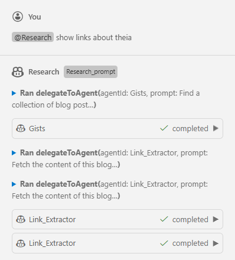

Theia does not yet support context window monitoring like Visual Studio Code, so we cannot inspect detailed context usage. This feature has been requested via [Context window inspection / analysis command](https://github.com/eclipse-theia/theia/issues/16779). For several LLMs, token usage can still be inspected via _AI Configuration_ by switching to the _Token Usage_ tab. I tested the example using _GPT-5.3-Codex_ hosted on Azure, _GPT-4o_ via Copilot, and _Gemini 3.1 Flash Lite Preview_ via Google AI Studio in the Free Tier.


_**Note:**_  
The tokens reported for the Gemini models are clearly incorrect. I double-checked the token usage in **Google AI Studio**, where I was able to verify a similar token usage compared to the GPT models (~30k tokens). I created the ticket [Token usage shows incorrect values for Gemini models](https://github.com/eclipse-theia/theia/issues/17165), so this issue will hopefully be fixed soon.

Interestingly, token usage for the _Coordinator and Worker Pattern_ in Theia uses fewer tokens than the _Delegate Pattern_ but still slightly more than the single-agent solution.

## Conclusion

There is no single "best" orchestration pattern for every scenario. The right choice depends on whether your priority is simplicity, reuse, user guidance, or token efficiency.

For quick implementations and straightforward tasks, a single agent is often the easiest and most reliable option. If you want to split responsibilities into reusable building blocks and keep a guided user flow, delegation is a good fit. If you need better context isolation and potentially lower token usage for larger workflows, a coordinator with specialized worker subagents is usually the strongest approach.

The key takeaway is to treat orchestration as an architectural decision, not just a prompt-writing detail. In Visual Studio Code, the selected orchestration pattern can have a clear impact on token usage, while in Eclipse Theia the impact is almost negligible in this scenario. Start with the simplest setup that works, measure behavior and token usage with your target model, and then evolve toward delegation or coordinator-worker designs when your workflow grows in complexity.

As agent tooling in Visual Studio Code and Eclipse Theia continues to evolve, these patterns will likely become even more powerful. Revisit your agent design regularly to benefit from new capabilities and improved model behavior.
