# AI Agent Orchestration

When talking about AI agents, we now often refer to _Agentic AI workflows_, which can involve multiple agents collaborating to achieve complex goals. When creating _Custom Agents_, you need to consider how they collaborate, especially if you design them for dedicated tasks rather than having one agent do everything. Keep each agent's context as small as practical while still providing enough information to achieve the desired results. Creating agents with dedicated tasks and a limited scope is similar to the encapsulation principle in object-oriented programming. Once you split responsibilities, you also need to consider how to orchestrate the work.

Apart from a _Single Agent_ that does all the work itself, this article explores two orchestration patterns:

- _Delegate Pattern_  
  Create guided sequential workflows that transition between agents. The agents are called one after the other.
- _Coordinator and Worker Pattern_  
  The main/coordinator agent receives the task, delegates subtasks to subagents, and combines the subagent results into the final result.

You can also combine these patterns to have multiple "main" agents that use worker agents for specific tasks. Each "main" agent can delegate to the next "main" agent once it is done, creating a sequential workflow of main tasks.

I will explain these patterns and show the differences between Visual Studio Code, Eclipse Theia, and Claude Code using the following example: collect links about a specific topic. First, check a GitHub user's gists for a collection of publications. Then fetch the relevant blog posts and extract the links they contain.

The examples compare workflow structure, context window usage, and total token usage or estimated cost. These are related but distinct: a smaller coordinator context does not necessarily mean that the workflow consumes fewer tokens overall. The screenshots show individual runs with different models and configurations, not a controlled benchmark across platforms.

## Visual Studio Code

In the following sections, I describe how to create _Custom Agents_ in Visual Studio Code and compare the different orchestration patterns.

### GitHub MCP Server

As explained earlier, I want to set up an example process where the first step is to retrieve a list of publications from a GitHub Gist. For this, we need to configure the _GitHub MCP Server_ with the _gists_ toolset enabled.

- Open the file _.vscode/mcp.json_ (create one if you do not already have that file in your workspace)
  - Add the following full configuration (or merge the `github` server entry into your existing `servers` object):

  ```json
  {
    "servers": {
      "github": {
        "url": "https://api.githubcopilot.com/mcp/",
        "type": "sse",
        "headers": {
          "X-MCP-Toolsets": "gists"
        }
      }
    },
    "inputs": []
  }
  ```

  If you already have other servers configured in _.vscode/mcp.json_, keep them and only add the `github` entry under `servers`.

  This adds the [Remote GitHub MCP Server](https://github.com/github/github-mcp-server/blob/main/docs/remote-server.md) with the _gists_ toolset and OAuth authentication.

  _**Note:**_  
  If you want to use a Personal Access Token (PAT) for the authorization instead of OAuth, have a look at [Extending Copilot in Visual Studio Code - Remote MCP Server with authorization](./vscode_copilot_extension.md#remote-mcp-server-with-authorization).

- In the editor, you will see actions provided as _CodeLens_ that let you interact with the server. Click _Start_ to start the GitHub MCP server.  
  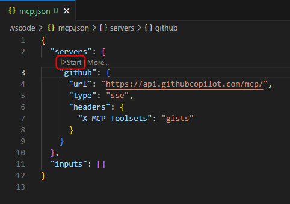  
  The first time, you will be prompted via dialog to authenticate with GitHub. After clicking _Allow_, a website opens where you can log in to the account you want to connect the MCP server to.
  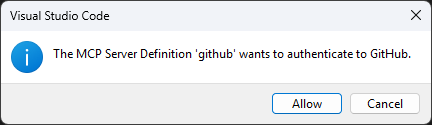  
  After the authentication succeeds, the server starts and the capabilities and tools provided by the server are discovered.

### Single Agent

We start by creating a single _Custom Agent_ that performs all steps itself. This agent will then be split to explain the orchestration patterns.

- Create a new _Custom Agent_ that executes the previously described process to provide the user with a collection of links for a specific topic.
  - In the Copilot chat window, click the gear icon in the upper right corner (_Open Customizations_)
  - In the _Agent Customizations_ dialog, select _Agents_ on the left side
  - In the right area, expand the button dropdown and select (_Generate Agent_) and select _New Agent (Workspace)_
  - Select _.github/agents_ for the location
  - Enter _research_ as name and confirm via ENTER
  - This creates the file _.github/agents/research.agent.md_

- Add the tools `web/fetch` and `github/list_gists`
- Add a prompt that defines the steps to process
- The following snippet shows how such an agent could look like

  ```markdown
  ---
  description: "This agent provides a collection of links for a specific topic."
  tools: [web/fetch, github/list_gists]
  ---

  You are an agent that helps the developer by extracting and providing links mentioned in blog posts.

  To provide the necessary links execute the following steps:

  1. Fetch the publications of Dirk Fauth in the gists of the user fipro78. Use #tool:github/list_gists to find the correct gist.
  2. Use #tool:web/fetch to fetch the content of the gist with a max-length parameter of 100000.
  3. Filter the fetched content for links about the requested information.
  4. For every found blog post, use #tool:web/fetch to fetch the content of the given blog post with a max-length parameter of 100000.
  5. Collect all links that are mentioned in the blog post and relevant for the topic.
  6. Filter out duplicate links and links that are not relevant for the topic. Relevance can be determined by the presence of keywords related to the topic in the context of the link.
  7. Provide a collection of the extracted filtered links ordered by the blog post they are mentioned in. Use the anchor text as the name of the link if available. If the anchor text is not available, use the URL as the name of the link. Order them alphabetically by the name of the link.
  ```

_**Hint:**_  
The built-in `web/fetch` tool can ask for approval to run and to access the requested URLs. This gives you control over which sources the agent accesses, but does not guarantee that their content is safe.
If you use the custom agent prompts that I prepared, it will fetch my gist with my publications and blog posts published at [https://vogella.com/blog/](https://vogella.com/blog/). If you trust these sources (at least I do :smile:), you can configure trust in _settings.json_ (_Command Palette (F1) -> Preferences: Open User Settings (JSON)_) by adding the following configuration to reduce the number of prompts during processing:

```json
{
  "chat.tools.urls.autoApprove": {
    "https://vogella.com/blog/": true
  }
}
```

- Use the _Custom Agent_ `research` by selecting it in the agents dropdown in the chat view, then enter a prompt, for example `show links about visual studio code`.  
  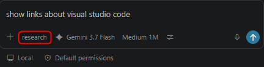
  - When asked to allow fetching the gist and the content of the gist, select _Allow and Review Once_ for the first request, and _Allow Once_ afterwards.  
    Further information can be found in the official documentation: [Manage approvals and permissions - URL approval](https://code.visualstudio.com/docs/agents/run/approvals#_url-approval)

After the agent finishes its task, you can [monitor the context window usage](https://code.visualstudio.com/docs/agents/guides/optimize-usage#_monitor-your-usage) and inspect the token usage in the [Agent Debug Log](https://code.visualstudio.com/docs/agents/agent-troubleshooting/chat-debug-view).
The following screenshots show the context window usage (hover over or select the context window control in the chat input) and the Agent Debug Log Summary (select the ellipsis (...) menu in the Chat view and select _Show Agent Debug Logs_) when I ran the _Custom Agent_ with Gemini 3.7 Flash and GPT-5.6-Luna. The values might be different when executing it again.

This is the context window usage and the Agent Debug Log Summary with _Gemini 3.7 Flash_:  
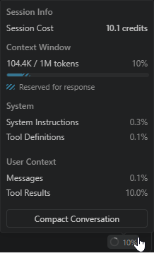  
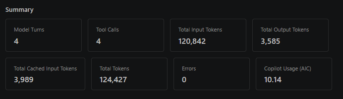

This is the context window usage and the Agent Debug Log Summary with _GPT-5.6-Luna_:  
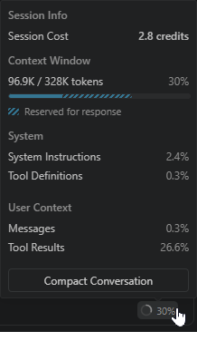  
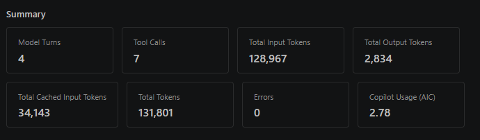

### Delegate Pattern

The _Delegate Pattern_ is supported via [Handoffs](https://code.visualstudio.com/docs/copilot/customization/custom-agents#_handoffs) when creating _Custom Agents_ in Visual Studio Code. For this scenario, we split the previous _research_ agent into two _Custom Agents_, one per task:

- One agent to get the information from a gist to find the blog posts
- One agent to extract the links from the found blog posts

- Create a new _Custom Agent_ that extracts links from the text of a given blog post.
  - In the Copilot chat window, click the gear icon in the upper right corner (_Open Customizations_)
  - In the _Agent Customizations_ dialog, select _Agents_ on the left side
  - In the right area, expand the button dropdown and select (_Generate Agent_) and select _New Agent (Workspace)_
  - Select _.github/agents_ for the location
  - Enter _link\_extractor_ as name and confirm via ENTER
  - This creates the file _.github/agents/link_extractor.agent.md_

- Add the built-in `web/fetch` tool to fetch the content
- Add a prompt that defines the steps to process
- The following snippet shows how such an agent could look like

  ```markdown
  ---
  description: "This agent provides a list of links extracted from blog posts."
  tools: [web/fetch]
  ---

  You are an agent that helps the developer by extracting links that are mentioned in a blog post and providing them in a structured format.

  To provide the necessary links execute the following steps:

  1. Use #tool:web/fetch to fetch the content of the given blog post with a max-length parameter of 100000.
  2. Collect all links that are mentioned in the blog post and relevant for the topic.
  3. Filter out duplicate links and links that are not relevant for the topic. Relevance can be determined by the presence of keywords related to the topic in the context of the link.
  4. Return the list of links with their corresponding anchor text if available. If the anchor text is not available, return the URL as the anchor text.
  5. Provide a collection of the extracted links ordered by the blog post they are mentioned in. Use the anchor text as the name of the link if available. If the anchor text is not available, use the URL as the name of the link. Order them alphabetically by the name of the link.
  ```

- Create a new _Custom Agent_ that is able to retrieve information from a _gist_.
  - In the Copilot chat window, click the gear icon in the upper right corner (_Open Customizations_)
  - In the _Agent Customizations_ dialog, select _Agents_ on the left side
  - In the right area, expand the button dropdown and select (_Generate Agent_) and select _New Agent (Workspace)_
  - Select _.github/agents_ for the location
  - Enter _gists_ as name and confirm via ENTER
  - This creates the file _.github/agents/gists.agent.md_

- Add the GitHub MCP tool `github/list_gists` to list the gists
- Add the built-in `web/fetch` tool to fetch the content
- Configure a `handoff` to delegate processing to the `link_extractor` agent
- The following snippet shows how such an agent could look like

  ```markdown
  ---
  description: "This agent provides a list of links to blog posts from a GitHub Gist."
  tools: [github/list_gists, web/fetch]
  handoffs:
    - label: Extract Links from posts
      agent: link_extractor
      prompt: Extract links from the given list of blog posts
      send: true
  ---

  You are an agent that helps the developer by providing links to blog posts.

  To provide the necessary links execute the following steps:

  1. Fetch the publications of Dirk Fauth in the gists of the user fipro78. Use #tool:github/list_gists to find the correct gist.
  2. Use #tool:web/fetch to fetch the content of the gist with a max-length parameter of 100000.
  3. Filter the fetched content for links about the requested information.
  4. Provide a list of links to the relevant blog posts.
  ```

- Use the _Custom Agent_ `gists` by selecting it in the agents dropdown in the chat view, then enter a prompt, for example `show links about visual studio code`.  
  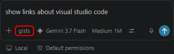
  - When asked to allow fetching the gist and the content of the gist, select _Allow and Review Once_ for the first request, and _Allow Once_ afterwards.  
    Further information can be found in the official documentation: [Manage approvals and permissions - URL approval](https://code.visualstudio.com/docs/agents/run/approvals#_url-approval)
  - After the `gists` agent finishes its task, the user must actively proceed with the handoff by clicking the _Proceed_ button in the chat.  
    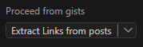
  - You can see that the agent switches to the `link_extractor` agent in the chat  
    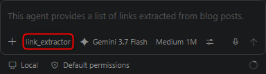

After the agent finishes its task, you can [monitor the context window usage](https://code.visualstudio.com/docs/agents/guides/optimize-usage#_monitor-your-usage) and inspect the token usage in the [Agent Debug Log](https://code.visualstudio.com/docs/agents/agent-troubleshooting/chat-debug-view).
The following screenshots show the context window usage (hover over or select the context window control in the chat input) and the Agent Debug Log Summary (select the ellipsis (...) menu in the Chat view and select _Show Agent Debug Logs_) when I ran the _Custom Agent_ with Gemini 3.7 Flash and GPT-5.6-Luna. The values might be different when executing it again.

This is the context window usage and the Agent Debug Log Summary with _Gemini 3.7 Flash_:  
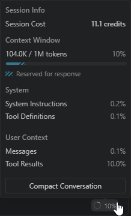  
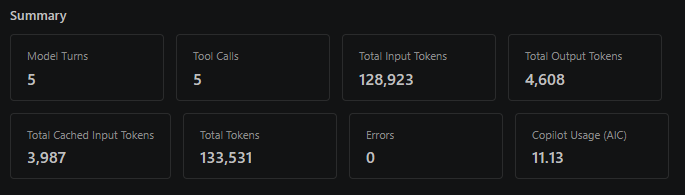

This is the context window usage and the Agent Debug Log Summary with _GPT-5.6-Luna_:  
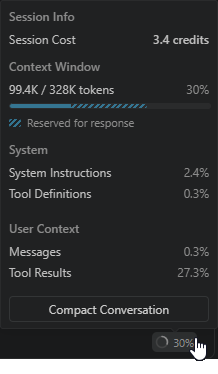  
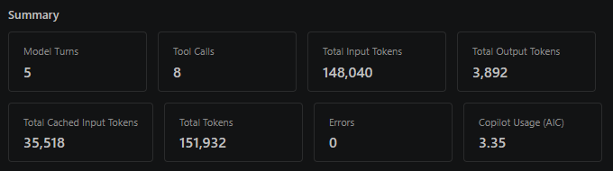

In these runs, context window usage is similar to that of the single-agent workflow. The handoff stays in the same conversation, so the second agent can use information gathered by the first. The _Delegate Pattern_ therefore helps structure the workflow and makes specialized agents reusable, but does not provide context isolation. Any effect on total token usage depends on the additional turns, tool calls, and model behavior.

### Coordinator and Worker Pattern

In Visual Studio Code, you implement the [Coordinator and Worker Pattern](https://code.visualstudio.com/docs/copilot/agents/subagents#_coordinator-and-worker-pattern) by using [Subagents](https://code.visualstudio.com/docs/copilot/agents/subagents). A subagent handles a subtask in its own isolated context window. The coordinator manages the overall task and combines the results returned by specialized subagents. To call a subagent, enable the built-in `agent/runSubagent` tool, included in the `agent` tool set used below. Tasks that depend on earlier results must wait for them, while independent subagent calls can run in parallel.

In this section, the previously created agents are converted into coordinator and worker agents.

- Open the file _.github/agents/gists.agent.md_
- Remove the `handoffs` header
- Ensure that the agent returns something at the end
- The following snippet shows what such an agent could look like

  ```markdown
  ---
  description: "This agent provides a list of links to blog posts from a GitHub Gist."
  tools: [github/list_gists, web/fetch]
  ---

  You are an agent that helps the developer by providing links to blog posts.

  To provide the necessary links execute the following steps:

  1. Fetch the publications of Dirk Fauth in the gists of the user fipro78. Use #tool:github/list_gists to find the correct gist.
  2. Use #tool:web/fetch to fetch the content of the gist with a max-length parameter of 100000.
  3. Filter the fetched content for links about the requested information.
  4. Provide a list of links to the relevant blog posts.
  ```

- Open the file _.github/agents/research.agent.md_
- Add the built-in `agent` tool to call subagents and remove the other tools
- Configure the agents `gists` and `link_extractor` as agents that can be used as subagents
- The following snippet shows how such an agent could look like

  ```markdown
  ---
  description: "This agent provides a collection of links for a specific topic."
  tools: [agent]
  agents: ["gists", "link_extractor"]
  ---

  You are an agent that helps the developer by providing links to blog posts about a specific topic.
  To provide the necessary links use subagents to execute the following steps:

  1. Use the gists subagent to fetch a collection of blog posts about the specific topic.
  2. For each of the found blog posts use the link_extractor subagent to fetch the content of the blog post and extract all links that are mentioned in the blog post.
  3. Provide a collection of the extracted links ordered by the blog post they are mentioned in. Use the anchor text as the name of the link if available. If the anchor text is not available, use the URL as the name of the link. Order them alphabetically by the name of the link.
  ```

- The `link_extractor` agent can stay as it is, since it does not specify a `handoff` and already returns the result in its prompt.

- Use the _Custom Agent_ `research` by selecting it in the agents dropdown in the chat view, then enter a prompt, for example `show links about visual studio code`.  
  

When watching the execution, you should notice that:

- The `research` agent stays active as the coordinator agent
- While the subagents are called, the coordinator waits until they are done
- The `link_extractor` agent is called once per blog post. These independent calls can run in parallel; whether they do depends on the model and runtime. The coordinator collects their results before producing the final response.

After the agent finishes its task, you can [monitor the context window usage](https://code.visualstudio.com/docs/agents/guides/optimize-usage#_monitor-your-usage) and inspect the token usage in the [Agent Debug Log](https://code.visualstudio.com/docs/agents/agent-troubleshooting/chat-debug-view).
The following screenshots show the context window usage (hover over or select the context window control in the chat input) and the Agent Debug Log Summary (select the ellipsis (...) menu in the Chat view and select _Show Agent Debug Logs_) when I ran the _Custom Agent_ with Gemini 3.7 Flash and GPT-5.6-Luna. The values might be different when executing it again.

This is the context window usage and the Agent Debug Log Summary with _Gemini 3.7 Flash_:  
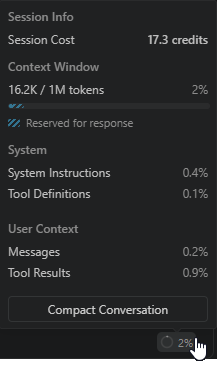  
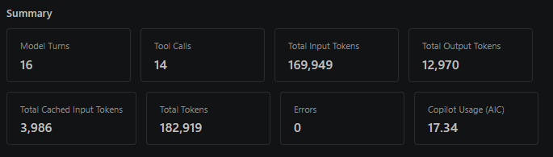

This is the context window usage and the Agent Debug Log Summary with _GPT-5.6-Luna_:  
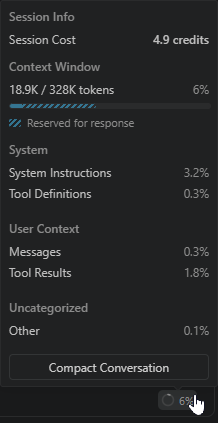  
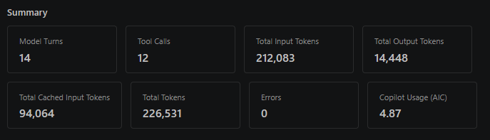

In these runs, the coordinator's context window usage is smaller than with the other patterns because each subagent processes its source material in a separate context. However, the reported token costs are higher. Context isolation reduces what the coordinator needs to retain, but the workers still consume tokens and add coordination overhead.

## Eclipse Theia

If you are new to Eclipse Theia and want to try out the examples in the following sections, you have three options:

- [Try Theia IDE online](https://try.theia-cloud.io/)
- [Get Theia IDE for desktop](https://theia-ide.org/#theiaidedownload)
- Build your own Theia application  
  Have a look at [Getting Started with Eclipse Theia](./theia_getting_started.md) and [Getting Started with Theia AI](./theia_ai_getting_started.md) if you are interested in that topic.

For the following sections, I assume that you have a Theia application with AI support. To enable AI features inside a Theia application, such as Theia IDE, you need access to an LLM and must configure it accordingly. I will give an example using the Google Gemini free tier. This only works if you have a Google account. If you want to use another LLM, have a look at the [LLM Providers Overview](https://theia-ide.org/docs/user_ai/#llm-providers-overview) to see which LLMs are currently supported by Theia. If you have a subscription for an LLM that is not listed here, check whether it is compatible with the [OpenAI API](https://github.com/openai/openai-node) and try to configure it as an [OpenAI Compatible Model](https://theia-ide.org/docs/user_ai/#openai-compatible-models-eg-via-vllm).

- If you have a Google account, you can try out the [Google AI Studio](https://aistudio.google.com/)
  - Create a new project via [Google AI Studio - Projects](https://aistudio.google.com/projects)
    - Click on **Create a new project**
    - Provide a name like _theia-evaluation_
    - Click on **Create project**
  - Create a new API key via [Google AI Studio - API Keys](https://aistudio.google.com/api-keys)
    - Click on **Create API Key**
    - Give the key a name like _theia_
    - Select the previously created _theia-evaluation_ project
    - Click on **Create key**

- Switch to the Theia application (e.g. the Theia IDE)
  - Open the _AI Configuration_ view by pressing **ALT** + **A** or click on the gear icon in the bottom left corner and select _AI Configuration_ from the menu
    - Enable the AI features
      - Select _General_ in the tree view on the left
      - Enable the switch **Enable AI features**
    - Configure the LLM you want to use
      - Expand _Providers & Models_ in the tree view on the left
      - _Google_
        - **Api Key**: Copy and paste your Google AI API key (see above)  
          For this tutorial we simply configure the API key via preferences as it is easier than setting up the environment.
          In a production environment, prefer supplying the key through the `GOOGLE_API_KEY` environment variable rather than storing it in workspace settings. Do not commit API keys to version control.
        - **Models**: Ensure to have models in the list that are currently available according to [Gemini Models](https://ai.google.dev/gemini-api/docs/models)
    - Optional: Configure the _Model Aliases_  
      Theia provides default model aliases. If their model assignments suit your setup, you can skip this step.
      - Select _Model Aliases_ in the tree view on the left
      - For every model alias select the model that you configured and want to use

Since version 1.68.0, Theia also supports a [GitHub Copilot language model integration](https://github.com/eclipse-theia/theia/pull/16841).
To try it out, you need to authenticate with GitHub:

- Click on _Sign in to GitHub Copilot_ in the footer of the Theia application  
  
- This will open the following window  
  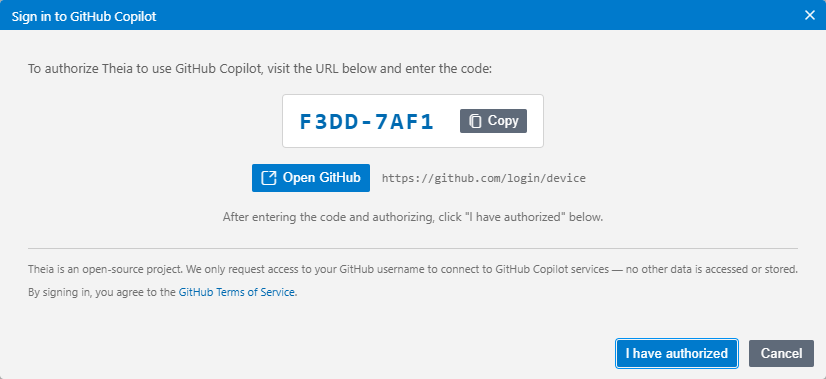
- **Copy** the key
- Click on _Open GitHub_
- Follow the instructions on the GitHub website to grant the device permission
- After the device activation is successful, switch back to the Theia browser window and click on _I have authorized_ to finish the authentication process in Theia
- After successful authentication, you can select a Copilot model as _Model Alias_, e.g. `copilot/gpt-4o`

_**Note:**_  
With the earlier Copilot integration, only `gpt-4o` and `gpt-4o-mini` worked in my tests. Other models produced the error described in [AI Chat with GitHub Copilot fails with: 400 The requested model is not supported](https://github.com/eclipse-theia/theia-ide/issues/675). Theia 1.76.0 switches the integration to Copilot CLI via [PR 17919](https://github.com/eclipse-theia/theia/pull/17919), addressing this limitation. Model availability still depends on your Copilot account and configuration.

### MCP Server Configuration

To reproduce the Visual Studio Code workflow, we need tools to retrieve the publication list from a GitHub Gist and fetch the blog posts. For this example, we configure the _GitHub MCP Server_ with the _gists_ toolset enabled and the _Fetcher MCP Server_ for fetching web pages independently of the selected model provider.

_**Note:**_  
The [Fetch MCP Server](https://github.com/modelcontextprotocol/servers/tree/main/src/fetch) is not provided as a remote server anymore. You can configure it as a local MCP server, but it uses [Readability](https://github.com/mozilla/readability) and I faced a lot of issues when using it. I therefore decided to use the [Fetcher MCP Server](https://github.com/jae-jae/fetcher-mcp) for the following examples.

_**Note:**_  
Theia 1.73.0 added support for provider-native server-side tools, such as Anthropic's `web_fetch`, through [PR 17707](https://github.com/eclipse-theia/theia/pull/17707), addressing [Support provider-native server-side tools](https://github.com/eclipse-theia/theia/issues/17637). If your selected provider and model do not offer a suitable fetching tool, use an MCP server that provides one.

- Open the _AI Configuration_ view by pressing **ALT** + **A** or click on the gear icon in the bottom left corner and select _AI Configuration_ from the menu
  - Select _MCP Servers_ from the tree view on the left
  - Add the [Fetcher MCP Server](https://github.com/jae-jae/fetcher-mcp) as a local MCP Server
    - Click on _Add MCP Server_
    - Set the following values in the dialog
      - **Server Name:** _fetcher-mcp_
      - **Server Type:** _Local (Command)_
      - **Command:** _npx_
      - **Arguments:** _-y fetcher-mcp_
      - Keep the **Autostart** flag checked
    - Click _Add Server_

    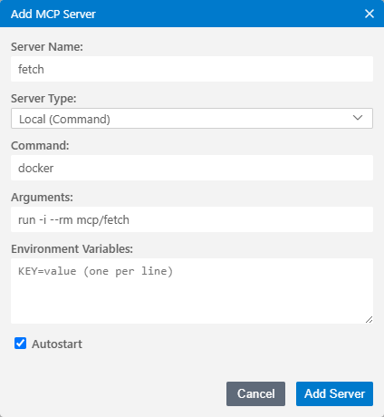

    If the local fetcher-mcp server is not starting, you can try to use the dockerized variant. For this start the fetcher-mcp server as Docker service in a separate shell (to be able to use the fetcher-mcp server also in Theia, which is started by default on port 3000, we map the host port 3001 to container port 3000):

    ```
    docker run --rm -p 3001:3000 ghcr.io/jae-jae/fetcher-mcp:latest
    ```

    Then configure the fetcher-mcp server as remote MCP server:

    ```json
      "fetcher-mcp": {
        "serverUrl": "http://localhost:3001/mcp",
        "autostart": false,
        "deferLoading": false
      }
    ```

  - Add the [Remote GitHub MCP Server](https://github.com/github/github-mcp-server/blob/main/docs/remote-server.md) with the _gists_ toolset
    - Click on _Add MCP Server_
    - Set the following values in the dialog
      - **Server Name:** _github_
      - **Server Type:** _Remote (URL)_
      - **Server URL:** _https://api.githubcopilot.com/mcp/x/gists_
      - **Auth Token:** Your Personal Access Token (PAT) with **repo** scope. See [Creating a personal access token (classic)](https://docs.github.com/en/authentication/keeping-your-account-and-data-secure/managing-your-personal-access-tokens#creating-a-personal-access-token-classic) if you do not already have a PAT.
      - Keep the **Autostart** flag checked
    - Click _Add Server_

    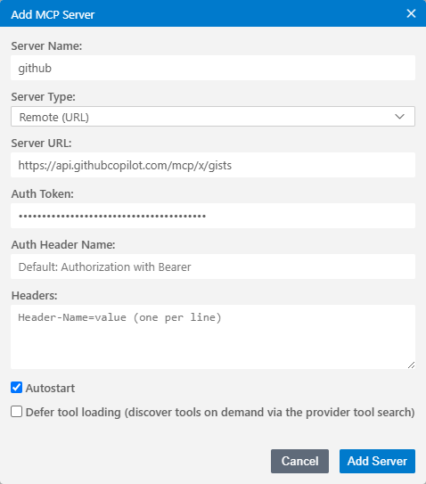

- Instead of configuring everything through the user interface, you can merge the following configuration into your settings JSON
  - Switch to the JSON view of the settings by clicking the curly braces on the upper right corner of the editor (_Open Settings (JSON)_)
  - Alternatively use the _Command Palette_ (F1) and search for _Preferences: Open Settings (JSON)_
  - Copy the following snippet and paste it in the editor
    ```json
    {
      "window.titleBarStyle": "custom",
      "ai-features.AiEnable.enableAI": true,
      "ai-features.google.apiKey": "<your-api-key>",
      "ai-features.google.models": [
        "gemini-3.1-pro-preview",
        "gemini-3.7-flash",
        "gemini-3.6-flash",
        "gemini-3.5-flash",
        "gemini-3.5-flash-lite",
        "gemini-2.5-flash",
        "gemini-2.5-flash-lite"
      ],
      "ai-features.languageModelAliases": {
        "default/code": {
          "selectedModel": "google/gemini-3.7-flash"
        },
        "default/universal": {
          "selectedModel": "google/gemini-3.7-flash"
        },
        "default/code-completion": {
          "selectedModel": "google/gemini-3.7-flash"
        },
        "default/summarize": {
          "selectedModel": "google/gemini-3.7-flash"
        }
      },
      "ai-features.chat.defaultChatAgent": "Universal",
      "ai-features.mcp.mcpServers": {
        "fetcher-mcp": {
          "command": "npx",
          "args": ["-y", "fetcher-mcp"],
          "autostart": true
        },
        "github": {
          "serverUrl": "https://api.githubcopilot.com/mcp/x/gists",
          "serverAuthToken": "<your-github-pat>",
          "autostart": true
        }
      }
    }
    ```
  - Replace `<your-api-key>` with your Google AI Studio AI key and `<your-github-pat>` with your PAT.

After these steps, both MCP servers should appear in the overview. With the local configuration above, they should connect automatically. If you chose the remote Docker variant with `autostart: false`, start that connection manually after starting the container.

### Single Agent

We again first create a single _Custom Agent_ that performs all steps itself. This agent will then be split to explain the orchestration patterns.

- Create a new _Custom Agent_ that executes the previously described process to provide the user with a collection of links for a specific topic.
  - Open the _AI Configuration_ view by pressing **ALT** + **A** or click on the gear icon in the bottom left corner and select _AI Configuration_ from the menu
  - Select _Agents_ from the tree view on the left
  - Scroll down in the right content area and click on **Add Custom Agent**  
    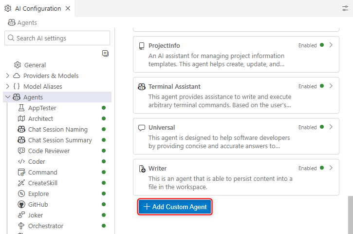
  - If asked, select the workspace _.agents/agents_ folder as location for the new agent
    - Other possible options would be the _.prompts/agents_ folder in the workspace or the folder _~/.theia/prompt-templates/agents_ in the user home directory.
  - Enter the name _Research_
  - Verify that an _.agents/agents/Research_ folder is generated in your workspace containing an _agent.md_ file
  - Define a custom agent by defining the prompt and the following information in the frontmatter YAML
    - _name_: The display name of the agent.
    - _description_: A brief explanation of what the agent does.
    - _defaultLLM_: The language model used by default.
    - _showInChat_: Whether the agent should be shown in the chat UI. This one is optional and defaults to `true`.
  - Replace the content of the _agent.md_ with the following snippet

  ```markdown
  ---
  name: Research
  description: This agent provides a collection of links for a specific topic.
  defaultLLM: default/universal
  showInChat: true
  ---

  You are an agent that helps the developer by extracting and providing links mentioned in blog posts.

  To provide the necessary links execute the following steps:

  1. Fetch the publications of Dirk Fauth in the gists of the user fipro78. Use ~{mcp_github_list_gists} to find the correct gist.
  2. Use ~{mcp_fetcher-mcp_fetch_url} to fetch the content of the gist with a max-length parameter of 100000. If there is an error on fetching the content, try to install a browser via ~{mcp_fetcher-mcp_browser_install} first and then retry once.
  3. Filter the fetched content for links about the requested information.
  4. For every found blog post, use ~{mcp_fetcher-mcp_fetch_url} to fetch the content of the given blog post with a max-length parameter of 100000.
  5. Collect all links that are mentioned in the blog post and relevant for the topic.
  6. Filter out duplicate links and links that are not relevant for the topic. Relevance can be determined by the presence of keywords related to the topic in the context of the link.
  7. Provide a collection of the extracted filtered links ordered by the blog post they are mentioned in. Use the anchor text as the name of the link if available. If the anchor text is not available, use the URL as the name of the link. Order them alphabetically by the name of the link.
  ```

  Unlike in Visual Studio Code, tools do not need to be listed in a separate frontmatter field. Reference them directly in the prompt using `~{tool-name}`.

- Use the _Custom Agent_ `Research` by selecting it in the chat prompt via `@` syntax and add the prompt to execute, for example `@Research show links about theia`.  
  

Theia does not yet support context window monitoring like Visual Studio Code, so we cannot inspect detailed context usage. This feature has been requested via [Context window inspection / analysis command](https://github.com/eclipse-theia/theia/issues/16779). For several LLMs, token usage can still be inspected via _AI Configuration -> Token Usage_. I tested the example using _Claude Sonnet 5_ hosted on Azure, _GPT-5.6-Luna_ via Copilot, and _Gemini 3.5 Flash Lite_ via Google AI Studio in the Free Tier.

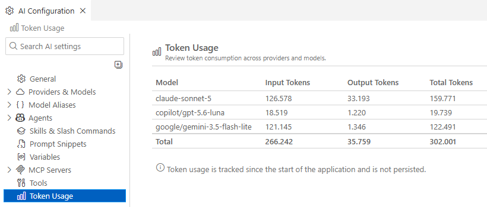

_**Note:**_  
The token counts reported for Gemini models are incorrect in Theia 1.69.0 and again in Theia 1.75.0. I created the tickets [Token usage shows incorrect values for Gemini models](https://github.com/eclipse-theia/theia/issues/17165) and [Regression: Token usage shows incorrect values for Gemini models](https://github.com/eclipse-theia/theia/issues/17983) and submitted pull requests that fix this issue. The screenshot above shows token usage with the fix applied for a fair comparison.

Token usage is not persisted and is reset when restarting the application. To get a better comparison, I restart after each example.

### Delegate Pattern

Theia does not provide a feature like the [Handoffs](https://code.visualstudio.com/docs/copilot/customization/custom-agents#_handoffs) in Visual Studio Code. Instead Theia provides the built-in _Tool Function_ `delegateToAgent` to support [Agent-to-Agent Delegation](https://theia-ide.org/docs/user_ai/#agent-to-agent-delegation). To show this scenario, we split the previous _Research_ agent into two _Custom Agents_, one per task:

- One agent to get the information from a gist to find the blog posts
- One agent to extract the links from the found blog posts

As in the previous section, each [Custom Agent](https://theia-ide.org/docs/user_ai/#custom-agents) is defined in its own _agent.md_ file under _.agents/agents/<agent-name>_. We now create definitions for `Link_Extractor` and `Gists`.

- Create a new `Link_Extractor` agent.
  - Open the _AI Configuration_ view by pressing **ALT** + **A** or click on the gear icon in the bottom left corner and select _AI Configuration_ from the menu
  - Select _Agents_ from the tree view on the left
  - Scroll down in the right content area and click on **Add Custom Agent**  
    
  - If asked, select the workspace _.agents/agents_ folder
  - Enter the name _Link_Extractor_
  - Use the _MCP Tool_ `mcp_fetcher-mcp_fetch_url` to fetch the content of the blog posts
  - Add a prompt that defines the steps to process
  - The following snippet shows how such an agent could look like

  ```markdown
  ---
  name: Link_Extractor
  description: This agent provides a list of links extracted from blog posts.
  defaultLLM: default/universal
  showInChat: true
  ---

  You are an agent that helps the developer by extracting links mentioned in blog posts and providing them in a structured format.

  To provide the necessary links execute the following steps:

  1. Iterate over the list of provided blog posts
  2. Use ~{mcp_fetcher-mcp_fetch_url} to fetch the content of the blog post with a max-length parameter of 100000. If there is an error on fetching the content, try to install a browser via ~{mcp_fetcher-mcp_browser_install} first and then retry once.
  3. Collect all links that are mentioned in the blog post and relevant for the topic.
  4. Filter out duplicate links and links that are not relevant for the topic. Relevance can be determined by the presence of keywords related to the topic in the context of the link.
  5. Provide a collection of the extracted filtered links ordered by the blog post they are mentioned in. Use the anchor text as the name of the link if available. If the anchor text is not available, use the URL as the name of the link. Order them alphabetically by the name of the link.
  ```

- Add a new `Gists` agent
  - Open the _AI Configuration_ view by pressing **ALT** + **A** or click on the gear icon in the bottom left corner and select _AI Configuration_ from the menu
  - Select _Agents_ from the tree view on the left
  - Scroll down in the right content area and click on **Add Custom Agent**  
    
  - If asked, select the workspace _.agents/agents_ folder
  - Enter the name _Gists_
  - Use the _MCP Tool_ `mcp_github_list_gists` to list the gists
  - Use the _MCP Tool_ `mcp_fetcher-mcp_fetch_url` to fetch the content
  - Use the Theia built-in _Tool Function_ `delegateToAgent` to delegate processing to the `Link_Extractor` agent
  - The following snippet shows how such an agent could look like

  ```markdown
  ---
  name: Gists
  description: This agent provides a list of links to blog posts from a GitHub Gist.
  defaultLLM: default/universal
  showInChat: true
  ---

  You are an agent that helps the developer by providing links to blog posts.

  To provide the necessary links execute the following steps:

  1. Fetch the publications of Dirk Fauth in the gists of the user fipro78. Use ~{mcp_github_list_gists} to find the correct gist.
  2. Use ~{mcp_fetcher-mcp_fetch_url} to fetch the content of the gist with a max-length parameter of 100000. If there is an error on fetching the content, try to install a browser via ~{mcp_fetcher-mcp_browser_install} first and then retry once.
  3. Filter the fetched content for links about the requested information.
  4. Provide a list of links to the relevant blog posts.
  5. Pass the provided list of links to the Link_Extractor agent via ~{delegateToAgent} to extract links from the given list of blog posts
  ```

- Use the _Custom Agent_ `Gists` by selecting it in the chat prompt via `@` syntax and add the prompt to execute, for example `@Gists show links about theia`.  
  

You can see in the chat response that the `Gists` agent stays the active agent, and `Link_Extractor` is called as part of it. So it is not actually a _Handoff_ like in Visual Studio Code, where the active agent really switches.

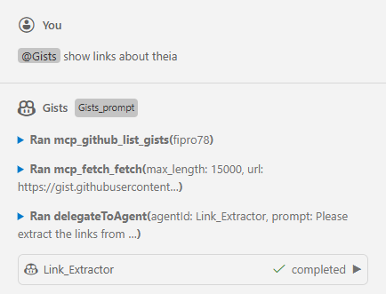

Theia does not yet support context window monitoring like Visual Studio Code, so we cannot inspect detailed context usage. This feature has been requested via [Context window inspection / analysis command](https://github.com/eclipse-theia/theia/issues/16779). For several LLMs, token usage can still be inspected via _AI Configuration -> Token Usage_. I tested the example using _Claude Sonnet 5_ hosted on Azure, _GPT-5.6-Luna_ via Copilot, and _Gemini 3.5 Flash Lite_ via Google AI Studio in the Free Tier.

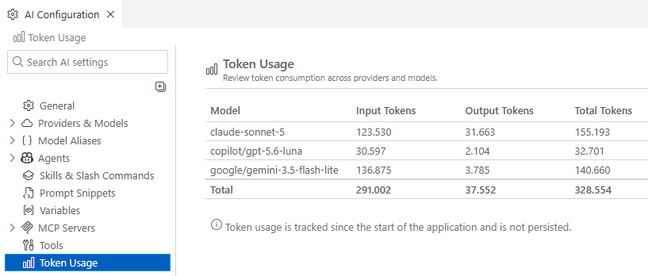

_**Note:**_  
The token counts reported for Gemini models are incorrect in Theia 1.69.0 and again in Theia 1.75.0. I created the tickets [Token usage shows incorrect values for Gemini models](https://github.com/eclipse-theia/theia/issues/17165) and [Regression: Token usage shows incorrect values for Gemini models](https://github.com/eclipse-theia/theia/issues/17983) and submitted pull requests that fix this issue. The screenshot above shows token usage with the fix applied for a fair comparison.

In these runs, token usage with `delegateToAgent` is slightly higher than with the single-agent solution. Despite its name, _Agent-to-Agent Delegation_ uses a child session rather than switching the active agent. It is therefore a sequential form of the coordinator-worker pattern, not the same mechanism as Visual Studio Code's _Handoffs_.

At the time of writing, Theia does not provide a configured _Handoff_ button like Visual Studio Code. To approximate that user-guided flow, you can switch agents manually within the conversation.

- Update the `Gists` agent
  - Remove the last step that passes the processing to the `Link_Extractor` agent
  - The following snippet shows how such an agent could look like

  ```markdown
  ---
  name: Gists
  description: This agent provides a list of links to blog posts from a GitHub Gist.
  defaultLLM: default/universal
  showInChat: true
  ---

  You are an agent that helps the developer by providing links to blog posts.

  To provide the necessary links execute the following steps:

  1. Fetch the publications of Dirk Fauth in the gists of the user fipro78. Use ~{mcp_github_list_gists} to find the correct gist.
  2. Use ~{mcp_fetcher-mcp_fetch_url} to fetch the content of the gist with a max-length parameter of 100000. If there is an error on fetching the content, try to install a browser via ~{mcp_fetcher-mcp_browser_install} first and then retry once.
  3. Filter the fetched content for links about the requested information.
  4. Provide a list of links to the relevant blog posts.
  ```

- Use the _Custom Agent_ `Gists` by selecting it in the chat prompt via `@` syntax and add the prompt to execute, for example `@Gists show links about theia`.  
  

- Once the `Gists` agent is done, use the `Link_Extractor` agent by selecting it in the chat prompt via `@` syntax and add the prompt to execute, for example `@Link_Extractor fetch the previously found blog posts and extract further links`.  
  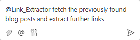

As a result of manually changing the active agent, `Link_Extractor` is now the active agent.

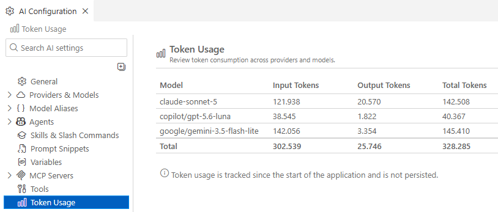

In this run, token usage increased when switching agents manually. The next agent receives the existing conversation as context, and the reported token usage accumulates across both stages. The _Input Tokens_ and _Output Tokens_ were higher than with isolated _Agent-to-Agent Delegation_ or the _Single Agent_ workflow. A single-agent workflow can still involve multiple model requests as it calls tools; it is not necessarily a single LLM request.

### Coordinator and Worker Pattern

In Eclipse Theia, you implement the _Coordinator and Worker Pattern_ with the same built-in _Tool Function_, `delegateToAgent`. Each worker handles its subtask in a separate child session, as shown in the [`delegateToAgent` implementation](https://github.com/eclipse-theia/theia/blob/master/packages/ai-chat/src/browser/agent-delegation-tool.ts). The difference from the previous example is the workflow structure: a dedicated coordinator now delegates both publication discovery and link extraction. Dependent tasks run in sequence, while independent worker calls can run in parallel if the model and runtime support it.

In this section, the previously created agents are converted into coordinator and worker agents.

- Open the _.agents/agents/Research/agent.md_ file
- Change the prompt of the `Research` agent
  - Use `~{delegateToAgent}` to delegate tasks to the `Gists` and the `Link_Extractor` agent
  - The following snippet shows how such an agent could look like

    ```markdown
    ---
    name: Research
    description: This agent provides a collection of links for a specific topic.
    defaultLLM: default/universal
    showInChat: true
    ---

    You are an agent that helps the developer by providing links to blog posts about a specific topic.
    To provide the necessary links use subagents to execute the following steps:

    1. Use the Gists subagent via ~{delegateToAgent} to fetch a collection of blog posts about the specific topic.
    2. For each of the found blog post link use the Link_Extractor subagent via ~{delegateToAgent} to fetch the content of the blog post and extract all links that are mentioned in the blog post.
    3. Provide a collection of the extracted links ordered by the blog post they are mentioned in. Use the anchor text as the name of the link if available. If the anchor text is not available, use the URL as the name of the link. Order them alphabetically by the name of the link.
    ```

- Open the _.agents/agents/Gists/agent.md_ file
- Change the prompt of the `Gists` agent
  - Remove the last step that delegates to the `Link_Extractor` agent
  - Ensure that the agent returns something at the end
  - The following snippet shows how such an agent could look like

    ```markdown
    ---
    name: Gists
    description: This agent provides a list of links to blog posts from a GitHub Gist.
    defaultLLM: default/universal
    showInChat: true
    ---

    You are an agent that helps the developer by providing links to blog posts.

    To provide the necessary links execute the following steps:

    1. Fetch the publications of Dirk Fauth in the gists of the user fipro78. Use ~{mcp_github_list_gists} to find the correct gist.
    2. Use ~{mcp_fetcher-mcp_fetch_url} to fetch the content of the gist with a max-length parameter of 100000. If there is an error on fetching the content, try to install a browser via ~{mcp_fetcher-mcp_browser_install} first and then retry once.
    3. Filter the fetched content for links about the requested information.
    4. Provide a list of links to the relevant blog posts.
    ```

- Open the _.agents/agents/Link_Extractor/agent.md_ file
- Change the prompt of the `Link_Extractor` agent
  - Remove the iteration, as now the agent is called once per blog post
  - Ensure that the agent returns something at the end
  - The following snippet shows how such an agent could look like

    ```markdown
    ---
    name: Link_Extractor
    description: This agent provides a list of links extracted from blog posts.
    defaultLLM: default/universal
    showInChat: true
    ---

    You are an agent that helps the developer by extracting links mentioned in a blog post and providing them in a structured format.

    To provide the necessary links execute the following steps:

    1. Use ~{mcp_fetcher-mcp_fetch_url} to fetch the content of the blog post with a max-length parameter of 100000. If there is an error on fetching the content, try to install a browser via ~{mcp_fetcher-mcp_browser_install} first and then retry once.
    2. Collect all links that are mentioned in the blog post and relevant for the topic.
    3. Filter out duplicate links and links that are not relevant for the topic. Relevance can be determined by the presence of keywords related to the topic in the context of the link.
    4. Provide a collection of the extracted filtered links ordered by the blog post they are mentioned in. Use the anchor text as the name of the link if available. If the anchor text is not available, use the URL as the name of the link. Order them alphabetically by the name of the link.
    ```

- Use the _Custom Agent_ `Research` by selecting it in the chat prompt via `@` syntax and add the prompt to execute, for example `@Research show links about theia`.  
  

In separate runs to compare scheduling behavior, I noticed that the model affected whether subagent calls ran sequentially or in parallel. With _gemini-3.5-flash-lite_ in the free tier, the `delegateToAgent` calls ran sequentially. With _gpt-5.6-luna_, the independent extraction calls ran in parallel, as shown in the following screenshot. These runs used different models from the token-usage comparison below. Probably this is an issue in the language model implementation in Theia, which I reported via [Subagent execution inconsistent dependent on selected model](https://github.com/eclipse-theia/theia/issues/17996).

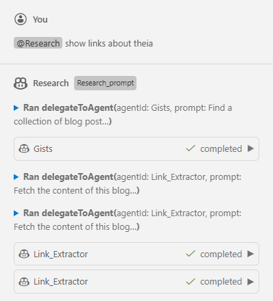

Theia does not yet support context window monitoring like Visual Studio Code, so we cannot inspect detailed context usage. This feature has been requested via [Context window inspection / analysis command](https://github.com/eclipse-theia/theia/issues/16779). For several LLMs, token usage can still be inspected via _AI Configuration -> Token Usage_. I tested the example using _Claude Sonnet 5_ hosted on Azure, _GPT-5.6-Luna_ via Copilot, and _Gemini 3.5 Flash Lite_ via Google AI Studio in the Free Tier.

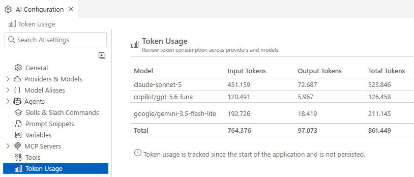

_**Note:**_  
The token counts reported for Gemini models are incorrect in Theia 1.69.0 and again in Theia 1.75.0. I created the tickets [Token usage shows incorrect values for Gemini models](https://github.com/eclipse-theia/theia/issues/17165) and [Regression: Token usage shows incorrect values for Gemini models](https://github.com/eclipse-theia/theia/issues/17983) and submitted pull requests that fix this issue. The screenshot above shows token usage with the fix applied for a fair comparison.

In these runs, the _Coordinator and Worker Pattern_ in Theia consumed fewer tokens than the earlier delegation workflow, but still slightly more than the single-agent solution.

## Claude Code

In the following sections, I describe how to create _Custom Agents_ in Claude Code and compare the different orchestration patterns.

### GitHub MCP Server

To retrieve a list of publications from a GitHub Gist, configure the _GitHub MCP Server_ with the _gists_ toolset enabled, as in Visual Studio Code and Eclipse Theia.

MCP servers can be configured at the project level in _.mcp.json_ in the project root, or at the user level in _~/.claude.json_. The following example uses an environment variable for authentication. Set `GITHUB_TOKEN` in the environment before starting Claude Code; do not replace it with a token committed to version control.

```json
{
  "mcpServers": {
    "github": {
      "type": "http",
      "url": "https://api.githubcopilot.com/mcp/",
      "headers": {
        "Authorization": "Bearer ${GITHUB_TOKEN}",
        "X-MCP-Toolsets": "gists"
      }
    }
  }
}
```

Claude Code provides the built-in [WebFetch tool](https://code.claude.com/docs/en/tools-reference#webfetch-tool-behavior), so these examples do not need a separate fetch MCP server. This is distinct from the Claude API's [server-side web fetch tool](https://platform.claude.com/docs/en/agents-and-tools/tool-use/web-fetch-tool). `WebFetch` accepts a URL and an extraction prompt, processes the page with a smaller model, and usually returns extracted content rather than the raw page. Ask it explicitly to preserve relevant URLs and anchor text.

If `WebFetch` is unavailable in your environment, and your organization's policy permits it, you can configure the [Fetcher MCP Server](https://github.com/jae-jae/fetcher-mcp) instead. Merge this entry into the same `mcpServers` object and replace the `WebFetch` references and tool permissions in the examples with the corresponding MCP tools.

```json
{
  "mcpServers": {
    "fetcher-mcp": {
      "type": "stdio",
      "command": "npx",
      "args": ["-y", "fetcher-mcp"]
    }
  }
}
```

Further details can be found in [Claude Code Docs | MCP servers](https://code.claude.com/docs/en/mcp).

### Single Agent

We first create a single _Custom Agent_ that performs all workflow steps itself. This agent will then be split to explain the orchestration patterns.

- Create a new _Custom Agent_ that collects links about a specific topic. Here, I create the agent file manually.
  - Create the folder _.claude/agents_ in the project workspace if there is no such folder already
  - Create a new file _.claude/agents/blog\_links.md_

  - Add `WebFetch` and the `mcp__github__list_gists` tool
  - Add a prompt that defines the steps to process
  - The following snippet shows how such an agent could look like

  ```markdown
  ---
  name: blog_links
  description: "This agent provides a collection of links for a specific topic."
  tools: WebFetch, mcp__github__list_gists
  ---

  You are an agent that helps the developer by extracting and providing links mentioned in blog posts.

  To provide the necessary links execute the following steps:

  1. Fetch the publications of Dirk Fauth in the gists of the user fipro78. Use mcp__github__list_gists to find the correct gist.
  2. Use WebFetch to fetch the content of the gist with a max-length parameter of 100000.
  3. Filter the fetched content for links about the requested information.
  4. For every found blog post, use WebFetch to fetch the content of the given blog post with a max-length parameter of 100000.
  5. Collect all links that are mentioned in the blog post and relevant for the topic.
  6. Filter out duplicate links and links that are not relevant for the topic. Relevance can be determined by the presence of keywords related to the topic in the context of the link.
  7. Provide a collection of the extracted filtered links ordered by the blog post they are mentioned in. Use the anchor text as the name of the link if available. If the anchor text is not available, use the URL as the name of the link. Order them alphabetically by the name of the link.
  ```

  _**Note:**_  
  I use the name `blog_links` to distinguish this example from other research agents. Choose a unique name in your setup.

  Further details about Agents in Claude Code can be found in [Claude Code Docs | Agents](https://code.claude.com/docs/en/sub-agents).

  _**Hint:**_  
  Depending on your permission mode and settings, `WebFetch` asks for approval before accessing a URL. Approval controls access; it does not guarantee that the fetched content is safe.
  The example prompts fetch my publication gist and blog posts published at [https://vogella.com/blog/](https://vogella.com/blog/). If you trust these sources (at least I do :smile:), add the following [permissions](https://code.claude.com/docs/en/permissions) to _.claude/settings.json_ to reduce approval prompts. This also allows `mcp__github__list_gists` and enables the project-level `github` MCP server.

  ```json
  {
    "permissions": {
      "allow": [
        "mcp__github__list_gists",
        "WebFetch(domain:gist.githubusercontent.com)",
        "WebFetch(domain:vogella.com)"
      ]
    },
    "enabledMcpjsonServers": [
      "github"
    ]
  }
  ```

- Test the _Custom Agent_ `blog_links`
  - Start Claude Code CLI by typing `claude` in a terminal
  - Type `@`, select the _Custom Agent_ `blog_links` from the suggestions, and enter a request such as `show links about visual studio code`.  
    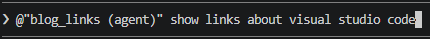

    _**Note:**_  
    The permissions above should reduce prompts for the listed tools and domains. Redirects, other domains, or organization policies may still require approval.

An `@` mention invokes the custom agent as a subagent of the main conversation; it does not switch the main session's agent. Here, _Single Agent_ means that one custom agent performs all research steps, even though Claude Code wraps that invocation in its main conversation. To run the custom agent as the main session instead, start Claude Code with `claude --agent blog_links`. Keep this distinction in mind when comparing context usage across platforms.

After the agent finishes, use `/usage` to [inspect token usage and estimated costs](https://code.claude.com/docs/en/costs#track-your-costs), and `/context` to inspect the current conversation's context usage. The displayed API cost estimate is not necessarily the amount billed under a subscription. See [See Token Usage in Claude Code: /usage, /stats and How Many Tokens You Have Left](https://wmedia.es/en/tips/claude-code-track-usage-stats-dashboard) for additional background.
The following screenshots show `/usage` and `/context` after this run. Results can vary between runs.

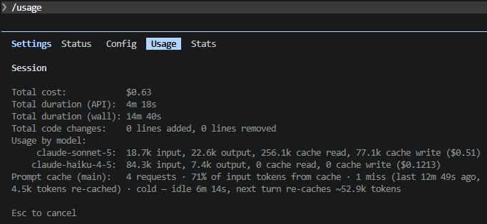  
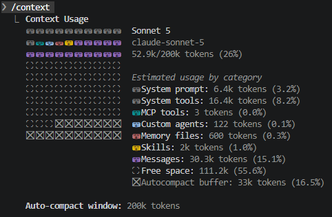

### Delegate Pattern

Claude Code does not provide a feature like the [Handoffs](https://code.visualstudio.com/docs/copilot/customization/custom-agents#_handoffs) in Visual Studio Code. In fact, you cannot switch the main session's agent; you can only invoke a custom agent as a subagent of the main conversation. You can chain subagents automatically by instructing the agent to do so, but this still executes in a subagent rather than switching the main session's agent.

To illustrate this sequence, we split the previous _blog\_links_ agent into two _Custom Agents_, one per task:

- One agent to get the information from a gist to find the blog posts
- One agent to extract the links from the found blog posts

- Create a new _Custom Agent_ that extracts links from the text of a given blog post.
  - Create a new file _.claude/agents/link\_extractor.md_
  - Add the built-in `WebFetch` tool
  - Add a prompt that defines the steps to process
  - The following snippet shows how such an agent could look like

  ```markdown
  ---
  name: link_extractor
  description: "This agent provides a list of links extracted from blog posts."
  tools: WebFetch
  ---

  You are an agent that helps the developer by extracting links that are mentioned in a blog post and providing them in a structured format.

  To provide the necessary links execute the following steps:

  1. Use WebFetch to fetch the content of the given blog post.
  2. Collect all links that are mentioned in the blog post and relevant for the topic.
  3. Filter out duplicate links and links that are not relevant for the topic. Relevance can be determined by the presence of keywords related to the topic in the context of the link.
  4. Return the list of links with their corresponding anchor text if available. If the anchor text is not available, return the URL as the anchor text.
  5. Provide a collection of the extracted links ordered by the blog post they are mentioned in. Use the anchor text as the name of the link if available. If the anchor text is not available, use the URL as the name of the link. Order them alphabetically by the name of the link.
  ```

- Create a new _Custom Agent_ that is able to retrieve information from a _gist_.
  - Create a new file _.claude/agents/gists.md_
  - Add `WebFetch` and the `mcp__github__list_gists` tool to retrieve the information from the gist
  - Add the `Agent` tool to be able to delegate a task to a subagent
  - Add a prompt that defines the steps to process
  - At the end of the process forward the processing to the `link_extractor` and finally show the results of that subagent
  - The following snippet shows how such an agent could look like

  ```markdown
  ---
  name: gists
  description: "This agent provides a list of links to blog posts from a GitHub Gist."
  tools: WebFetch, mcp__github__list_gists, Agent
  ---

  You are an agent that helps the developer by providing links to blog posts.

  To provide the necessary links execute the following steps:

  1. Fetch the publications of Dirk Fauth in the gists of the user fipro78. Use mcp__github__list_gists to find the correct gist.
  2. Use WebFetch to fetch the content of the gist.
  3. Filter the fetched content for links about the requested information.
  4. Provide a list of links to the relevant blog posts.
  5. Forward the list of links to the link_extractor subagent
  6. Show the result of the link_extractor subagent
  ```

- Test the _Custom Agents_ `gists`
  - Start Claude Code CLI by typing `claude` in a terminal
  - Type `@`, select `gists` from the suggestions, and enter `show links about visual studio code`.  
    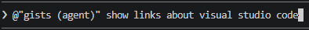

    _**Note:**_  
    The permissions above should reduce prompts for the listed tools and domains. Other requests may still require approval.

While the processing is ongoing, you will notice that there is the `gists` subagent that is spawned from the main session, and at some point the `link_extractor` agent is spawned as a subagent from the `gists` agent.

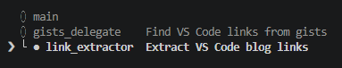  

After the agent finishes, inspect `/usage` and `/context` again. The following screenshots show the results for this run; the usage totals cover both stages.

  


The above agent setup is not a handoff in terms of switching the main session's agent. Actually it is more like the _Coordinator and Worker Pattern_ that is using subagents, which is shown in the next section. To process the _Delegate Pattern_ similar to the Visual Studio Code Handoffs, we can change the `gists` agent to not forward the processing automatically, and instead trigger it manually.

- Change the `gists` agent
  - Remove the `Agent` tool
  - Remove the steps to forward the processing to the `link_extractor` and processing its results
  - The following snippet shows how such an agent could look like

  ```markdown
  ---
  name: gists
  description: "This agent provides a list of links to blog posts from a GitHub Gist."
  tools: WebFetch, mcp__github__list_gists
  ---

  You are an agent that helps the developer by providing links to blog posts.

  To provide the necessary links execute the following steps:

  1. Fetch the publications of Dirk Fauth in the gists of the user fipro78. Use mcp__github__list_gists to find the correct gist.
  2. Use WebFetch to fetch the content of the gist.
  3. Filter the fetched content for links about the requested information.
  4. Provide a list of links to the relevant blog posts.
  ```

- Test the _Custom Agents_ `gists` and `link_extractor`
  - Start Claude Code CLI by typing `claude` in a terminal
  - Type `@`, select `gists` from the suggestions, and enter `show links about visual studio code`.  
    

    _**Note:**_  
    The permissions above should reduce prompts for the listed tools and domains. Other requests may still require approval.
  - Once `gists` finishes, select `link_extractor` through `@` and enter `fetch the previously found blog posts and extract links about visual studio code`.  
    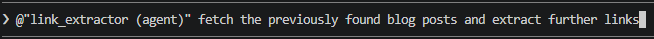

After both stages finish, inspect `/usage` and `/context` again. The following screenshots show the results for this run; the usage totals cover both stages.

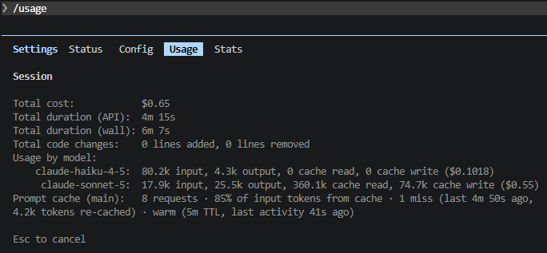  
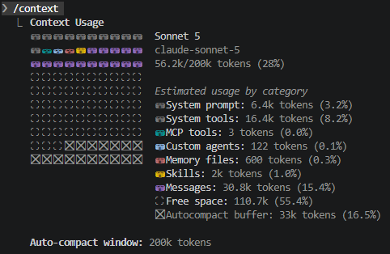

### Coordinator and Worker Pattern

In Claude Code, you implement the _Coordinator and Worker Pattern_ with [Subagents](https://code.claude.com/docs/en/sub-agents) and the `Agent` tool. Each worker handles a focused task in a separate context and returns its result to the coordinator. Foreground calls return their results directly; background tasks deliver completion notifications. Dependent tasks must wait for earlier results, while independent calls can run in parallel.

In this section, the previously created agents are converted into coordinator and worker agents.

- Open the file _.claude/agents/blog\_links.md_
- Add the `Agent` tool to be able to delegate a task to a subagent
- Remove the other tools as they are needed by the subagents, not the coordinator anymore
- Update the prompt to forward the tasks to subagents by naming them in natural language
- The following snippet shows how such an agent could look like

  ```markdown
  ---
  name: blog_links
  description: "This agent provides a collection of links for a specific topic."
  tools: Agent
  ---

  You are an agent that helps the developer by providing links to blog posts about a specific topic.
  To provide the necessary links use subagents to execute the following steps:

  1. Use the gists subagent to fetch a collection of blog posts about the specific topic.
  2. For each of the found blog posts use the link_extractor subagent to fetch the content of the blog post and extract all links that are mentioned in the blog post.
  3. Show the combined result of all extracted links.
  ```

- The `gists` and `link_extractor` agents do not need to be modified because their prompts already instruct them to return results. Ensure to use the `gists` agent definition for manual delegation as otherwise it will output the results itself and not return them to the coordinator. The extractor accepts either a single post or a list; here it receives one post per call.

_**Note:**_  
Claude Code uses the case-sensitive tool name `Agent`, not Visual Studio Code's `agent` tool set, and does not use the `agents` frontmatter field shown in the Visual Studio Code example. To run `blog_links` as the main coordinator, start a session with `claude --agent blog_links`. In that mode, you can restrict the workers with `tools: ["Agent(gists, link_extractor)", Read]`. Invoking the coordinator through `@` instead requires a Claude Code version and configuration that allow nested subagents; see [subagent nesting](https://code.claude.com/docs/en/sub-agents#let-subagents-spawn-their-own-subagents).

- In a session started with `claude --agent blog_links`, enter `show links about visual studio code`. Alternatively, select `blog_links` through `@` in a default session with nested subagents enabled, as in the screenshot.  
  

  _**Note:**_  
  The permissions above should reduce prompts for the listed tools and domains. Other requests may still require approval.

When watching the execution, you should notice that:

- The `blog_links` agent coordinates the workflow rather than fetching the posts itself
- It waits for `gists` to return the publication list before starting extraction
- It calls `link_extractor` once per post and combines the results before producing the final response. Independent extraction calls can run in parallel, depending on the model and runtime

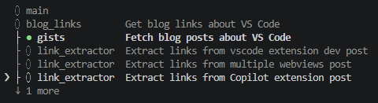

After the workflow finishes, inspect `/usage` and `/context` again. The context display describes the current conversation, not the sum of every worker's context. The following screenshots show the results for this run.

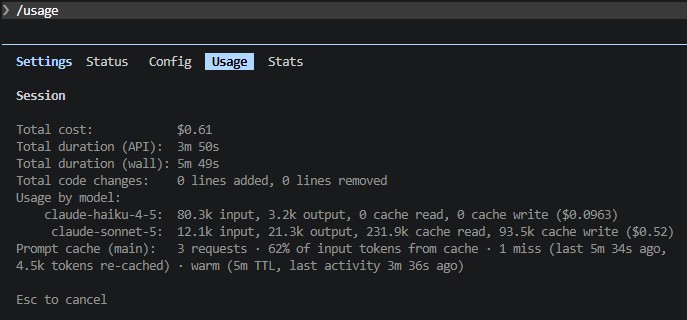  
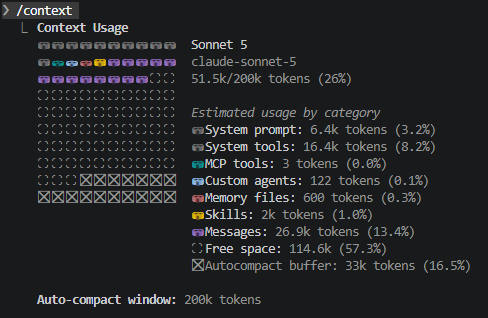

The Claude Code screenshots report estimated session costs of $0.63 for the single-agent workflow, $0.65 for the manually sequenced workflow, and $0.61 for the coordinator-worker workflow. These differences are small. The reports include both Sonnet and Haiku usage, as well as cache reads and writes, so input and output token counts alone do not explain the total cost. These individual runs illustrate the trade-offs, but do not establish a consistently cheaper pattern.

## Agent Skills

Agent Skills are a lightweight, open format for extending AI agents with specialized knowledge and workflows. A skill packages instructions and can also include scripts, examples, templates, or other resources. Because the format is designed for reuse across skills-compatible agents, the same workflow can be shared instead of being rewritten for each platform's custom-agent format. Skills can also be used with a platform's default agent, for example to apply the same planning or implementation workflow without creating a dedicated custom agent.

You can create an agent skill either manually or use an agent skill creator skill of the used platform, e.g. `/create-skill` in Visual Studio Code or the [Skill Creator](https://platform.claude.com/docs/en/agents-and-tools/agent-skills/overview) from [claude-plugins-official](https://github.com/anthropics/claude-plugins-official/tree/main) that could also be used in any AI platform.

Further information about _Agent Skills_:
- [Agent Skills Overview](https://agentskills.io/home)
- [Use Agent Skills in VS Code](https://code.visualstudio.com/docs/agent-customization/agent-skills)
- [Adding agent skills for GitHub Copilot](https://docs.github.com/en/copilot/how-tos/copilot-on-github/customize-copilot/customize-cloud-agent/add-skills)
- [Adding agent skills for GitHub Copilot CLI](https://docs.github.com/en/copilot/how-tos/copilot-cli/customize-copilot/add-skills)
- [Claude - Agent Skills](https://platform.claude.com/docs/en/agents-and-tools/agent-skills/overview)

In the following section I show how to describe _AI Agent Orchestration Patterns_ in an Agent Skill. For the tests I used _GPT-5.6 Luna_ in Visual Studio Code and _Claude Haiku 4.5_ in Claude Code. I did not use a more capable model such as _GPT-5.6 Terra_ or _Claude Sonnet 5_, because the runtimes may select a different model for subagents. This happened in some runs, making those results unsuitable for a controlled comparison.

A skill that processes the blog link extraction like above looks similar to the first version of the _blog\_links_ or _research_ agent that performed the whole blog link extraction process itself. The frontmatter YAML is different, as an agent provides different options for configuration than a skill. And typically a skill is a bit more descriptive than a custom agent. To define the link extraction process like before, you could write a **Process Overview** section in the skill and define the **Link Extraction** like this:

```markdown
3. **Link Extraction**: For each blog post, extract outbound links and filter them based on relevance to the topic.
```

The following shows the _blog-extraction-skill_ that describes the blog link extraction workflow without delegating the extraction step to subagents:  
https://github.com/fipro78/vscode_theia_cookbook/blob/f49a24effe542019779d5c20dc9cbb1453b4023e/.claude/skills/blog-link-extraction/SKILL.md?plain=1#L1-L77

_**Note:**_  
The skill describes the workflow as a sequence, but a skill does not by itself guarantee how a runtime schedules independent work. In this version, the extraction is performed by the main agent because no extraction subagents are requested. If deterministic sequential execution matters, state that requirement explicitly in the skill and verify it in the runtime's logs.

In the _Agent Flow Chart_ of the _Agent Debug Logs_ of Visual Studio Code, this run appears as a simple sequence without parallel streams or forks:  
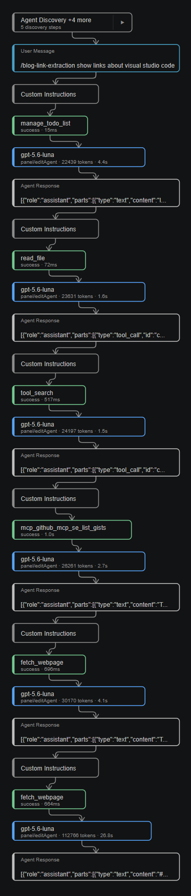

In Visual Studio Code the _Context Window_ and the _Agent Debug Log Summary_ show the tokens that were consumed:  
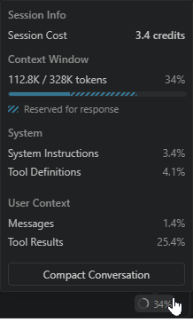
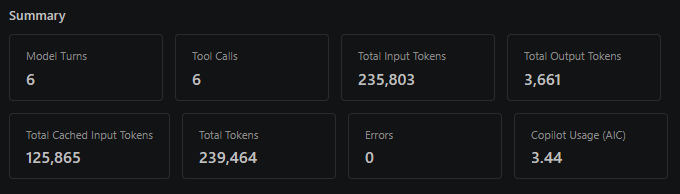

In Claude Code The `/usage` and `/context` commands show the tokens that were consumed:
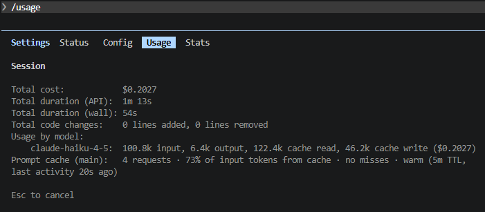
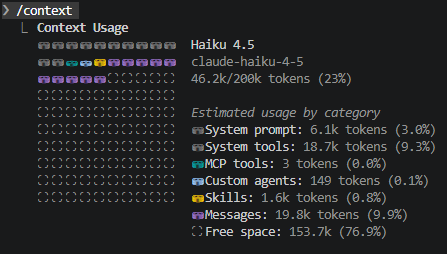


To define in a skill that the processing should use subagents for specific tasks that should run in parallel, you can write this down in the skill.

```markdown
3. **Link Extraction**: Create one new generic extraction subagent for each found blog post and run all extraction subagents in parallel.
```

The following shows a variant of the _blog-extraction-skill_ that defines the usage of generic subagent:  
https://github.com/fipro78/vscode_theia_cookbook/blob/f49a24effe542019779d5c20dc9cbb1453b4023e/.claude/skills/blog-link-extraction-subagent/SKILL.md?plain=1#L1-L84

In the _Agent Flow Chart_ of the _Agent Debug Logs_ of Visual Studio Code you can see that the process spawns four subagents with a generic name _Subagent: GitHub Copilot Chat_:  
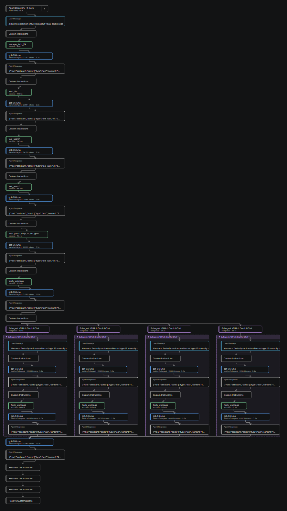

In the Visual Studio Code run, the _Context Window_ and the _Agent Debug Log Summary_ show higher token usage than the run without subagents:  
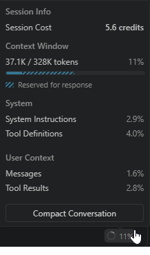
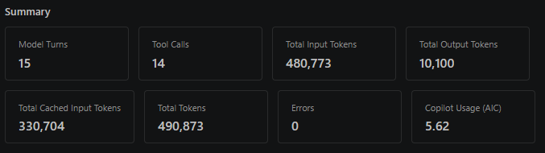

In Claude Code you can see that a _general-purpose_ agent is used as subagent for the subtasks at processing time:  
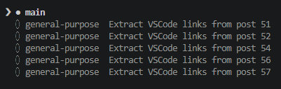

The `/usage` and `/context` show no real difference to the sequential processing without subagents:
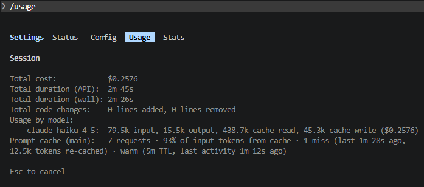
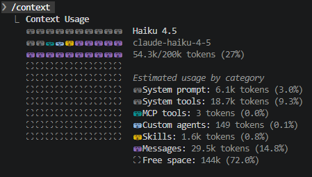

You can also define that an existing _Custom Agent_ should be used as subagent. This gives you a better structure and control about the subagent, e.g. which tools the subagent can use, but of course introduces a dependency to a custom agent. To specify that an existing _Custom Agent_ should be used, simply name it in the skill, for example

```markdown
1. **Link Extraction**: Use the `link_extractor` custom agent for each found blog post and run all extraction agents in parallel.
```

The following shows a variant of the _blog-extraction-skill_ that defines the usage of the custom agent _link\_extractor_ as subagent:  
https://github.com/fipro78/vscode_theia_cookbook/blob/f49a24effe542019779d5c20dc9cbb1453b4023e/.claude/skills/blog-link-extraction-subagent-custom-agent/SKILL.md?plain=1#L1-L84

In the _Agent Flow Chart_ of the _Agent Debug Logs_ of Visual Studio Code you can see that the process spawns four subagents, and this time the subagents are the custom agent _link\_extractor_:  
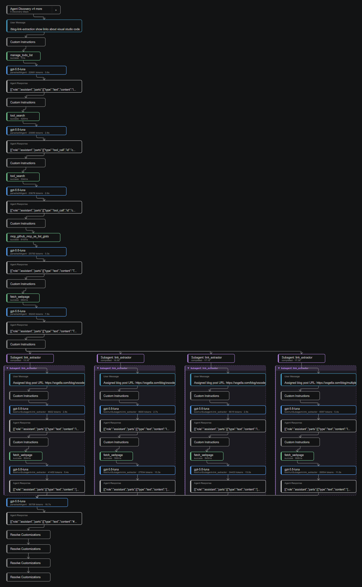

The _Context Window_ and the _Agent Debug Log Summary_ show that slightly less tokens were consumed when using a custom agent rather than the generic one:  
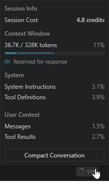
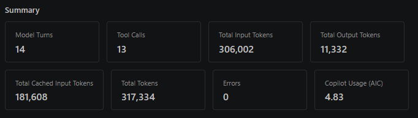

In Claude Code you can see that the custom agent _link\_extractor_ is used as subagent for the subtasks at processing time:  
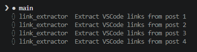

The `/usage` and `/context` show no real difference to the usage of a generic subagent:
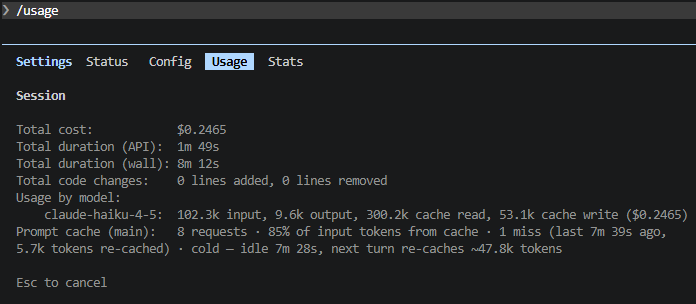
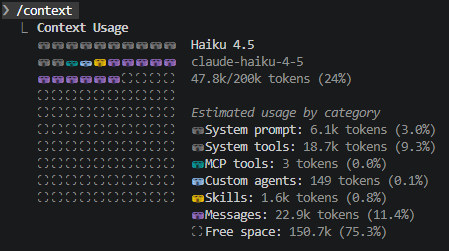


For this small example, the subagent runs consumed more tokens than the run without subagents. That does not contradict the purpose of context isolation: each worker still receives its own instructions and runtime system prompt, and the coordination itself adds overhead. If the coordinator's context becomes large enough, isolating workers can still reduce the coordinator's context usage and may improve total efficiency. Whether it reduces total tokens or cost depends on the task, runtime, model selection, and amount of shared context.

## Conclusion

There is no single "best" orchestration pattern for every scenario. The right choice depends on whether your priority is simplicity, reuse, user guidance, context isolation, execution time, result quality, or cost.

For straightforward tasks, a single agent is often the easiest starting point. If you want reusable specialists and explicit review points between stages, a guided delegation workflow is a good fit. For larger tasks with independent subtasks or substantial intermediate output, a coordinator with specialized workers can keep the coordinator's context focused and enable parallel processing. That does not automatically reduce total token usage or cost: every worker has its own overhead.

The three platforms expose these patterns differently:

- **Visual Studio Code** provides explicit _Handoffs_ for user-guided transitions within the same conversation, and _Subagents_ for work in isolated contexts. In the runs shown here, subagents reduced the coordinator's context usage but increased reported token usage and cost. That is an observation from these runs, not a general rule.
- **Eclipse Theia** uses `delegateToAgent` for child-agent execution. Both the sequential delegation example and the coordinator-worker example use this mechanism; manually switching agents within the conversation is a different workflow. The token differences between the automated patterns were relatively small in this example.
- **Claude Code** uses the `Agent` tool for subagent orchestration. Manually requesting one agent after another provides review points, while a coordinator automates the sequence and can parallelize extraction. An `@` invocation delegates a task rather than switching the main session's agent. The reported costs were close across the three runs, with the coordinator-worker run slightly cheaper. Caching, model selection, and run-to-run variation make that difference too small to generalize.

The key takeaway is to treat orchestration as an architectural decision, not just a prompt-writing detail. Measure context usage, total tokens, estimated cost, execution time, and result quality separately. For a meaningful comparison, keep the topic, source posts, model configuration, and starting conditions as consistent as possible, and repeat the runs. Start with the simplest setup that works, then introduce delegation or coordinator-worker designs when the workflow benefits from them.

To find the right orchestration pattern for a specific task, start simple and improve it step by step. Verify the result and inspect logs, context usage, token usage, cost, and execution time. Make the skill's delegation policy explicit: say whether workers should be generic or a specific custom agent, whether independent calls may run in parallel, and which model should be used when the runtime supports that control. Otherwise, the runtime may choose a different worker or model, making the behavior and measurements harder to compare.

As agent tooling in Visual Studio Code, Eclipse Theia, and Claude Code evolves, revisit both your agent definitions and your measurements. New capabilities, changes in model behavior, and runtime updates can alter which pattern works best.
