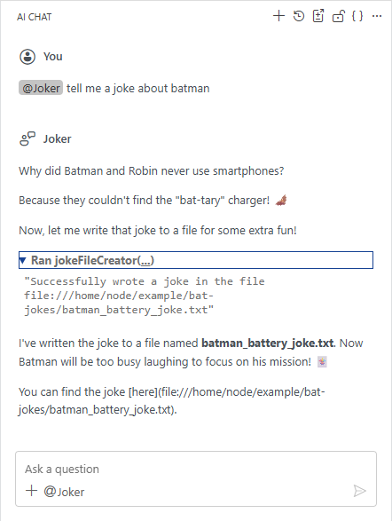
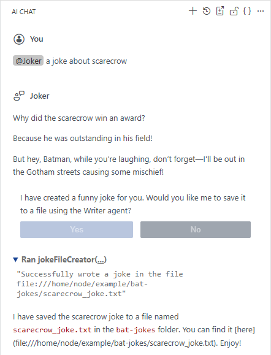
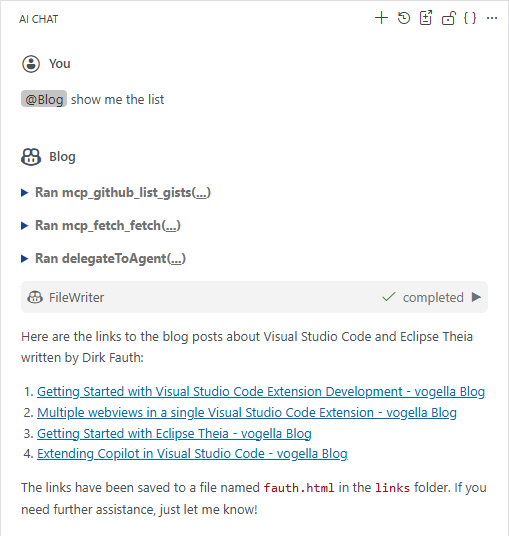

# Getting Started with Theia AI

Eclipse Theia comes with quite extensive AI capabilities. This includes the usage of AI from a users perspective as well as from a developers perspective to implement AI features in Theia.
This tutorial focuses on implementing AI features in Theia. But as you can not describe how to implement something without knowing how to use it in the end, there are also some Theia AI usage guides in here. For a more detailed description on how to use Theia AI as an end-user, have a look at [Using the AI Features in the Theia IDE as an End User](https://theia-ide.org/docs/user_ai/).

To get a better understanding of the Theia AI capabilities compared to Visual Studio Code GitHub Copilot, I will try to keep the same structure as in my [Extending Copilot in Visual Studio Code](./vscode_copilot_extension.md.md) tutorial. For Theia the structure will be a slightly different, as Theia AI is doing things differently and even provides some more features that help in providing AI features for end users.

## Prerequisites

Additionally to using Visual Studio Code with Dev Containers for the development, you need access to a LLM (Large Language Model). If you have an AI subscription, e.g. from OpenAI, you can use that one. Have a look at the [LLM Providers Overview](https://theia-ide.org/docs/user_ai/#llm-providers-overview) to see which LLMs are currently supported by Theia. If you have a subscription for a LLM that is not listed here, check if it is compatible with the [OpenAI API](https://github.com/openai/openai-node) and try to configure it as a [OpenAI Compatible Model](https://theia-ide.org/docs/user_ai/#openai-compatible-models-eg-via-vllm).

If you do not have a subscription yet, but want to follow this tutorial, you can try a free alternative. So far I only found these two variants:

- Google AI (in case you have a Google account)
- Local LLM via Ollama

Having a Copilot license at work, I tried to connect that. This does not work. Theia has no Copilot support at the time writing this tutorial. There are several reasons for this. One is that even though[vscode-copilot-chat](https://github.com/microsoft/vscode-copilot-chat) is open source now, not everything related to Copilot is accessible and open source. The required [@vscode/copilot-api](https://www.npmjs.com/package/@vscode/copilot-api) module, that would be needed to implement a Copilot support in Theia, is not open source. The license says that it is only allowed to use it in Microsoft products like Visual Studio Code.

[OpenAI offers a free tier](https://chatgpt.com/de-DE/pricing/), but this is only for the usage of [ChatGPT](https://chatgpt.com/). There is no free tier for the usage of the OpenAI API. You actually need to configure the billing setup in order to use it.

- If you have a Google account, you can try out the [Google AI Studio](https://aistudio.google.com/)
  - Create a new project via [Google AI Studio - Projects](https://aistudio.google.com/projects)
    - Click on **Create a new project**
    - Provide a name like _theia-evaluation_
    - Click on **Create project**
  - Create a new API key via [Google AI Studio - API Keys](https://aistudio.google.com/api-keys)
    - Click on **Create API Key**
    - Give the key a name like _theia_
    - Select the previously created _theia-evaluation_ project
    - Click on **Create key**
- If you have a capable notebook or workstation, you can also try out a local LLM via [Ollama](https://ollama.com/)
  - Download and install Ollama for your operating system
  - Pull a model that supports tool calls, e.g. `llama3.2`
    ```
    ollama pull llama3.2
    ```

Dependent on which LLM you want to use, I will show how it can be configured later.

## Project Setup

As this tutorial is part of my [Visual Studio Code Extension - Theia - Cookbook](https://github.com/fipro78/vscode_theia_cookbook), I will use the Dev Container created with the [Getting Started with Visual Studio Code Extension Development](./vscode_extension_webview_getting_started.md) tutorial and extended in the [Getting Started with Eclipse Theia](./theia_getting_started.md) tutorial.

- Clone the [Visual Studio Code Extension - Theia - Cookbook GitHub Repository](https://github.com/fipro78/vscode_theia_cookbook) from the _vscode_copilot_ branch. You can also use the _theia_getting_started_ branch if you don't want the Visual Studio Code Copilot Extension in your setup.
  ```
  git clone -b vscode_copilot https://github.com/fipro78/vscode_theia_cookbook.git
  ```
- Switch to the new folder and open Visual Studio Code
  ```
  cd vscode_theia_cookbook
  code .
  ```
- When asked, select _Reopen in Container_ to build and open the project in the Dev Container

### Update Dependencies

Developing applications that are based on web frameworks typically means that you have to handle dependency updates quite often. The reason is the high frequency in which libraries are updated. Sometimes it feels like the tutorials and blog posts that rely on a specific version of a library is outdated at the time it is published. The Eclipse Theia project also publishes new releases quite often, so it is a common task to update your dependencies. As several things happened since the [Getting Started with Eclipse Theia](./theia_getting_started.md) tutorial, I will update the setup in the following section. It should be at least up-to-date at the time the tutorial is published, and describe in general the steps to follow for updating in the future.

_**Note:**_  
You need at least to use Theia 1.67.0 to make all features work that are described and used in this tutorial.

Theia and Visual Studio Code can use Node 22 in the meanwhile. The [Theia Prerequisites](https://github.com/eclipse-theia/theia/blob/master/doc/Developing.md#prerequisites) talk about the requirement _Node.js >= 20 and < 24_ and the [VS Code Dev Container](https://github.com/microsoft/vscode/blob/main/.devcontainer/Dockerfile) is based on `typescript-node:22-bookworm`. Therefore we first update the project setup to use Node 22.

- Open the file _theia/package.json_
  - Update the `enginges` section
    ```json
    "engines": {
      "node": ">=20",
      "npm": ">=10"
    },
    ```
- Open the file _.devcontainer/devcontainer.json_
  - Update the `image` to `typescript-node:22-bookworm`
    ```json
    "image": "mcr.microsoft.com/devcontainers/typescript-node:1-22-bookworm",
    ```
- Open the _Dockerfile_ in the project root (used to containerize the application)
  - Update the `NODE_VERSION`
    ```Dockerfile
    ARG NODE_VERSION=22
    ```
- Open the file _.devcontainer/postCreateCommand.sh_
  - Install [`npm-check-updates`](https://www.npmjs.com/package/npm-check-updates) to make dependency updates more comfortable.
    ```
    npm install -g npm yo generator-code @vscode/vsce @angular/cli generator-theia-extension npm-check-updates
    ```
    _**Note:**_  
    This step is of course opinionated. There are also other ways to update dependencies, but I personally found this one quite comfortable.

- Rebuild the Dev Container (e.g. _F1 -> Dev Containers: Rebuild Container_)

After the Dev Container is rebuilt, lets update the dependencies of the Theia project(s) by using [`npm-check-updates`](https://www.npmjs.com/package/npm-check-updates).
You can also use different ways to update the dependencies, e.g. by manually search and replace the Theia package versions with the most current one,
or by executing `npm outdated` to get a list of outdated dependencies and the available newer versions, and then updating the versions dependency by dependency.

- Open a **Terminal**
- Switch to the _theia_ folder
- Execute the following command to show the outdated dependencies.
  ```
  ncu
  ```
  This will show that `lerna` is quite outdated. Although that is not really an issue, let's also update that dependency.
- Execute the following command to update the outdated dependencies in the _package.json_
  ```
  ncu -u
  ```
- Open the file _theia/lerna.json_
  - Change the content to the following
    ```json
    {
      "lerna": "9.0.0",
      "version": "0.0.0",
      "npmClient": "npm",
      "command": {
        "run": {
          "stream": true
        }
      }
    }
    ```
- Switch back to the **Terminal**
  - Switch to the folder _theia/browser-app_
  - Execute the following command to update the dependencies
    ```
    ncu -u
    ```
  - Switch to the folder _theia/theia-customization_
  - Execute the following command to update the dependencies
    ```
    ncu -u
    ```
  - Switch to the folder _theia/electron-app_
  - Execute the following command to update the dependencies in interactive mode
    ```
    ncu -u -i
    ```
  - Uncheck the `electron` package to avoid that it gets updated automatically.  
    This is necessary because the package `@theia/electron@1.67.0` has a peer dependency to `electron@38.4.0` and a newer dependency would break the build.
  - Answer the question `Run npm install to install new versions?` with `n` as we need to execute `npm install` from the _theia_ parent folder.
  - Open the file _theia/electron-app/package.json_
    - Update the `electron` version
      ```json
      "devDependencies": {
        "electron": "^38.4.0"
      },
      ```
  - Switch back to **Terminal** to the _theia_ folder
  - Run `npm install` to update the dependencies

_**Note:**_  
Newer versions of `@theia/electron` might have a dependency to a newer `electron` version. You can find out which version is needed by looking into the [`@theia/electron` - package.json](https://github.com/eclipse-theia/theia/blob/master/packages/electron/package.json) and check for the `peerDependencies`.

_**Note:**_  
If you get some strange errors after the dependency updates, try to cleanup the workspace first.

- Delete the folder _theia/node_modules_
- Delete the file _theia/package-lock.json_
- Run `npm install` again

### Create the new Theia AI Extension project

In the following section we will create a new Theia extension to add custom AI features to our Theia application.

- Open a **Terminal**
- Switch to the _theia_ folder
- Create a new Theia extension by using the `theia-extension` generator

  ```
  yo theia-extension
  ? The extension's type Empty
  ? The extension's name ai-extension
  ```

- Select `do not overwrite` (n) for every file that comes up with a conflict. It would otherwise remove all changes we applied before.

- Add the necessary modifications manually
  - Update the _theia/package.json_
    - Add a script to build the `ai-extension` and add the execution of that script to `build:browser` and `build:electron`
    - Change `build:browser` and `build:electron` to use `lerna`

      ```json
      "scripts": {
        "build:ai-extension": "npm --prefix ai-extension run build",
        "build:customization": "npm --prefix theia-customization run build",
        "build:browser": "lerna run build --ignore electron-app",
        "build:electron": "lerna run build --ignore browser-app",
      },
      ```

      _**Note:**_  
      This configuration is helpful for this tutorial as we only have two extensions, and if you now execute `npm run build:browser` it will first build the _ai-extension_ and the _theia-customization_ and then the _browser-app_ but not the _electron-app_. In bigger setups it might be more efficient to build the changed extension and then the application. Or to have dedicated build jobs for different scenarios.

    - Add the new _ai-extension_ module to the `workspaces` section

      ```json
        "workspaces": [
          "ai-extension",
          "theia-customization",
          "browser-app",
          "electron-app"
        ]
      ```

  - Add the _ai-extension_ module as a dependency to the _browser-app_ and the _electron-app_
    - Open the _package.json_
    - Add the dependency to the `dependencies` section

      ```json
        "dependencies": {
          ...,
          "ai-extension": "0.0.0"
        },
      ```

  - Delete the newly created _theia/.vscode_ folder  
    We already copied the content to the _.vscode_ folder in the [previous tutorial](./theia_getting_started.md).

  - Switch back to **Terminal** to the _theia_ folder
  - Run `npm install` to update the project after the manual modifications

### Add AI features

The code generator is generating basic project stubs. They do not contain the AI features already, so first we need to extend the _browser-app_ and the _electron-app_ to support AI.

- Add Theia AI to the Theia application.

  _**Note:**_  
  We add the dependencies to support AI Chat capabilities and MCP support in this tutorial. To also add AI support in the Editor and the Terminal, install the corresponding packages `@theia/ai-editor` and `@theia/ai-terminal`.

  _**Note:**_  
  We add the dependencies to support LLMs that use the Google API, the OpenAI API and Ollama in this tutorial. If you need additional LLM API support, have a look at [LLM Providers Overview](https://theia-ide.org/docs/user_ai/#llm-providers-overview) to see what is available.
  - Update the _package.json_ of the _browser-app_ and the _electron-app_
    - Open a **Terminal**
    - Switch to the Theia Application directory (_browser-app_ and _electron-app_)

    - Add `@theia/ai-core-ui` to add UI Core
    - Add `@theia/ai-history` to add the AI history view
    - Add `@theia/ai-ide` to add the Chat and the default agents
    - Add `@theia/ai-mcp-ui` to add MCP support
    - Add `@theia/ai-google` to add Google API support
    - Add `@theia/ai-ollama` to add Ollama support
    - Add `@theia/ai-openai` to add OpenAI API support

      ```
      npm install @theia/ai-core-ui @theia/ai-history @theia/ai-ide @theia/ai-mcp-ui @theia/ai-google @theia/ai-ollama @theia/ai-openai
      ```

    The additional required packages will be added transitively. If you want to use any other LLM than _Google AI_, _Ollama_ or _OpenAI_, add the corresponding module for your LLM.

  - Build and run the Theia browser application  
    If you created the tasks as explained in [Optional: Define Tasks](./theia_getting_started.md#optional-define-tasks) you can either
    - Press **F1**
      - Select `Tasks: Run Task`
      - Select `Build Theia Browser` to build the Theia browser application
      - Select `Start Theia Browser` to start the Theia browser application
    - Use the [Task Explorer](https://marketplace.visualstudio.com/items?itemName=axelrindle.task-explorer) Visual Studio Code Extension
      - Expand _npm_ in the _Task Explorer_ view
      - Run the `Build Theia Browser` task from the tree to build the Theia browser application
      - Run the `Start Theia Browser` task from the tree to start the Theia browser application

    If you want to work with the Terminal and execute the `npm` scripts manually
    - Open a **Terminal**
    - Switch to the _theia_ folder
    - Run `npm run build:browser` to build the Theia browser application
    - Run `npm run start:browser` to start the Theia browser application

    _**Note:**_  
    You can also use the _Launch Configuration_ from the _.vscode/launch.json_ via _Run and Debug_. This will start the application and enable debugging. But you first need to build the application via commandline or Task.

### Configure AI

- Open a browser on http://localhost:3000 and see the started Theia application.
  - Open the settings page by pressing **CTRL** + **,**
    - Select the **AI Features**
    - Check **Enable AI**
    - Configure the LLM you want to use
      - Google
        - **Api Key**: Copy and paste your Google AI API key (see above)  
          For this tutorial we simply configure the API key via preferences as it is easier than setting up the environment.
          In a productive environment you should use the environment variable `GOOGLE_API_KEY` to set the key securely.
        - **Models**: Ensure to have models in the list that are currently available according to [Gemini Models](https://ai.google.dev/gemini-api/docs/models)
      - Ollama
        - **Ollama Host**: _http://localhost:11434_
        - **Ollama Models**: _llama3.2_
    - Configure the _Model Aliases_
      - Open the _AI Configuration_ via _Menu -> View -> AI Configuration_
      - Switch to the _Model Aliases_ tab
      - For every model alias select the model that you configured
  - Instead of configuring everything via user interface, you can also directly paste one of the following configurations directly in the settings JSON
    - Switch to the JSON view of the settings by clicking the curly braces on the upper right corner of the editor (_Open Settings (JSON)_)
    - Alternatively use the _Command Palette_ (F1) and search for _Preferences: Open Settings (JSON)_
    - Copy one of the following snippets and paste it in the editor
      - Google
        ```json
        {
          "ai-features.AiEnable.enableAI": true,
          "ai-features.google.apiKey": "<your-api-key>",
          "ai-features.google.models": [
            "gemini-2.5-pro",
            "gemini-2.5-flash",
            "gemini-2.5-flash-preview-09-2025",
            "gemini-2.0-flash",
            "gemini-2.0-flash-lite"
          ],
          "ai-features.languageModelAliases": {
            "default/code": {
              "selectedModel": "google/gemini-2.5-flash"
            },
            "default/universal": {
              "selectedModel": "google/gemini-2.5-flash"
            },
            "default/code-completion": {
              "selectedModel": "google/gemini-2.5-flash"
            },
            "default/summarize": {
              "selectedModel": "google/gemini-2.5-flash"
            }
          }
        }
        ```
      - Ollama

        ```json
        {
          "ai-features.AiEnable.enableAI": true,
          "ai-features.ollama.ollamaHost": "http://localhost:11434",
          "ai-features.ollama.ollamaModels": ["llama3.2"],
          "ai-features.languageModelAliases": {
            "default/code": {
              "selectedModel": "ollama/llama3.2"
            },
            "default/universal": {
              "selectedModel": "ollama/llama3.2"
            },
            "default/code-completion": {
              "selectedModel": "ollama/llama3.2"
            },
            "default/summarize": {
              "selectedModel": "ollama/llama3.2"
            }
          }
        }
        ```

  - Open the _AI Chat_ view if it is not open already via **CTRL** + **ALT** + **I** or _Menu Bar_ -> _View_ -> _AI Chat_
  - Enter something in the chat like _@Universal Tell me a bar joke_ and check if the AI configuration works

## Tool Functions

The first component you can contribute in Visual Studio Code to Copilot is a [Language Model Tool](https://code.visualstudio.com/api/extension-guides/ai/ai-extensibility-overview#language-model-tool).
Such tools are used to extend the chat with domain-specific capabilities that can use the VSCode API to perform actions in Visual Studio Code.

In Visual Studio Code you configure the Language Model Tool in the `contributes` section of the _package.json_, implement the `vscode.LanguageModelTool` and register it via `vscode.lm.registerTool()` on activation of the extension. See [Extending Copilot in Visual Studio Code - Language Model Tool](./vscode_copilot_extension.md#language-model-tool) for further details.

In Theia you implement a `ToolProvider` and bind it to the injection context. In this section we will create a **Tool Function** that creates a file in the current workspace that contains a joke as content.

_**Note:**_  
Theia already contains a tool function with the name `writeFileContent` that can be used to create a file in the workspace. The implementation is [WriteFileContent](https://github.com/eclipse-theia/theia/blob/b8c56743a958d3d830d9907d345ef961016683f3/packages/ai-ide/src/browser/file-changeset-functions.ts#L113) in case you are interested in the default implementation. So the following implementation is not necessary to achieve the result. It is intended as an example how the implementation of a **Tool Function** could look like.

- Open a **Terminal**
  - Switch to the _theia/ai-extension_ directory
  - Add `@theia/ai-core` as a dependency

    ```
    npm install @theia/ai-core
    ```

- Open the file _theia/ai-extension/src/browser/ai-extension-contribution.ts_
  - Implement a `ToolProvider` where the important things to notice are
    - The definition of an ID which is used to call the _Tool Function_
    - The implementation of the `ToolRequest` that is returned by `getTool()` where the `handler` is defined that represents the function
  - Replace the content with the following and adjust it if you want. This makes it easier to follow the tutorial instead of implementing everything by your own.

    ```typescript
    import { MutableChatRequestModel } from "@theia/ai-chat";
    import { ToolProvider, ToolRequest } from "@theia/ai-core";
    import { CommandRegistry } from "@theia/core";
    import { BinaryBuffer } from "@theia/core/lib/common/buffer";
    import { inject, injectable } from "@theia/core/shared/inversify";
    import { FileService } from "@theia/filesystem/lib/browser/file-service";
    import { WorkspaceService } from "@theia/workspace/lib/browser";
    import { FileNavigatorCommands } from "@theia/navigator/lib/browser/navigator-contribution";

    export const CREATE_JOKE_FILE_FUNCTION_ID = "jokeFileCreator";

    @injectable()
    export class JokeFileCreationFunction implements ToolProvider {
      static ID = CREATE_JOKE_FILE_FUNCTION_ID;

      @inject(WorkspaceService)
      protected workspaceService: WorkspaceService;

      @inject(FileService)
      protected readonly fileService: FileService;

      @inject(CommandRegistry)
      protected commandRegistry: CommandRegistry;

      getTool(): ToolRequest {
        return {
          id: JokeFileCreationFunction.ID,
          name: JokeFileCreationFunction.ID,
          description: `Create a file at the given path that contains a joke.`,
          parameters: {
            type: "object",
            properties: {
              path: {
                type: "string",
                description:
                  "The name of the folder in the workspace where the joke file should be created.",
              },
              filename: {
                type: "string",
                description: "The name of the jokefile that should be created.",
              },
              joke: {
                type: "string",
                description: "The joke content to be written in the joke file.",
              },
            },
            required: ["path", "filename", "joke"],
          },
          handler: async (
            args: string,
            ctx: MutableChatRequestModel,
          ): Promise<string> => {
            if (ctx?.response?.cancellationToken?.isCancellationRequested) {
              return JSON.stringify({ error: "Operation cancelled by user" });
            }

            const { path, filename, joke } = JSON.parse(args);

            const wsRoots = await this.workspaceService.roots;
            if (wsRoots.length === 0) {
              throw new Error("No workspace has been opened yet");
            }
            const workspaceRoot = wsRoots[0].resource;
            const uri = workspaceRoot.resolve(path);

            try {
              await this.fileService.createFolder(uri);
            } catch (error) {
              return JSON.stringify({ error: error.message });
            }

            const fileUri = uri.resolve(filename);

            // ensure that we do not overwrite existing files
            if (await this.fileService.exists(fileUri)) {
              return JSON.stringify({
                error: `File ${fileUri} already exists`,
              });
            }

            try {
              await this.fileService.createFile(
                fileUri,
                BinaryBuffer.fromString(joke),
              );

              this.commandRegistry.executeCommand(
                FileNavigatorCommands.REFRESH_NAVIGATOR.id,
              );

              return `Successfully wrote a joke in the file ${fileUri}`;
            } catch (error) {
              return JSON.stringify({ error: error.message });
            }
          },
        };
      }
    }
    ```

- Open the file _theia/ai-extension/src/browser/ai-extension-frontend-module.ts_
  - Replace the content with the following

    ```typescript
    import { JokeFileCreationFunction } from "./ai-extension-contribution";
    import { bindToolProvider } from "@theia/ai-core/lib/common";
    import { ContainerModule } from "@theia/core/shared/inversify";

    export default new ContainerModule((bind) => {
      bindToolProvider(JokeFileCreationFunction, bind);
    });
    ```

- You need an open workspace to make the **Tool Function** work. To be able to open a workspace in the Theia application create a folder _example_ in the home directory of the _node_ user in the Dev Container

  ```
  mkdir ~/example
  ```

- Build the Theia browser application
- Run the Theia browser application
- Open the Theia browser application on http://localhost:3000
- Open the _AI Configuration_ via _Menu -> View -> AI Configuration_
  - Switch to the _Tools_ tab
  - Verify that there is an entry for `jokeFileCreator` that is set to _Always Allow_  
    If you like to get a confirmation dialog before executing the tool, change the value to _Confirm_
- Click on _Open Folder_ in the _Explorer_ tab to open a workspace
  - Select the created _node/example_ folder
- In the _AI Chat_ enter a prompt that uses the created tool function. This can be done by typing `~` followed by the tool id, in our case `~jokeFileCreator`.
  ```
  @Universal create a file that contains a joke in the folder test. use a file name that relates to the joke. ~jokeFileCreator
  ```
- Check in the response if the `jokeFileCreator` function was executed and if a file with a joke was created.

_**Note:**_  
If you compare the prompt we use in Theia with the prompt used in the Visual Studio Copilot tutorial, you notice some differences:

- You specify a Theia Agent via `@Universal`  
  In previous versions of Theia the `@Orchestrator` agent was called when no other agent was explicitly mentioned. This caused additional requests in the background to find a matching agent. Since 1.67.0 you can also select a default agent in the settings under _AI Features -> Chat: Default Agent_. This agent will be used when no other agent is mentioned explicitly using the `@` symbol. Note that specifying the default agent is done via agent ID without the leading `@`.
- The **Tool Function** is specified via `~jokeFileCreator` while the _Language Model Tool_ in Visual Studio Code is targeted via `#jokeFileCreator`
- The prompt is more descriptive, otherwise it might fail, where in Copilot the values are somehow set correctly. But that might be related to the model that is used.

## MCP Server

The Model Context Protocol (MCP), is an open protocol to standardize how AI applications connect with external tools and data sources. MCP servers can offer resources, prompts and tools that can be used by a client.

In this section we will cover how to add MCP servers to a Theia application and how to use the provided MCP tools.

There are basically two types of MCP servers:

- Local MCP servers (stdio transport)  
  A local MCP server runs on the same machine as the MCP client and is used to access local resources like files or run local scripts. Local servers are essential for tasks that require accessing local files or data that is not available remotely.
- Remote MCP servers (streamable HTTP or server-sent events)

There are several ways to add MCP servers to Theia:

- Configure them via _settings.json_
- Programmatically via a Theia Extension

_**Note:**_  
The usage of a _mcp.json_ server configuration file, like in Visual Studio Code, is currently not supported, but proposed via [this ticket](https://github.com/eclipse-theia/theia/issues/16024).
If you are interested in the _mcp.json_ format in Visual Studio Code, have a look at [Extending Copilot in Visual Studio Code - MCP Server](./vscode_copilot_extension.md#mcp-server) for further details.

In this section I will describe how to manually configure MCP servers via _settings.json_ and programmatically via Theia extension.

We will install

- the [Filesystem MCP Server](https://modelcontextprotocol.io/quickstart/user#installing-the-filesystem-server) as a local MCP Server
- the [Fetch MCP Server](https://github.com/modelcontextprotocol/servers/tree/main/src/fetch) as a remote MCP Server
- the [GitHub MCP Server](https://github.com/github/github-mcp-server) as a remote MCP Server that requires an authorization

### Add MCP server via settings.json

In the following section we will add MCP servers via _settings.json_ file. For this you need of course a running Theia application. At this point you don't need to build anything, so simply start the Theia browser application or use the running instance if you did not stop the server from the previous steps.

#### Local MCP Server

- Run the Theia browser application
- Open the Theia browser application on http://localhost:3000
- Open the settings page by pressing **CTRL** + **,**
- Switch to the JSON view of the settings by clicking the curly braces on the upper right corner of the editor (_Open Settings (JSON)_)
  - Alternatively use the _Command Palette_ (F1) and search for _Preferences: Open Settings (JSON)_
- Add the following content to configure the filesystem server as local MCP server.

  ```json
  "ai-features.mcp.mcpServers": {
    "filesystem": {
      "command": "npx",
      "args": [
        "-y",
        "@modelcontextprotocol/server-filesystem",
        "/home/node/example"
      ]
    }
  },
  ```

_**Note:**_  
The [Filesystem MCP Server](https://github.com/modelcontextprotocol/servers/tree/main/src/filesystem) supports [Roots](https://modelcontextprotocol.info/docs/concepts/roots/). Visual Studio Code as a MCP client supports roots and sets the workspace as such. At the time writing this tutorial, Theia as a MCP client does not support roots. There is a [ticket](https://github.com/eclipse-theia/theia/issues/14689) that requests that feature also, so there is a good chance that Theia will support roots also in the future. Until then we need to configure the allowed directories via commandline parameter. In the above example this is the _/home/node/example_ folder in the Dev Container we created in the previous section. If you did not create that folder, or you want to use another folder that should be accessible by the filesystem server, adjust the parameter on your needs.

- To start the filesystem MCP server you can either
  - Use the command palette: _F1 -> MCP: Start MCP Server -> filesystem_
  - Use the _AI Configuration_ view: _Menu_ -> _View_ -> _AI Configuration_
    - Open the _MCP Servers_ tab
    - Click on the _Play_ button for the **filesystem** MCP server  
      

Starting the server will discover the capabilities and tools provided by the server. These tools can then be used for example in the Chat.

- Test if the configuration works by entering the following to the AI Chat

  ```
  @Universal list files in /home/node/example ~mcp_filesystem_list_directory
  ```

- You should now see that the `mcp_filesystem_list_directory` tool from the _filesystem (MCP Server)_ is executed to solve your request.

_**Note:**_  
The name of the tool to use can be found either by typing `~` and go through the list, or from the _AI Configuration - MCP Servers_ view, if you expand the _Tools_ section and click on the _Copy tool_ icon of the corresponding tool.

To compare the results with the Visual Studio Code Copilot Extension example, you can also try to execute one of the following prompts:

```
@Universal list allowed directories ~mcp_filesystem_list_allowed_directories
```

or a more extended one

```
@Universal list files in the allowed directories and all subdirectories ~mcp_filesystem_list_allowed_directories ~mcp_filesystem_list_directory
```

#### Remote MCP Server

- Add the following content to the _settings.json_ in the `ai-features.mcp.mcpServers` section to configure the fetch server as remote MCP server.
  ```json
  "fetch": {
    "serverUrl": "https://remote.mcpservers.org/fetch/mcp"
  }
  ```
- Click on the _Connect_ button to connect to the **fetch** remote MCP server  
  
- Test if the configuration works by entering the following to the AI Chat

  ```
  @Universal fetch the content from https://eclipse.dev/nattable ~mcp_fetch_fetch
  ```

- You should now see that the `mcp_fetch_fetch` tool from the _fetch (MCP Server)_ is executed to solve your request.

#### Remote MCP Server with authorization

Most of the remote MCP servers require an authorization in order to work. Currently it is only possible to write the token in plain text into the _settings.json_ file. As long as the _settings.json_ is locally on your system, this is not an issue. But it can become an issue if you want to share your settings with team colleagues or store them on a central server. There is an [open ticket](https://github.com/eclipse-theia/theia/issues/16198) that addresses this issue.

In the following section we will configure MCP servers with an authorization token in plain text in the _settings.json_.

To demonstrate this we use the [GitHub MCP Server](https://github.com/github/github-mcp-server) with a PAT (Personal Access Token). This is also described in [Using the GitHub MCP Server](https://docs.github.com/en/copilot/how-tos/provide-context/use-mcp/use-the-github-mcp-server).

- Create a Personal Access Token as described in [Creating a personal access token (classic)](https://docs.github.com/en/authentication/keeping-your-account-and-data-secure/managing-your-personal-access-tokens#creating-a-personal-access-token-classic)
- Use **repo** as scope

You can use the GitHub MCP server locally via Docker. To make this work in a Dev Container you need the [docker-in-docker](https://github.com/devcontainers/features/tree/main/src/docker-in-docker) feature added to the _devcontainer.json_

```json
"features": {
  "ghcr.io/devcontainers/features/docker-in-docker:2": {},
}
```

The local GitHub MCP server can then be configured in the _settings.json_ file like this:

```json
"github": {
  "command": "docker",
  "args": [
      "run",
      "-i",
      "--rm",
      "-e",
      "GITHUB_PERSONAL_ACCESS_TOKEN",
      "ghcr.io/github/github-mcp-server"
  ],
  "env": {
      "GITHUB_PERSONAL_ACCESS_TOKEN": "<your-token>"
  }
}
```

The token is configured in the `env` section of the local MCP server configuration. Replace `<your-token>` with the PAT created before.

Instead of using the GitHub MCP server locally, you can directly use the GitHub hosted server as explained in [A practical guide on how to use the GitHub MCP server](https://github.blog/ai-and-ml/generative-ai/a-practical-guide-on-how-to-use-the-github-mcp-server/). The token can be configured via the `serverAuthToken` property, which resolves to a `Bearer` authorization token. If `Bearer` is not correct for the specific server, you can change this via the `serverAuthTokenHeader` property.

```json
"github": {
  "serverUrl": "https://api.githubcopilot.com/mcp/",
  "serverAuthToken": "<your-token>"
}
```

Alternatively you can configure the header also in the `headers` section directly, e.g. if you need to use a custom header for the authorization.

```json
"github": {
  "serverUrl": "https://api.githubcopilot.com/mcp/",
  "headers": {
    "Authorization": "Bearer <your-token>"
  }
}
```

_**Note:**_  
GitHub recommends to authenticate against the MCP remote servers via OAuth. At the time writing this tutorial there is no OAuth support for MCP servers available in Theia, so you need to stick with the `Authorization` token until the OAuth support is added in Theia.

As the GitHub MCP Server provides a huge set of tools, the tools are categorized and not all tools are enabled by default. If you for example want to use the GitHub Gist related tools, you need to enable that. This can either be done by using the explicit MCP URL

```json
"github": {
  "serverUrl": "https://api.githubcopilot.com/mcp/x/gists",
  "serverAuthToken": "<your-token>"
}
```

or by setting the optional header `X-MCP-Toolsets`

```json
"github": {
  "serverUrl": "https://api.githubcopilot.com/mcp/",
  "headers": {
    "Authorization": "Bearer <your-token>",
    "X-MCP-Toolsets": "gists"
  }
}
```

Further details about this are available in [Remote GitHub MCP Server](https://github.com/github/github-mcp-server/blob/main/docs/remote-server.md).

- Test if the GitHub MCP Server configuration works
  - Start the server
  - Enter the following in the chat
    ```
    @Universal fetch the publications written by Dirk Fauth in the gists of fipro78. Provide the links to blog posts about VS Code and Eclipse Theia in the chat that are extracted from a related gists file. Use ~mcp_github_list_gists  to list the available gists. Then use ~mcp_fetch_fetch  to fetch the content of the found gists with a max-length parameter of 15000.
    ```

### Add MCP server programmatically via Theia Extension

You can also register MCP server programmatically via a Theia extension. This way you can for example bundle AI extensions like agents or the direct usage of the AI API with the registration of MCP servers that are needed for the provided functionality. You can also share default MCP servers with an authorization token that is configured in an environment variable.

To register a MCP server programmatically you can either use the `MCPFrontendService` or the `MCPServerManager` directly, which is used by the `MCPFrontendService` internally. To retrieve environment variables you can use the `EnvVariablesServer`.

In the following section we will register the MCP servers from the section above programmatically.

_**Note:**_  
Remember to remove the MCP server configuration from the _settings.json_ or use different names for the MCP servers to avoid naming collisions.

- Open the file _ai-extension/src/browser/ai-extension-contribution.ts_
  - Add the necessary import statements
    ```typescript
    import { CommandRegistry, MessageService } from "@theia/core";
    import { FrontendApplicationContribution } from "@theia/core/lib/browser";
    import { EnvVariablesServer } from "@theia/core/lib/common/env-variables";
    import {
      LocalMCPServerDescription,
      MCPFrontendService,
      RemoteMCPServerDescription,
    } from "@theia/ai-mcp/lib/common";
    ```
  - Add a new class `McpFrontendContribution` that implements `FrontendApplicationContribution`
  - Get the `MCPFrontendService` and the `EnvVariablesServer` injected
  - Implement the `onStart()` method
    - Register the `filesystem` MCP server as local MCP server via `LocalMCPServerDescription`
    - Register the `fetch` MCP server as remote MCP server via `RemoteMCPServerDescription`
    - Register the `github` MCP server as remote MCP server via `RemoteMCPServerDescription` and add a `resolve` function to provide the `GITHUB_TOKEN` environment variable

    ```typescript
    @injectable()
    export class McpFrontendContribution implements FrontendApplicationContribution {
      @inject(EnvVariablesServer)
      private readonly envVariablesServer: EnvVariablesServer;

      @inject(MCPFrontendService)
      protected readonly mcpFrontendService: MCPFrontendService;

      @inject(MessageService)
      private readonly messageService: MessageService;

      async onStart(): Promise<void> {
        try {
          // add a local MCP server
          const fileSystemServer: LocalMCPServerDescription = {
            name: "filesystem",
            command: "npx",
            args: [
              "-y",
              "@modelcontextprotocol/server-filesystem",
              "/home/node/example",
            ],
          };
          this.mcpFrontendService.addOrUpdateServer(fileSystemServer);

          // add a remote MCP server
          const fetchServer: RemoteMCPServerDescription = {
            name: "fetch",
            serverUrl: "https://remote.mcpservers.org/fetch/mcp",
          };
          this.mcpFrontendService.addOrUpdateServer(fetchServer);

          // get the GITHUB_TOKEN environment variable
          const githubTokenVar =
            await this.envVariablesServer.getValue("GITHUB_TOKEN");
          // add a remote MCP server with resolve method
          const githubServer: RemoteMCPServerDescription = {
            name: "github",
            serverUrl: "https://api.githubcopilot.com/mcp/",
            serverAuthToken: githubTokenVar?.value,
            headers: {
              "X-MCP-Toolsets": "gists",
            },
          };
          this.mcpFrontendService.addOrUpdateServer(githubServer);
        } catch (error) {
          console.error("Error configuring MCP server:", error);
          this.messageService.error(
            "Failed to configure MCP server. Please check the console for details.",
          );
        }
      }
    }
    ```

    Alternatively it is possible to get the token interactively by implementing `resolve()` of the `RemoteMCPServerDescription`:
    - Get the `QuickInputService` injected

    ```typescript
    @inject(QuickInputService)
    protected readonly quickInputService: QuickInputService;
    ```

    - Change the `githubServer` definition
      - Remove the `serverAuthToken`
      - Add a `resolve` function that asks for the authentication token by using the `QuickInputService`

    ```typescript
    const githubServer: RemoteMCPServerDescription = {
      name: "github",
      serverUrl: "https://api.githubcopilot.com/mcp/",
      headers: {
        "X-MCP-Toolsets": "gists",
      },
      resolve: async (serverDescription) => {
        console.log("Resolving GitHub MCP server description");

        // Prompt user for authentication token
        const authToken = await this.quickInputService.input({
          prompt: "Enter authentication token for GitHubMCP server",
          password: true,
          value:
            "serverAuthToken" in serverDescription
              ? serverDescription.serverAuthToken || ""
              : "",
        });

        if (authToken) {
          // Return updated server description with new token
          return {
            ...serverDescription,
            serverAuthToken: authToken,
          } as RemoteMCPServerDescription;
        }

        // If no token provided, return original description
        return serverDescription;
      },
    };
    this.mcpFrontendService.addOrUpdateServer(githubServer);
    ```

  _**Note:**_  
  If you want to automatically start the programmatically registered MCP servers, you need to call the corresponding API at the end:

  ```typescript
  this.mcpFrontendService.startServer(fileSystemServer.name);
  this.mcpFrontendService.startServer(fetchServer.name);
  this.mcpFrontendService.startServer(githubServer.name);
  ```

- Open the file _ai-extension/src/browser/ai-extension-frontend-module.ts_
  - Register the `McpFrontendContribution`

  ```typescript
  import {
    McpFrontendContribution,
    JokeFileCreationFunction,
  } from "./ai-extension-contribution";
  import { bindToolProvider } from "@theia/ai-core/lib/common";
  import { FrontendApplicationContribution } from "@theia/core/lib/browser";
  import { ContainerModule } from "@theia/core/shared/inversify";

  export default new ContainerModule((bind) => {
    bindToolProvider(JokeFileCreationFunction, bind);

    bind(McpFrontendContribution).toSelf().inSingletonScope();
    bind(FrontendApplicationContribution).toService(McpFrontendContribution);
  });
  ```

- Build the Theia browser application
- Run the Theia browser application
- Open the Theia browser application on http://localhost:3000
- Open the _AI Configuration_ via _Menu -> View -> AI Configuration_
- Switch to the _MCP Servers_ tab
- Start the MCP servers if they are not configured to `autostart`
- In the _AI Chat_ view use prompts like in the section before to verify that the MCP servers are registered and working correctly.

Further information about MCP in Theia:

- [@theia/ai-mcp](https://github.com/eclipse-theia/theia/tree/master/packages/ai-mcp)
- [@theia/ai-mcp-ui](https://github.com/eclipse-theia/theia/tree/master/packages/ai-mcp-ui)
- [MCP Integration](https://theia-ide.org/docs/user_ai/#mcp-integration)

## Agents

Custom agents in Theia allow the creation of custom workflows and extending the Theia IDE with new capabilities. An agent in Theia AI is comparable to the [_Chat Participant_ in Visual Studio Code Copilot](./vscode_copilot_extension.md#chat-participant). So it is a specialized assistant to extend the IDE with domain specific experts knowledge.
In comparison to Visual Studio Code, this is not limited to the chat, it can also be integrated into other parts of the IDE like the editor, the terminal or a custom widget. Similar to the _Chat Participant_ in Visual Studio Code, an agent can use the available and exposed Theia AI to access and integrate in the Theia application. This applies of course to agents that are implemented and contributed programmatically.

_**Note:**_  
Defining a custom agent via configuration file similar to custom agents in Visual Studio Code will be described in [Further customizations](#further-customizations).

### Implement a Custom Agent

In this section we will implement a _Custom Agent_. In the section after this one, we will extend the agent to have more influence on the processing, access the Theia API or add agent specific variables and tools.

- Create a new file _ai-extension/src/browser/ai-extension-joker-agent.ts_
  - Create a new class `JokerChatAgent` that extends `AbstractStreamParsingChatAgent`
    - Define a `BasePromptFragment` that basically consists of an `id` and a `template`
    - Set the required fields according to your needs
      - Define the `LanguageModelRequirement` for the purpose `chat` and by default uses `default/universal` model alias
      - Set the `prompts` and define a simple `PromptVariantSet` based on the single `BasePromptFragment
      - Add the _Tool Function_ `jokeFileCreator` that we created before to the `functions`
    - Copy and paste the following code to the new file to make it easy to proceed

    ```typescript
    import { AbstractStreamParsingChatAgent } from "@theia/ai-chat";
    import {
      BasePromptFragment,
      LanguageModelRequirement,
    } from "@theia/ai-core";
    import { CREATE_JOKE_FILE_FUNCTION_ID } from "./ai-extension-contribution";
    import { injectable } from "@theia/core/shared/inversify";

    export const jokerTemplate: BasePromptFragment = {
      id: "joker-system-default",
      template: `
      # Instructions
    
      You are the Joker, the arch enemy of Batman.
      To attack Batman, you tell a joke that is so funny, it distracts him from his mission.
      To keep the distraction going on, write the joke to a file. Use **~{${CREATE_JOKE_FILE_FUNCTION_ID}}** to write the joke to a file.
      If the user does not provide a path, create a new folder "bat-jokes" in the current workspace folder and store the file in that folder.
      Choose a filename that is related to the joke itself.
      `,
    };

    @injectable()
    export class JokerChatAgent extends AbstractStreamParsingChatAgent {
      id: string = "Joker";
      name: string = "Joker";
      languageModelRequirements: LanguageModelRequirement[] = [
        {
          purpose: "chat",
          identifier: "default/universal",
        },
      ];
      protected defaultLanguageModelPurpose: string = "chat";
      override description =
        "This agent creates a file with a joke about batman.";

      override iconClass: string = "codicon codicon-feedback";
      protected override systemPromptId: string = "joker-system";
      override prompts = [
        { id: "joker-system", defaultVariant: jokerTemplate, variants: [] },
      ];
      override functions = [CREATE_JOKE_FILE_FUNCTION_ID];
    }
    ```

- Open the file _ai-extension/src/browser/ai-extension-frontend-module.ts_
  - Import the necessary dependencies
  - Register the `JokerChatAgent` via dependency injection
  - Register it as an `Agent`
  - Register it as a `ChatAgent`

    ```typescript
    import {
      McpFrontendContribution,
      JokeFileCreationFunction,
    } from "./ai-extension-contribution";
    import { Agent, bindToolProvider } from "@theia/ai-core/lib/common";
    import { ChatAgent } from "@theia/ai-chat/lib/common";
    import { FrontendApplicationContribution } from "@theia/core/lib/browser";
    import { ContainerModule } from "@theia/core/shared/inversify";
    import { JokerChatAgent } from "./ai-extension-joker-agent";

    export default new ContainerModule((bind) => {
      bindToolProvider(JokeFileCreationFunction, bind);

      bind(McpFrontendContribution).toSelf().inSingletonScope();
      bind(FrontendApplicationContribution).toService(McpFrontendContribution);

      bind(JokerChatAgent).toSelf().inSingletonScope();
      bind(Agent).toService(JokerChatAgent);
      bind(ChatAgent).toService(JokerChatAgent);
    });
    ```

- Build the Theia browser application
- Run the Theia browser application
- Open the Theia browser application on http://localhost:3000
- Open the _AI Configuration_ via _Menu -> View -> AI Configuration_
  - Switch to the _Agents_ tab
  - Verify that the `Joker` agent is listed
- In the _AI Chat_ enter a prompt that uses the `@Joker` agent.
  ```
  @Joker tell me a joke about batman
  ```
- Check in the response if the `jokeFileCreator` function was executed and if a file with a joke was created.

  

Further information about _Custom Agents_ in Theia AI can be found here:

- [Current Agents in the Theia IDE](theia-ide.org/docs/user_ai/#current-agents-in-the-theia-ide)
- [Building Custom AI assistants and AI support with Theia AI](https://theia-ide.org/docs/theia_ai/)

### Advanced Theia AI Agent features

The above agent implementation is pretty simple, and actually you can achieve the same by creating a _Custom Agent_ via configuration file, as the agent basically only consists of a specialized prompt. The advantage of a programmatically registered _Custom Agent_ is:

- it can be integrated and delivered with the Theia application, without the need to have a user to define a _customAgents.yml_ file
- you can use the Theia API to, for example customize the response rendering, access the platform to perform additional tasks, start a related MCP server in case it is not already started but needed for the processing.

We will have a look at those features in the following sections.

#### Prompt Variants

Theia supports a feature called [_Prompt Variants_](https://eclipsesource.com/blogs/2024/12/06/eclipse-theia-1-56-release-news-and-noteworthy/#support-for-prompt-variantshttpsgithubcomeclipse-theiatheiapull14487) which enables tool builders to define multiple prompts per agents that a user can switch between. To demonstrate that we will add a new _Prompt Variant_ to the `JokerChatAgent` that does not use the _Tool Function_ to write the joke into a file.

- Open the file _ai-extension/src/browser/ai-extension-joker-agent.ts_
  - Define a new `BasePromptFragment` with a simplified prompt

    ```typescript
    export const jokerTemplateSimple: BasePromptFragment = {
      id: "joker-system-simple",
      template: `
      # Instructions
    
      You are the Joker, the arch enemy of Batman.
      To attack Batman, you tell a joke that is so funny, it distracts him from his mission.
      `,
    };
    ```

  - Extend the `prompts` field to specify the prompt variants
    ```typescript
    override prompts = [
      {
        id: "joker-system",
        defaultVariant: jokerTemplate,
        variants: [jokerTemplate, jokerTemplateSimple],
      },
    ];
    ```

- Build the Theia browser application
- Run the Theia browser application
- Open the Theia browser application on http://localhost:3000
- Open the _AI Configuration_ via _Menu -> View -> AI Configuration_
  - Switch to the _Agents_ tab
  - Select the `Joker` agent
  - Select the _joker-system-simple_ entry in the _Prompt Templates_ combobox
- In the _AI Chat_ enter a prompt that uses the `@Joker` agent.
  ```
  @Joker tell me a joke about batman
  ```
- Check that now there is only a joke in the response, but no file is generated.

By using _Prompt Variants_ you are able to provide users different ways how an agent works. In Theia _Prompt Variants_ are for example used to switch the `@Coder` chat agent to the **Agent** mode. This is explained in [Theia Coder Agent Mode: From AI Assistant to Autonomous Developer](https://eclipsesource.com/blogs/2025/07/08/theia-coder-agent-mode/) that also has a video linked to show it in more detail.

_**Note:**_  
A user is even able to adjust prompt templates via the _AI Configuration_. By clicking the _Edit_ button next to the selected _Prompt Template_, the _Prompt Template_ can be modified, which will create a _.prompttemplate_ file in the _.theia/prompt-templates_ folder in the user home.

#### Agent-specific Variables

Additionally to _Tool Functions_ that can be used in prompts, you can define _Variables_ that can be resolved at runtime. There are [_Global Variables_](https://theia-ide.org/docs/theia_ai/#global-variables) and [_Agent-specific Variables_](https://theia-ide.org/docs/theia_ai/#agent-specific-variables). _Global Variables_ are available to all agents. Theia provides some _Global Variables_ like for example **#selectedText** for the currently selected text or **#currentFileContent** for the whole content of the currently opened file.

You can see which _Global Variables_ are available in the _AI Configuration_ on the _Variables_ tab. To use a _Global Variable_ you can type a **#** in the _AI Chat_ and then select it from the list of available variables, e.g. open a joke file that was created before and write something like the following to the chat:

```
explain #currentFileContent
```

I will not go into detail on how to implement _Global Variables_ here. The [_Global Variables_](https://theia-ide.org/docs/theia_ai/#global-variables) section in the Theia documentation and the implementation of the [**#today**](https://github.com/eclipse-theia/theia/blob/master/packages/ai-core/src/common/today-variable-contribution.ts) variable.

For creating custom agents programmatically, it can be interesting to define [_Agent-specific Variables_](https://theia-ide.org/docs/theia_ai/#agent-specific-variables). Such variables can be filled by any Theia API and enables extended use cases, like adding data to a prompt dynamically and even adding data before the work is delegated to another agent.

In this section we will implement another chat agent that uses _Agent-specific Variables_ and is able to write content into a file in the workspace. The following implementation is used to get a better understanding of a programmatically defined agent and the usage of _Agent-specific Variables_.

- Create a new file _ai-extension/src/browser/ai-extension-writer-agent.ts_
  - Create a new class `WriterChatAgent` that extends `AbstractStreamParsingChatAgent`
  - Specify a prompt that
    - uses the variable placeholders `{{folder}}` and `{{content}}`
    - uses the `jokeFileCreator` _Tool Function_
  - Define the `agentSpecificVariables` field to declare the variables `folder` and `content` which enables to keep track of used variables and even shows that information on the agent configuration page.
  - Implement `getSystemMessageDescription()` where the variables are resolved
    - Extract the values from the `request`
    - If they are not present in the `request`, define a default value

  ```typescript
  import {
    AbstractStreamParsingChatAgent,
    SystemMessageDescription,
  } from "@theia/ai-chat";
  import {
    AIVariableContext,
    BasePromptFragment,
    LanguageModelRequirement,
  } from "@theia/ai-core";
  import { injectable } from "@theia/core/shared/inversify";
  import { CREATE_JOKE_FILE_FUNCTION_ID } from "./ai-extension-contribution";

  export const writerTemplate: BasePromptFragment = {
    id: "writer-system-default",
    template: `
        # Instructions
      
        You are an agent that operates in the current workspace of the Theia IDE. 
        You are able to persist the provided content into a file by using ~{${CREATE_JOKE_FILE_FUNCTION_ID}}.
        Derive the filename out of the provided content if no filename is provided.
        The file should be created in the folder {{folder}} in the current workspace.
  
        The content to persist is as follows:
        {{content}}
        `,
  };

  @injectable()
  export class WriterChatAgent extends AbstractStreamParsingChatAgent {
    id: string = "Writer";
    name: string = "Writer";
    languageModelRequirements: LanguageModelRequirement[] = [
      {
        purpose: "chat",
        identifier: "default/universal",
      },
    ];
    protected defaultLanguageModelPurpose: string = "chat";
    override description =
      "This is an agent that is able to persist content into a file in the workspace.";

    override iconClass: string = "codicon codicon-new-file";
    protected override systemPromptId: string = "writer-system";
    override prompts = [
      { id: "writer-system", defaultVariant: writerTemplate, variants: [] },
    ];
    override functions = [CREATE_JOKE_FILE_FUNCTION_ID];
    override agentSpecificVariables: [
      {
        name: "folder";
        description: "The folder in which the file should be created.";
        usedInPrompt: true;
      },
      {
        name: "content";
        description: "The content to persist into the file.";
        usedInPrompt: true;
      },
    ];

    protected override async getSystemMessageDescription(
      context: AIVariableContext,
    ): Promise<SystemMessageDescription | undefined> {
      // extract data from the context
      let request = (context as any).request;
      let folder = request.getDataByKey(`folder`) as string;
      let content = request.getDataByKey(`content`) as string;

      // provide default values if not set
      if (!folder) {
        folder = "temp";
      }

      if (!content) {
        content = "Lorem ipsum dolor sit amet.";
      }

      const variableValues = {
        folder: folder,
        content: content,
      };

      // get the resolved prompt
      const resolvedPrompt = await this.promptService.getResolvedPromptFragment(
        this.systemPromptId,
        variableValues,
        context,
      );

      // return the system message description
      return resolvedPrompt
        ? SystemMessageDescription.fromResolvedPromptFragment(resolvedPrompt)
        : undefined;
    }
  }
  ```

- Open the file _ai-extension/src/browser/ai-extension-frontend-module.ts_
  - Register the new `WriterChatAgent`

  ```typescript
  bind(WriterChatAgent).toSelf().inSingletonScope();
  bind(Agent).toService(WriterChatAgent);
  bind(ChatAgent).toService(WriterChatAgent);
  ```

- Build the Theia browser application
- Run the Theia browser application
- Open the Theia browser application on http://localhost:3000
- In the _AI Chat_ enter a prompt that uses the `@Writer` agent.
  ```
  @Writer write a file
  ```

You should see that a new file is generated in a new folder _temp_ that contains the text _Lorem ipsum dolor sit amet._

Further information about variables in Theia AI can be found here:

- [AI Usage - Context Variables](https://theia-ide.org/docs/user_ai/#context-variables)
- [AI Developer - Variables](https://theia-ide.org/docs/theia_ai/#variables)

#### Agent-to-Agent Delegation (programmatically)

You can delegate the processing from one agent to another by using the `delegateToAgent` _Tool Function_. This is described in [Agent-to-Agent Delegation](https://theia-ide.org/docs/user_ai/#agent-to-agent-delegation) in the Theia documentation, and I describe this also later in [Agent-to-Agent Delegation (function)](#agent-to-agent-delegation-function). As in some cases it might be interesting to delegate to another agent programmatically, I will describe this approach in the following section. Delegating to another agent can be done by using the `ChatAgentService` Theia API.

In the following section we will extend the `JokerChatAgent` to programmatically forward to the `WriterChatAgent` if the _joker-system-simple_ prompt template was selected.

- Open the file _ai-extension/src/browser/ai-extension-joker-agent.ts_
  - Get the `ChatAgentService` injected
    ```typescript
    @inject(ChatAgentService)
    protected chatAgentService: ChatAgentService;
    ```
  - Override `addContentsToResponse()`
    - Check if the selected variant was the _joker-system-simple_ template by using the `PromptService`
    - Add the _content_ and the _folder_ data to the `request`
    - Get the `WriterChatAgent` by using the `ChatAgentService`
    - Delegate the request to the `WriterChatAgent`

    ```typescript
    protected override async addContentsToResponse(
      response: LanguageModelResponse,
      request: MutableChatRequestModel
    ): Promise<void> {
      await super.addContentsToResponse(response, request);

      const selectedVariantId = this.promptService.getSelectedVariantId(
        this.systemPromptId
      );

      if (selectedVariantId === "joker-system-simple") {
        // extract information from the result and add it to the request
        const responseText = await getTextOfResponse(response);
        request.addData("content", responseText);
        request.addData("folder", "bat-jokes");

        const agent = this.chatAgentService.getAgent("Writer");
        if (!agent) {
          throw new Error(`Chat agent "Writer" not found.`);
        }

        return await agent.invoke(request);
      }
    }
    ```

  - Update the import statements to fix the compile errors

    ```typescript
    import {
      AbstractStreamParsingChatAgent,
      ChatAgentService,
      MutableChatRequestModel,
    } from "@theia/ai-chat";
    import {
      BasePromptFragment,
      getTextOfResponse,
      LanguageModelRequirement,
      LanguageModelResponse,
    } from "@theia/ai-core";
    import { CREATE_JOKE_FILE_FUNCTION_ID } from "./ai-extension-contribution";
    import { inject, injectable } from "@theia/core/shared/inversify";
    ```

- Build the Theia browser application
- Run the Theia browser application
- Open the Theia browser application on http://localhost:3000
- Open the _AI Configuration_ via _Menu -> View -> AI Configuration_
  - Switch to the _Agents_ tab
  - Select the `Joker` agent
  - Ensure that the _joker-system-simple_ entry is selected in the _Prompt Templates_ combobox
- In the _AI Chat_ enter a prompt that uses the `@Joker` agent.
  ```
  @Joker a joke about scarecrow
  ```
- Check that now there is a joke in the response and a file is generated.

The above implementation is of course a pretty simple one with the intention to show how it basically works. A more advanced example on how to programmatically forward from one agent to another can be seen in the [`@Orchestrator` chat agent implementation](https://github.com/eclipse-theia/theia/blob/master/packages/ai-ide/src/common/orchestrator-chat-agent.ts) provided by Theia itself.

And if you are interested in the implementation of the `delegateToAgent` _Tool Function_, have a look [here](https://github.com/eclipse-theia/theia/blob/master/packages/ai-chat/src/browser/agent-delegation-tool.ts).

#### Custom Response Part Rendering

Another interesting feature when implementing a _Custom Agent_ in Theia, is the ability to fully customize the chat response rendering. This can be done by overriding `AbstractChatAgent#addContentsToResponse()` and adding additional content of type `ChatResponseContent` to the response.

There are already several default implementations of `ChatResponseContent` available that can be used to customize the response:

- `CodeChatResponseContent`
- `CommandChatResponseContent`
- `ErrorChatResponseContent`
- `HorizontalLayoutChatResponseContent`
- `InformationalChatResponseContent`
- `MarkdownChatResponseContent`
- `ProgressChatResponseContent`
- `QuestionResponseContent`
- `TextChatResponseContent`
- `ThinkingChatResponseContent`
- `ToolCallChatResponseContent`

Those default interfaces and implementations are located in [chat-model.ts](https://github.com/eclipse-theia/theia/blob/master/packages/ai-chat/src/common/chat-model.ts).

To add a simple static text to the response, you can use the `TextChatResponseContent`, or if it should be formatted in some way the `MarkdownChatResponseContent`.

- Open the file _ai-extension/src/browser/ai-extension-joker-agent.ts_
  - In the method `addContentsToResponse()` add a `TextChatResponseContentImpl` or a `MarkdownChatResponseContentImpl`
    ```typescript
    request.response.response.addContent(
      new TextChatResponseContentImpl(
        `Hilarious, Batman will never recover from this as he will always try to remember my distracting jokes!`,
      ),
    );
    ```
    ```typescript
    request.response.response.addContent(
      new MarkdownChatResponseContentImpl(
        `Hilarious, **Batman** :bat: will never recover from this :dizzy_face: as he will always try to remember my _distracting jokes_!`,
      ),
    );
    ```

You can also implement your own `ChatResponseContent` with a corresponding renderer, to have even more control on how the response should be rendered. This is described in more detail in [Custom Response Part Rendering](https://theia-ide.org/docs/theia_ai/#custom-response-part-rendering) of the Theia documentation.

You can also register a custom renderer for the existing `ChatResponseContent` implementations. We will create a customized renderer for the `QuestionResponseContent` and extend the `JokerChatAgent` to ask the user if the joke should be saved in a file.

_**Note:**_  
We are doing this because the default [QuestionPartRenderer](https://github.com/eclipse-theia/theia/blob/master/packages/ai-chat-ui/src/browser/chat-response-renderer/question-part-renderer.tsx) implementation is intended to ask the user as part of the prompt and shows the buttons disabled if the process is **not** waiting for input. In our case the first step is done and we do not put the process in a waiting state. If you are interested in the question-response-handling with the waiting state, have a look at the Theia [AskAndContinueChatAgent](https://github.com/eclipse-theia/theia/blob/master/examples/api-samples/src/browser/chat/ask-and-continue-chat-agent-contribution.ts) example.

- Open the file _ai-extension/src/browser/ai-extension-joker-agent.ts_
  - In the method `addContentsToResponse()` add a `QuestionResponseContentImpl`
    - Ask the user if the joke should be saved to a file.
    - If the answer is _Yes_ delegate to the `Writer` agent.
    - If the answer is _No_ show the markup message from the previous section.

    ```typescript
    protected override async addContentsToResponse(
      response: LanguageModelResponse,
      request: MutableChatRequestModel,
    ): Promise<void> {
      await super.addContentsToResponse(response, request);

      const selectedVariantId = this.promptService.getSelectedVariantId(
        this.systemPromptId,
      );

      if (selectedVariantId === "joker-system-simple") {
        // if the simple variant is selected, ask if the user wants to delegate to the Writer agent
        request.response.response.addContent(
          new QuestionResponseContentImpl(
            `I have created a funny joke for you. Would you like me to save it to a file using the Writer agent?`,
            [
              { text: "Yes", value: "yes" },
              { text: "No", value: "no" },
            ],
            request,
            async (selectedOption) => {
              if (selectedOption.value === "yes") {
                // get the response text and add it to the request for the Writer agent
                const responseText = await getTextOfResponse(response);
                request.addData("content", responseText);
                request.addData("folder", "bat-jokes");

                // delegate to the Writer agent to save the joke to a file
                const agent = this.chatAgentService.getAgent("Writer");
                if (!agent) {
                  throw new Error(`Chat agent "Writer" not found.`);
                }

                await agent.invoke(request);
              } else {
                // don't save to file, just add a funny closing remark
                request.response.response.addContent(
                  new MarkdownChatResponseContentImpl(
                    `Hilarious, **Batman** :bat: will never recover from this :dizzy_face: as he will always try to remember my _distracting jokes_!`,
                  ),
                );
              }
            },
          ),
        );
      }
    }
    ```

- Create a new file _ai-extension/src/browser/no-wait-question-part-renderer.tsx_
  - Copy the code from [QuestionPartRenderer](https://github.com/eclipse-theia/theia/blob/master/packages/ai-chat-ui/src/browser/chat-response-renderer/question-part-renderer.tsx)
  - Change the name to `NoWaitQuestionPartRenderer`
  - In the `canHandle()` method return a value \> 10 to ensure that our renderer is picked in the rendering process
  - Change the definition of `isDisabled` to only check the `question.selectedOption` to ensure the buttons are shown disabled once the user selected an option. The other statements would show the buttons always disabled in our case, as we do not put the processing in a waiting state.

    ```typescript
    import { ChatResponseContent, QuestionResponseContent } from "@theia/ai-chat";
    import { injectable } from "@theia/core/shared/inversify";
    import * as React from "@theia/core/shared/react";
    import { ReactNode } from "@theia/core/shared/react";
    import { ChatResponsePartRenderer } from "@theia/ai-chat-ui/lib/browser/chat-response-part-renderer";
    import { ResponseNode } from "@theia/ai-chat-ui/lib/browser/chat-tree-view";

    @injectable()
    export class NoWaitQuestionPartRenderer implements ChatResponsePartRenderer<QuestionResponseContent> {
      canHandle(response: ChatResponseContent): number {
        if (QuestionResponseContent.is(response)) {
          return 100;
        }
        return -1;
      }

      render(question: QuestionResponseContent, node: ResponseNode): ReactNode {
        const isDisabled = question.selectedOption !== undefined;

        return (
          <div className="theia-QuestionPartRenderer-root">
            <div className="theia-QuestionPartRenderer-question">
              {question.question}
            </div>
            <div className="theia-QuestionPartRenderer-options">
              {question.options.map((option, index) => (
                <button
                  className={`theia-button theia-QuestionPartRenderer-option ${
                    question.selectedOption?.text === option.text ? "selected" : ""
                  }`}
                  onClick={() => {
                    if (!question.isReadOnly && question.handler) {
                      question.selectedOption = option;
                      question.handler(option);
                    }
                  }}
                  disabled={isDisabled}
                  key={index}
                >
                  {option.text}
                </button>
              ))}
            </div>
          </div>
        );
      }
    }
    ```

- Open the file _ai-extension/src/browser/ai-extension-frontend-module.ts_
  - Import the `ChatResponsePartRenderer` interface
    ```typescript
    import { ChatResponsePartRenderer } from "@theia/ai-chat-ui/lib/browser/chat-response-part-renderer";
    ```
  - Register the new `NoWaitQuestionPartRenderer`

    ```typescript
    bind(ChatResponsePartRenderer)
      .to(NoWaitQuestionPartRenderer)
      .inSingletonScope();
    ```

- Build the Theia browser application
- Run the Theia browser application
- Open the Theia browser application on http://localhost:3000
- Open the _AI Configuration_ via _Menu -> View -> AI Configuration_
  - Switch to the _Agents_ tab
  - Select the `Joker` agent
  - Ensure that the _joker-system-simple_ entry is selected in the _Prompt Templates_ combobox
- In the _AI Chat_ enter a prompt that uses the `@Joker` agent.
  ```
  @Joker a joke about scarecrow
  ```
- Check that additionally to the joke you are asked whether to save the joke to a file and two buttons to select how to proceed  
  
- If you select _Yes_ the file should be saved  
  
- If you select _No_ you should only get the markdown formatted response  
  

## Further Customizations

Users can further customize the Theia AI experience by configuring _Task Contexts_, _Prompt Fragments_, _Slash Commands_ and _Custom Agents_.

- Task Context  
  [Task Context](https://theia-ide.org/docs/user_ai/#task-context) is a concept to externalize your intent into dedicated files that serve as persistent, editable records of what you want the AI to accomplish. _Task Context_ files are stored in _.prompts/task-context/_ with the default settings. Additional information is available in [Structured AI Coding with Task Context: A Better Way to Work with AI Agents](https://eclipsesource.com/blogs/2025/07/01/structure-ai-coding-with-task-context/).
- Prompt Fragments  
  [Prompt Fragments](https://theia-ide.org/docs/user_ai/#prompt-fragments) are used to define reusable prompts to execute reusable development tasks. _Prompt Fragment_ files are stored in the _.prompts_ folder with the default settings.  
  They are similar to Visual Studio Code Copilot [Prompt Files](https://code.visualstudio.com/docs/copilot/customization/prompt-files).
- Slash Commands  
  [Slash Commands](https://theia-ide.org/docs/user_ai/#slash-commands) are basically a way to execute a _Prompt Fragment_ in a more intuitive way. Configuring a _Prompt Fragment_ as a _Slash Command_ makes them feel even more like using [Prompt Files](https://code.visualstudio.com/docs/copilot/customization/prompt-files) in Visual Studio Code Copilot.
- Custom Agents  
  [Custom Agents](https://theia-ide.org/docs/user_ai/#custom-agents) are used to create a specialist assistant for specific tasks that can be used in the chat for planning or research or to define specialized workflows. _Custom Agents_ are stored in a _.prompts/customAgents.yml_ file with the default settings.  
  They are similar to Visual Studio Code Copilot [Custom Agents](https://code.visualstudio.com/docs/copilot/customization/custom-agents).

By having the task contexts, prompt fragments and custom agents in the workspace, it is possible to have a dedicated set of AI enhancements per project that are checked in the repository.

Further information can be found in [Using the AI Features in the Theia IDE as an End User](https://theia-ide.org/docs/user_ai/).

I will not go into details of every possible customization. But as an example and comparison to the previous programmatically registered _Custom Agent_, we will create a prompt and a custom agent, each able to achieve the same result.

### Prompt Fragments

[Prompt Fragments](https://theia-ide.org/docs/user_ai/#prompt-fragments) are used to define reusable prompts to execute reusable development tasks. _Prompt Fragment_ files are stored in the _.prompts_ folder with the default settings. They are similar to Visual Studio Code Copilot [Prompt Files](https://code.visualstudio.com/docs/copilot/customization/prompt-files).

_Prompt Fragments_ can be used by using the special variable `#prompt:promptFragmentID`. It does not support any additional arguments.

- Start the Theia browser application
- Open the Theia browser application on http://localhost:3000
- Ensure that you have a workspace open otherwise open a folder somewhere (e.g. _/home/node/example_)
- Create a new folder _.prompts_ in your workspace
- Create a new file _harley.prompttemplate_ in that folder
- Add the following content

  ```
  You are Harley Quinn, the girlfriend of the Joker, who is the arch enemy of Batman.
  To attack Batman, you tell a joke that is so funny, it distracts him from his mission.

  To keep the distraction going on, write the joke to a file. Use ~jokeFileCreator to write the joke to a file.
  If the user does not provide a path, create a new folder "bat-jokes" in the current workspace folder and store the file in that folder.
  Choose a filename that is related to the joke itself.
  ```

- Test the _Prompt Fragment_ with the following chat message in the _AI Chat_
  ```
  @Universal #prompt:harley joke about batgirl
  ```

### Slash Commands

[Slash Commands](https://theia-ide.org/docs/user_ai/#slash-commands) are basically a way to execute a _Prompt Fragment_ in a more intuitive way. Configuring a _Prompt Fragment_ as a _Slash Command_ makes them feel even more like using [Prompt Files](https://code.visualstudio.com/docs/copilot/customization/prompt-files) in Visual Studio Code Copilot.

By configuring a _Prompt Fragment_ as a _Slash Command_ you can call the prompt via `/commandname` and don't need to use the `#prompt:promptFragmentID` variable. Additionally you can pass arguments to a _Slash Command_ that can be used in the prompt via placeholders (`$ARGUMENTS` for all arguments in a single string, `$1`,`$2`,`$3` for the individual argument by position). Note that the `commandAgents` header is used to limit the usage of the _Slash Command_ to specific agents, while in Visual Studio Code Prompt Files the `agent` header is used to specify the agent that is used to execute the prompt.

- Open the file _.prompts/harley.prompttemplate_ in your workspace
- Change the content by adding a _Frontmatter_ block with the necessary metadata
- Modify the prompt to tell a joke about the person passed as first argument

  ```
  ---
  isCommand: true
  commandName: harley
  commandDescription: Tell a joke and wrote it to a file
  commandArgumentHint: The person to tell a joke about
  commandAgents:
    - Universal
  ---
  You are Harley Quinn, the girlfriend of the Joker, who is the arch enemy of Batman.
  To attack Batman, you tell a joke about $1 that is so funny, it distracts him from his mission.

  To keep the distraction going on, write the joke to a file. Use ~jokeFileCreator to write the joke to a file.
  If the user does not provide a path, create a new folder "bat-jokes" in the current workspace folder and store the file in that folder.
  Choose a filename that is related to the joke itself.
  ```

- Test the _Prompt Fragment_ by using the _Slash Command_ in the _AI Chat_ like this
  ```
  @Universal /harley batgirl
  ```

As mentioned before, the creation of a _Prompt Fragment_ and configure it as a _Slash Command_ is similar to the creation and usage of a prompt file in Visual Studio Code as explained in [Extending Copilot in Visual Studio Code - Further Customizations](./vscode_copilot_extension.md#further-customizations).

### Custom Agents

As a user you can create a _Custom Agent_ in Theia via a configuration file. Dependent on the available tools, the integration into the user interface is limited compared to [Implementing a Custom Agent](#implement-a-custom-agent), as you have no access to the Theia API of course.

[Custom Agents](https://theia-ide.org/docs/user_ai/#custom-agents) are used to create a specialist assistant for specific tasks that can be used in the chat for planning or research or to define specialized workflows. _Custom Agents_ are stored in a _.prompts/customAgents.yml_ file with the default settings. They are similar to Visual Studio Code Copilot [Custom Agents](https://code.visualstudio.com/docs/copilot/customization/custom-agents).

- Start the Theia browser application
- Open the Theia browser application on http://localhost:3000
- Ensure that you have a workspace open otherwise open a folder somewhere (e.g. _/home/node/example_)
- Open the _AI Configuration_ via _Menu -> View -> AI Configuration_
- Switch to the _Agents_ tab
- Click on **Add Custom Agent**  
  
- Select the _.prompts_ folder of the current workspace
- Verify that a _.prompts_ folder is generated in your workspace that contains a _customAgents.yml_ file
- Define a custom agent by defining the following information
  - _id_: A unique identifier for the agent.
  - _name_: The display name of the agent.
  - _description_: A brief explanation of what the agent does.
  - _prompt_: The default prompt that the agent will use for processing requests.
  - _defaultLLM_: The language model used by default.
- Replace the content of the _customAgents.yml_ with the following snippet

  ```yaml
  - id: Blog
    name: Blog
    description: This agent provides a list of blog posts related to VS Code and Theia written by Dirk Fauth.
    prompt: >-

      You are an agent that helps the developer by providing links to blog posts about VS Code and Theia written by Dirk Fauth.

      To provide the necessary links execute the following steps:
      1. Fetch the publications of Dirk Fauth in the gists of fipro78. Use ~{mcp_github_list_gists} to find the correct gist.
      2. Use ~{mcp_fetch_fetch} to fetch the content of the gists with a max-length parameter of 15000.
      3. Filter the found links for information about VS Code or Theia
      4. Provide a list of links to the blog posts about VS Code or Theia

    defaultLLM: default/universal
  ```

- Test the new _Custom Agent_
  - Open the _AI Configuration_ via _Menu -> View -> AI Configuration_
  - Switch to the _MCP Servers_ tab
  - Ensure that the _fetch_ MCP server and the _github_ MCP server configured for the _gists_ tools are available and started
  - Open the _AI Chat_ and enter the following prompt
    ```
    @Blog show me the list
    ```
  - Verify the result in the chat response

The creation of a _Custom Agent_ in Theia via configuration file is similar to creating a [_Custom Agent_ in Visual Studio Code](./vscode_copilot_extension.md#custom-agents).

#### Agent-to-Agent Delegation (function)

The tasks that can be performed by AI agents are getting more and more complicated when they are used to solve complex tasks. Such complex tasks typically contain repetitive tasks that can be useful for multiple scenarios. And like in all programming languages, you usually want to modularize and reuse such tasks instead of define them over and over again. In terms of agents this means to create agents for specialized tasks and then tell the more complex agents to call those specialized agents to solve a specific task. In Theia AI this can be done by using the Agent-to-Agent Delegation, either in the prompt via a dedicated delegate function, or programmatically using the `ChatAgentService`. The programmatical approach was already shown in [Agent-to-Agent Delegation (programmatically)](#agent-to-agent-delegation-programmatically). The following section describes the Agent-to-Agent Delegation function that can be used in prompts.

- Run the Theia browser application
- Open the Theia browser application on http://localhost:3000
- Ensure that you have a workspace open otherwise open a folder somewhere (e.g. _/home/node/example_)
- Open the _AI Configuration_ via _Menu -> View -> AI Configuration_
- Switch to the _Agents_ tab
- Click on **Add Custom Agent**
- Alternatively simply open the _.prompts/customAgents.yaml_ file created before
- Add a new `FileWriter` agent that uses the Theia built-in _Tool Function_ `writeFileContent` to persist content to a file

  ```yaml
  - id: FileWriter
    name: FileWriter
    description: This is an agent that is able to persist content into a file in the workspace.
    prompt: >-

      You are an agent that operates in the current workspace of the Theia IDE.
      You are able to persist the provided content into a file by using ~{writeFileContent}.

    defaultLLM: default/universal
  ```

- Add a new step to the `Blog` agent that delegates to the new `FileWriter` agent to persist the result by using the `delegateToAgent` _Tool Function_

  ```yaml
  - id: Blog
    name: Blog
    description: This agent provides a list of blog posts related to VS Code and Theia written by Dirk Fauth.
    prompt: >-

      You are an agent that helps the developer by providing links to blog posts about VS Code and Theia written by Dirk Fauth.

      To provide the necessary links execute the following steps:
      1. Fetch the publications of Dirk Fauth in the gists of fipro78. Use ~{mcp_github_list_gists} to find the correct gist.
      2. Use ~{mcp_fetch_fetch} to fetch the content of the gists with a max-length parameter of 15000.
      3. Filter the found links for information about VS Code or Theia
      4. Provide a list of links to the blog posts about VS Code or Theia
      5. Persist the result by delegating to `FileWriter` via ~{delegateToAgent} and write to the links folder in a file named fauth.html

    defaultLLM: default/universal
  ```

- Open the _AI Chat_ and enter the following prompt
  ```
  @Blog show me the list
  ```
- Verify that at the end the new `FileWriter` agent is called to persist the result and created the file _links/fauth.html_  
  

The `delegateToAgent` function is a very nice and powerful way to delegate tasks from one agent to another by using a prompt to create multi-agent-workflows.

## Use Visual Studio Code Copilot Extension in Theia

If you read my previous articles, you might wonder if you could implement a Visual Studio Code Copilot Extension and use it in Theia, as Theia is in general compatible with Visual Studio Code Extensions. If you did not read my previous articles and you are interested in that topic, have a look at [Getting Started with Eclipse Theia - Theia - Visual Studio Code Extension](./theia_getting_started.md#theia---visual-studio-code-extension).

As described above, there is some kind of a mapping between the AI contributions you can provide in a Visual Studio Code Copilot Extension and a Theia AI Extension.
At the time writing this article, the `@theia/plugin-ext` extension only supports the mapping of programmatically registered MCP servers via `McpServerDefinitionProvider` to Theia `MCPServerDescription`s.
The _Language Model Tools_ and the _Chat Participants_ are not supported and therefore will simply not be available in a Theia application.

## Further Information

There are several blog posts, tutorials and videos available related to Theia AI. The following list contains some links, but is of course not complete and probably also not up-to-date at the time you are reading this blog post.

- [Why Extending GitHub Copilot in VS Code May Not Be the Best Fit for Your AI-Native Development Tool](https://blogs.eclipse.org/post/thomas-froment/why-extending-github-copilot-vs-code-may-not-be-best-fit-your-ai-native)
- [Theia Documentation](https://theia-ide.org/docs/)
  - [Using the AI Features in the Theia IDE as an End User](https://theia-ide.org/docs/user_ai/)
  - [Theia Coder: AI-Powered Development in the Theia IDE](https://theia-ide.org/docs/theia_coder/)
  - [Building Custom AI assistants and AI support with Theia AI](https://theia-ide.org/docs/theia_ai/)
- [EclipseSource Blog](https://eclipsesource.com/blogs/)
  - [QA on Autopilot – How AI Agents Collaborate in Theia AI](https://eclipsesource.com/blogs/2025/08/05/agent-to-agent-delegation-in-theia-ai/)
  - [Slash Commands: Automating AI Workflows in Theia AI](https://eclipsesource.com/blogs/2026/01/08/slash-commands-theia-ai/)
- [EclipseSource on YouTube](https://www.youtube.com/@EclipseSourceGmbH)
  - [AI Coding with the new Agent Mode of Theia Coder](https://www.youtube.com/watch?v=1XcsPPedIXA)
  - [AI Coding Isn’t a Group Chat. Use Task Contexts](https://www.youtube.com/watch?v=Wy9epGszWz0)
  - [QA on Autopilot – How AI Agents Collaborate in Theia AI](https://www.youtube.com/watch?v=FSxw3VGw8T4)
  - [It's Released: Your Native Claude Code IDE Integration in Theia](https://www.youtube.com/watch?v=Rou4eiIPrK4)
- [TheiaCon 2025 on YouTube](https://www.youtube.com/playlist?list=PLy7t4z5SYNaQyTt3QT9nddDLIuEiUKPoX)

## Conclusion

In this comprehensive tutorial, we explored the extensive AI capabilities available in Eclipse Theia, focusing on how developers can implement and extend AI features in their Theia applications. We covered three main approaches to enhance Theia's AI functionality:

**Tool Functions** provide deep integration with Theia's APIs, allowing you to create domain-specific capabilities that can interact directly with the workspace, file system, and other IDE features. While Theia already includes several built-in tools, custom Tool Functions enable specialized functionality tailored to your specific development needs.

**MCP (Model Context Protocol) Servers** offer a standardized way to connect AI applications with external tools and data sources. We demonstrated both manual configuration via _settings.json_ and programmatic registration through Theia extensions, covering local servers (stdio transport), remote servers, and authentication scenarios using various methods including PATs and OAuth.

**Custom Agents** create specialized AI assistants with domain-specific expertise that can be integrated throughout the Theia IDE. We explored how to implement agents programmatically with advanced features like prompt variants, agent-specific variables, and agent-to-agent delegation. Custom Agents excel when you need specialized workflows, deep Theia integration, or the ability to distribute AI capabilities as part of your Theia-based application.

We also explored configuration-based approaches like defining custom agents via YAML files, which enable users and teams to create specialized workflows without coding, and the powerful concept of agent-to-agent delegation for building sophisticated multi-agent workflows.

The key takeaway is that Theia AI provides a comprehensive and flexible framework for AI integration that goes beyond simple chat interfaces. Whether you're building an AI-native IDE, adding intelligent assistants for specialized domains, or creating complex multi-agent workflows, Theia AI offers the building blocks needed to create sophisticated AI experiences.

Compared to Visual Studio Code's Copilot extension model, Theia AI provides more flexibility in how AI features can be integrated throughout the IDE, native support for MCP servers, and extensive customization options through both programmatic APIs and configuration files. While VS Code Copilot extensions can be partially used in Theia (currently limited to MCP server definitions), native Theia AI extensions offer deeper integration and more capabilities.

The complete source code and examples from this tutorial are available in my [GitHub repository](https://github.com/fipro78/vscode_theia_cookbook), providing a practical foundation for building your own AI-powered Theia applications.

Whether you're looking to enhance developer productivity with domain-specific AI tools, create specialized development workflows, or build an entirely AI-native development environment, this tutorial provides the essential building blocks to get started with Theia AI.
