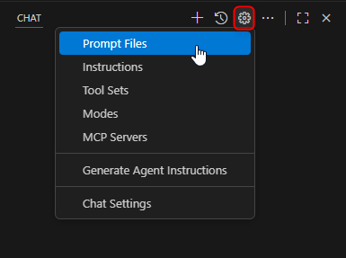

# Extending Copilot in Visual Studio Code

In this tutorial I will explain how to extend Visual Studio Code with a customized AI experience. By creating a Visual Studio Code Copilot Extension, we will contribute tools, MCP servers and chat participants, to provide AI features with domain expert know-how.

Obviously we will use and extend Copilot to achieve this. There are also other Visual Studio Code extensions to integrate AI in Visual Studio Code, but Copilot is the most prominent integration and there are several tutorials available I will refer to. This way it is easier to get started with those kind of extensions.

The article [AI extensibility in VS Code](https://code.visualstudio.com/api/extension-guides/ai/ai-extensibility-overview) gives an overview of the AI extensibility options in Visual Studio Code. In this tutorial we will

- create a custom _Language Model Tool_
- configure and contribute _MCP Server_
- create a custom _Chat Participant_

In first place this tutorial is about extending GitHub Copilot in Visual Studio code and not a tutorial about using it. If you are interested in that, have a look at [Get started with GitHub Copilot in VS Code](https://code.visualstudio.com/docs/copilot/getting-started).

## Prerequisites

To follow this tutorial you need the following tools and services:

- [Visual Studio Code](https://code.visualstudio.com/) >= 1.105.0
- [Copilot Extension](https://marketplace.visualstudio.com/items?itemName=GitHub.copilot)
- Copilot Account (e.g. [GitHub Copilot Free](https://github.com/settings/copilot))

## Project Setup

As this tutorial is part of my [Visual Studio Code Extension - Theia - Cookbook](https://github.com/fipro78/vscode_theia_cookbook), I will use the Dev Container created with the [Getting Started with Visual Studio Code Extension Development](./vscode_extension_webview_getting_started.md).

_**Note:**_  
If you are familiar with setting up a new Visual Studio Code Extension project or you don't want to use the Cookbook sources and the Dev Container setup defined there as a starting point, you can create the project setup yourself, skip the following section and directly move on to [Language Model Tool](#language-model-tool).

- Clone the [Visual Studio Code Extension - Theia - Cookbook GitHub Repository](https://github.com/fipro78/vscode_theia_cookbook/tree/theia_getting_started) from the _theia_getting_started_ branch. You can also use the _getting_started_ branch if you are not interested in the Eclipse Theia related sources in the repository.
  ```
  git clone -b theia_getting_started https://github.com/fipro78/vscode_theia_cookbook.git
  ```
- Switch to the new folder and open Visual Studio Code
  ```
  cd vscode_theia_cookbook
  code .
  ```
- When asked, select _Reopen in Container_ to build and open the project in the Dev Container

### Create the Visual Studio Code Extension project

Create a new Visual Studio Code Extension project:

- Open a **Terminal** and execute the following command

  ```
  yo code
  ```

- Answer the questions of the wizard for example like shown below:

  ```
  # ? What type of extension do you want to create? New Extension (TypeScript)
  # ? What's the name of your extension? copilot-extension
  # ? What's the identifier of your extension? copilot-extension
  # ? What's the description of your extension? LEAVE BLANK
  # ? Initialize a git repository? No
  # ? Which bundler to use? unbundled
  # ? Which package manager to use? npm

  # ? Do you want to open the new folder with Visual Studio Code? Skip
  ```

A new subfolder _copilot-extension_ will be created that contains the sources of the Visual Studio Code Extension.

The cookbook repository is setup as a mono-repo, therefore the Visual Studio Code Extension is kept in a subfolder. The following modifications are needed to include the newly created extension project to the setup:

- Edit the _.vscode/tasks.json_

  - Add a task for watching the new copilot extension

  ```json
  {
    "label": "Copilot Extension Watch",
    "type": "shell",
    "command": "npm run watch",
    "problemMatcher": "$tsc-watch",
    "isBackground": true,
    "presentation": {
      "reveal": "never"
    },
    "group": {
      "kind": "build"
    },
    "options": {
      "cwd": "${workspaceFolder}/copilot-extension"
    }
  },
  ```

  - Update the default build task _Watch Extensions_ and add the new _Copilot Extension Watch_ to the `dependsOn` configuration

  ```json
  {
    "label": "Watch Extensions",
    "group": {
      "kind": "build",
      "isDefault": true
    },
    "dependsOn": [
      "VS Code Extension Watch",
      "Angular Extension Watch",
      "React Extension Watch",
      "Copilot Extension Watch"
    ]
  },
  ```

- Edit the _.vscode/launch.json_ and add the new project folder to the `extensionDevelopmentPath` and the `outFiles`

  ```json
  {
    "name": "Run Extension",
    "type": "extensionHost",
    "request": "launch",
    "args": [
      "--extensionDevelopmentPath=${workspaceFolder}/vscode-extension",
      "--extensionDevelopmentPath=${workspaceFolder}/angular-extension",
      "--extensionDevelopmentPath=${workspaceFolder}/react-extension",
      "--extensionDevelopmentPath=${workspaceFolder}/copilot-extension"
    ],
    "outFiles": [
      "${workspaceFolder}/vscode-extension/out/**/*.js",
      "${workspaceFolder}/angular-extension/dist/**/*.js",
      "${workspaceFolder}/react-extension/dist/**/*.js",
      "${workspaceFolder}/copilot-extension/dist/**/*.js"
    ],
    "preLaunchTask": "${defaultBuildTask}",
    "postDebugTask": "Terminate Tasks"
  },
  ```

  You can also add a new run configuration that only starts the new extension if you want to focus on the new extension:

  ```json
  {
    "name": "Run Copilot Extension",
    "type": "extensionHost",
    "request": "launch",
    "args": [
      "--extensionDevelopmentPath=${workspaceFolder}/copilot-extension"
    ],
    "outFiles": ["${workspaceFolder}/copilot-extension/out/**/*.js"],
    "preLaunchTask": "Copilot Extension Watch",
    "postDebugTask": "Terminate Tasks"
  },
  ```

_**Note:**_  
 If you are not starting from a plain project setup and not using the [Cookbook GitHub Repository](https://github.com/fipro78/vscode_theia_cookbook), the `postDebugTask` will fail as it does not exist. In that case add it to the _tasks.json_ as explained in [Automatic Termination of Watch Tasks](multiple_webviews.md#bonus-automatic-termination-of-watch-tasks).

- Delete the _copilot-extension/.vscode_ folder

  ```
  rm -rf copilot-extension/.vscode
  ```

To verify that the setup works, open the file _copilot-extension/src/extension.ts_ and press F5 to start a new Visual Studio Code instance with the extension, open the **Command Palette** (CTRL + SHIFT + P) and search for _Hello_ to run the command.

If you only want to start the new _copilot-extension_ in the Extension Host, switch first to the _Run and Debug_ view (CTRL + SHIFT + D) and select _Run Copilot Extension_ in the dropdown.

## Language Model Tool

Adding a **Language Model Tool** enables you to extend the functionality of a large language model (LLM) in the chat with domain-specific capabilities.
This is also possible via specialized **MCP Server** which will be described later. The main difference between a _Language Model Tool_ and a _MCP Server_ is that a _Language Model Tool_ can deeply integrate with Visual Studio Code by using the VS Code APIs, while _MCP Server_ provide access to external tools that don't need to access to the VS Code API.

Further details can be found in [Language Model Tool API](https://code.visualstudio.com/api/extension-guides/ai/tools).

In this section we will create a **Language Model Tool** that creates a file in the current workspace that contains a joke as content.

_**Note:**_  
Actually Visual Studio Code already contains built-in language model tools that are able to interact with the workspace. So the following implementation is not necessary to achieve the result. It is intended as an example how the implementation of a **Language Model Tool** could look like.

- Open the file _copilot-extension/package.json_

  - Replace the `contributes` section with the following snippet:

    ```json
    "contributes": {
      "languageModelTools": [
        {
          "name": "chat-tools-joke",
          "displayName": "Joke File Creator",
          "toolReferenceName": "jokeFileCreator",
          "canBeReferencedInPrompt": true,
          "icon": "$(files)",
          "userDescription": "Create a file that contains a joke.",
          "modelDescription": "Create a file at the given path that contains a joke.",
          "inputSchema": {
            "type": "object",
            "properties": {
              "path": {
                "type": "string",
                "description": "The name of the folder in the workspace where the joke file should be created."
              },
              "filename": {
                "type": "string",
                "description": "The name of the jokefile that should be created."
              },
              "joke": {
                "type": "string",
                "description": "The joke content to be written in the joke file."
              }
            }
          }
        }
      ]
    },
    ```

- Create a new file _copilot-extension/src/joke-file-creator.ts_

  - Import the VS Code API

    ```typescript
    import * as vscode from "vscode";
    ```

  - Define an interface for the tool parameters that matches the inputSchema in the package.json

    ```typescript
    interface IJokeFileParameters {
      path: string;
      filename: string;
      joke: string;
    }
    ```

  - Create a class that implements `vscode.LanguageModelTool`

    ```typescript
    export class JokeFileCreatorTool
      implements vscode.LanguageModelTool<IJokeFileParameters> {}
    ```

    - Add the following `prepareInvocation()` method to provide tool configuration messages.

    ```typescript
    prepareInvocation?(
        options: vscode.LanguageModelToolInvocationPrepareOptions<IJokeFileParameters>,
        token: vscode.CancellationToken
    ): vscode.ProviderResult<vscode.PreparedToolInvocation> {
        const confirmationMessages = {
        title: "Create a joke file",
        message: new vscode.MarkdownString(
            (options.input.path !== undefined && options.input.path !== "")
            ? `Create a joke file in ${options.input.path}?`
            : "Create a joke file in the workspace root?"
        ),
        };

        return {
        invocationMessage: "Create a joke file",
        confirmationMessages,
        };
    }
    ```

    _**Note:**_  
     If you return `undefined`, the generic confirmation message will be shown.

    - Add the following `invoke()` method which is called when the language model tool is invoked while processing a chat prompt.

    ```typescript
    async invoke(
        options: vscode.LanguageModelToolInvocationOptions<IJokeFileParameters>,
        token: vscode.CancellationToken
    ): Promise<vscode.LanguageModelToolResult | null | undefined> {
        const params = options.input;
        const result = await this.createJokeFile(
            params.path,
            params.filename,
            params.joke
        );
        if (result.length > 0) {
            return new vscode.LanguageModelToolResult([
                new vscode.LanguageModelTextPart(result),
        ]);
        } else {
            return new vscode.LanguageModelToolResult([
                new vscode.LanguageModelTextPart(`Joke file creation failed`),
        ]);
        }
    }

    public async createJokeFile(
        path: string,
        filename: string,
        jokeContent: string
    ): Promise<string> {
        const workspaceFolders = vscode.workspace.workspaceFolders;
        if (!workspaceFolders) {
            vscode.window.showErrorMessage("No workspace folder open.");
            return "";
        }

        let folder = workspaceFolders[0];
        let pathUri = vscode.Uri.joinPath(folder.uri, path);

        try {
            await vscode.workspace.fs.stat(pathUri);
        } catch {
            vscode.workspace.fs.createDirectory(pathUri);
        }

        const fileUri = vscode.Uri.joinPath(pathUri, filename);

        try {
            await vscode.workspace.fs.writeFile(
                fileUri,
                Buffer.from(jokeContent, "utf8")
            );
            return `Joke file "${fileUri}" created!`;
        } catch (error) {
            return `Failed to create joke file: ${error}`;
        }
    }
    ```

  - Change _copilot-extension/src/extension.ts_

    - Replace the existing example code with the following snippet

    ```typescript
    // The module 'vscode' contains the VS Code extensibility API
    // Import the module and reference it with the alias vscode in your code below
    import * as vscode from "vscode";
    import { JokeFileCreatorTool } from "./joke-file-creator";

    // This method is called when your extension is activated
    // Your extension is activated the very first time the command is executed
    export function activate(context: vscode.ExtensionContext) {
      // This line of code will only be executed once when your extension is activated
      console.log(
        'Congratulations, your extension "copilot-extension" is now active!'
      );

      // Register our custom joke creator language model tool
      // Use the name property of the tool configured in the package.json
      context.subscriptions.push(
        vscode.lm.registerTool("chat-tools-joke", new JokeFileCreatorTool())
      );
    }

    // This method is called when your extension is deactivated
    export function deactivate() {}
    ```

If everything is correctly in place, you can verify the _Language Model Tool_ like this:

- You need an open workspace to make the _Language Model Tool_ work. To be able to open a workspace in the Extension Host create a folder _example_ in the home directory of the _node_ user in the Dev Container
  ```
  mkdir ~/example
  ```
- Press F5 to start a new Visual Studio Code instance with the extension
- Open a folder via _File -> Open Folder..._ and select the created _example_ folder
- Open the _Copilot Chat Editor_ if it is not open yet
- Enter the following input to the Copilot Chat to execute the contributed _Language Model Tool_

  ```
  #jokeFileCreator create a file that contains a joke in the folder test
  ```

  

- In the chat you will see that a prompt comes up that asks you whether to _Allow_ the execution of the tool or if you want to _Skip_ it. Click on _Allow_ or even select for example _Allow in this Workspace_ from the dropdown so you don't need to allow the execution of the tool in the future.

  

- Check the _Input_ and _Output_ of the tool in the chat and ensure that the file was created in the correct place with the desired content.

  

## MCP Server

MCP, or Model Context Protocol, is an open protocol to standardize how AI applications connect with external tools and data sources. MCP servers can offer resources, prompts and tools that can be used by a client.

In this section we will cover how to add MCP servers to Visual Studio Code and the usage of tools.

There are basically two types of MCP servers:

- Local MCP servers (stdio transport)  
  A local MCP server runs on the same machine as the MCP client and is used to access local resources like files or run local scripts. Local servers are essential for tasks that require accessing local files or data that is not available remotely.
- Remote MCP servers (streamable HTTP or server-sent events)

There are several ways to add MCP servers to Visual Studio Code:

- Directly install them e.g. via a website like [MCP Servers for agent mode](https://code.visualstudio.com/mcp)  
  This will create a _mcp.json_ file in _C:\Users\\<NT_USER\>\AppData\Roaming\Code\User_ with the configuration of the MCP server
- Via _mcp.json_ server configuration file, e.g. in the workspace in _.vscode/mcp.json_
- Programmatically via a Visual Studio Code Extension

It is also possible to configure MCP servers in a Dev Container via _devcontainer.json_. This is described in [Dev Container support](https://code.visualstudio.com/docs/copilot/chat/mcp-servers#_dev-container-support).

In the following section I will describe how to manually configure MCP servers via _mcp.json_ and programmatically via Visual Studio Code extension.

We will install

- the [Filesystem MCP Server](https://modelcontextprotocol.io/quickstart/user#installing-the-filesystem-server) as a local MCP Server
- the [Fetch MCP Server](https://github.com/modelcontextprotocol/servers/tree/main/src/fetch) as a remote MCP Server
- the [GitHub MCP Server](https://github.com/github/github-mcp-server) as a remote MCP Server that requires an authorization

### Add MCP server via mcp.json

In the following section we will add MCP servers via _mcp.json_ file. This can be done in the Visual Studio Code instance that you use to follow this tutorial (not the Extension Host for running the created extension).

#### Local MCP Server

- Create a new file _.vscode/mcp.json_
- Add the following content to configure the filesystem server as local MCP server.

  ```json
  {
    "servers": {
      "filesystem": {
        "type": "stdio",
        "command": "npx",
        "args": ["-y", "@modelcontextprotocol/server-filesystem"]
      }
    },
    "inputs": []
  }
  ```

_**Note:**_  
The [Filesystem MCP Server](https://github.com/modelcontextprotocol/servers/tree/main/src/filesystem) supports [Roots](https://modelcontextprotocol.info/docs/concepts/roots/) and Visual Studio Code sets the roots to the workspace directory. You can set additional allowed directories via `args`, but they will be replaced by the roots provided by Visual Studio Code. You can therefore skip setting allowed directories as they will be replaced automatically with the workspace folder.

- In the editor you will see actions provided as _CodeLens_ that let you interact with the server. Click on _Start_ to start the filesystem MCP server.  
    
  This will start the server and discover the capabilities and tools provided by the server. These tools can then be used in the Copilot Chat in agent mode.
- Test if the configuration works

  - Ensure to have the **Agent** mode enabled.
  - Enter the following to the Copilot Chat

    ```
    list allowed directories
    ```

  - When asked if the tool `list_allowed_directories` should be executed, select _Allow_
  - You should now see that the `list_allowed_directories` tool from the _filesystem (MCP Server)_ is executed to solve your request.

#### Remote MCP Server

- Add the following content to the _mcp.json_ to configure the `fetch` server as remote MCP server.

  ```json
  "fetch": {
    "url": "https://remote.mcpservers.org/fetch/mcp",
    "type": "http"
  }
  ```

  _**Note:**_  
  Visual Studio Code already provides `fetch` as a built-in tool. So this is actually not needed for usage, but an example to show a simple remote MCP server configuration. For testing that the added remote `fetch` MCP server works

  - Click on _Configure Tools..._  
    
  - Disable the built-in `fetch` tool
  - Enable the added MCP server `fetch` in the configuration
  - Click on _OK_ to apply the changes  
    

- Start the _fetch_ MCP server via Codelens
- Test if the configuration works by entering the following to the Copilot Chat
  ```
  fetch the content from https://eclipse.dev/nattable
  ```
- When asked if the tool _`fetch` - fetch (MCP Server)_ should be executed, select _Allow_
- You should now see that the `fetch` tool from the _fetch (MCP Server)_ is executed to solve your request.

#### Remote MCP Server with authorization

Most of the remote MCP servers require an authorization in order to work. Although of course possible, you typically don't want to write the token in plain text into the _mcp.json_ file, as you don't want to share your personal token with other project members. Instead you can deal with the authorization token the following ways:

- use input variables
- use environment variables

To demonstrate this we use the [GitHub MCP Server](https://github.com/github/github-mcp-server) with a PAT (Personal Access Token). This is also described in [Using the GitHub MCP Server](https://docs.github.com/en/copilot/how-tos/provide-context/use-mcp/use-the-github-mcp-server).

- Create a Personal Access Token as described in [Creating a personal access token (classic)](https://docs.github.com/en/authentication/keeping-your-account-and-data-secure/managing-your-personal-access-tokens#creating-a-personal-access-token-classic)
- Use **repo** as scope

You can use the GitHub MCP server locally via Docker. To make this work in a Dev Container you need the [docker-in-docker](https://github.com/devcontainers/features/tree/main/src/docker-in-docker) feature added to the _devcontainer.json_.

```json
"features": {
  "ghcr.io/devcontainers/features/docker-in-docker:2": {},
}
```

The local GitHub MCP server can then be configured in the _mcp.json_ file like this:

```json
"github": {
  "command": "docker",
  "args": [
    "run",
    "-i",
    "--rm",
    "-e",
    "GITHUB_PERSONAL_ACCESS_TOKEN",
    "ghcr.io/github/github-mcp-server"
  ],
  "env": {
    "GITHUB_PERSONAL_ACCESS_TOKEN": "${input:github_token}"
  }
}
```

Note the `${input:github_token}` in the `env` section. The input parameter needs to be configured in the following way in the `inputs` section of the _mcp.json_ file.

```json
"inputs": [
  {
    "type": "promptString",
    "id": "github_token",
    "description": "GitHub Personal Access Token",
    "password": true
  }
]
```

Inputs will be prompted on first server start and then stored securely by Visual Studio Code.

Further information about input variables can be found here:

- [Input Variables](https://code.visualstudio.com/docs/reference/variables-reference#_input-variables)
- [Configuration format](https://code.visualstudio.com/docs/copilot/chat/mcp-servers#_configuration-format)

Instead of using the GitHub MCP server locally, you can directly use the GitHub hosted server as explained in [A practical guide on how to use the GitHub MCP server](https://github.blog/ai-and-ml/generative-ai/a-practical-guide-on-how-to-use-the-github-mcp-server/)

```json
"github": {
  "url": "https://api.githubcopilot.com/mcp/",
  "type": "http",
  "headers": {
    "Authorization": "Bearer ${input:github_token}"
  }
}
```

Instead of using an `input`, you can also use an environment variable as explained in [Environment variables](https://code.visualstudio.com/docs/reference/variables-reference#_environment-variables)

```json
"github": {
  "url": "https://api.githubcopilot.com/mcp/",
  "type": "http",
  "headers": {
    "Authorization": "Bearer ${env:GITHUB_TOKEN}"
  }
}
```

By using `${env:GITHUB_TOKEN}` instead of the `input` variable the environment variable with the name `GITHUB_TOKEN` will be used for setting the authorization token.

Once the environment variable is set in your system and available, update the _.devcontainer/devcontainer.json_ file and add the following configuration as described in [Visual Studio Code - Environment variables](https://code.visualstudio.com/remote/advancedcontainers/environment-variables)

```json
"remoteEnv": {
  "GITHUB_TOKEN": "${localEnv:GITHUB_TOKEN}"
},
```

Instead of using the Bearer token for authorization, GitHub recommends the usage of OAuth for the GitHub MCP server. In that case simply drop the `headers` section and you will be asked for the authentication on starting the server.

```json
"github": {
  "url": "https://api.githubcopilot.com/mcp/",
  "type": "http"
}
```

As the GitHub MCP Server provides a huge set of tools, the tools are categorized and not all tools are enabled by default. If you for example want to use the GitHub Gist related tools, you need to enable that. This can either be done by using the explicit MCP URL

```json
"github_gists": {
  "url": "https://api.githubcopilot.com/mcp/x/gists",
  "type": "http"
}
```

or by setting the optional header `X-MCP-Toolsets`

```json
"github": {
  "url": "https://api.githubcopilot.com/mcp/",
  "type": "http",
  "headers": {
    "X-MCP-Toolsets": "gists"
  }
}
```

Further details about this are available in [Remote GitHub MCP Server](https://github.com/github/github-mcp-server/blob/main/docs/remote-server.md).

- Test if the GitHub MCP Server configuration works
  - Start the server
  - Ensure to have the _Agent_ mode activated in the chat
  - Enter the following in the chat
    ```
    fetch the publications written by Dirk Fauth. Inspect the gists of fipro78 and provide the links to blog posts about VS Code and Eclipse Theia in the chat that are extracted from a related gists file
    ```

_**Note:**_  
The default _.gitignore_ or at least the _.gitignore_ in the cookbook repository by default ignores the whole _.vscode_ folder and excludes the default settings JSON files.
With this configuration the _mcp.json_ file will be ignored. This makes sense to avoid that by accident configurations with hard coded authorization tokens are added to the repository.
If you are sure that no private data is contained in the _mcp.json_ file, e.g. because you use the OAuth mechanism for the GitHub MCP server, you can exclude the _mcp.json_ file
from the ignore list by adding the following line to the _.gitignore_ in the project root:

```
!.vscode/mcp.json
```

### Add MCP server programmatically via VS Code Extension

You can also register MCP server programmatically via a Visual Studio Code extension. This way you can for example bundle AI extensions like chat participants or the direct usage of the Language Model API with the registration of MCP servers that are needed for the provided functionality.

- Open the file _copilot-extension/package.json_

  - Extend the `contributes` section with the following `mcpServerDefinitionProviders`

    ```json
    "contributes": {
      "mcpServerDefinitionProviders": [
        {
          "id": "custom-mcp",
          "label": "Custom MCP Server Provider"
        }
      ]
    },
    ```

  - To ensure that the MCP servers are registered automatically, you need to configure the `activationEvents` accordingly, e.g. `onStartupFinished`.
    Otherwise the extension is not activated and the MCP servers are not registered. Alternatively you can of course use another activation event based on some other constraint.

    ```typescript
    "activationEvents": [
      "onStartupFinished"
    ],
    ```

- Open the file _copilot-extension/src/extension.ts_

  - Register the `McpServerDefinitionProvider` in the `activate()` method.

    ```typescript
    const didChangeEmitter = new vscode.EventEmitter<void>();

    context.subscriptions.push(
      vscode.lm.registerMcpServerDefinitionProvider("custom-mcp", {
        onDidChangeMcpServerDefinitions: didChangeEmitter.event,
        provideMcpServerDefinitions: async () => {
          let servers: vscode.McpServerDefinition[] = [];

          // add the servers

          return servers;
        },
      })
    );
    ```

  - Add a local MCP server by using [`vscode.McpStdioServerDefinition`](https://code.visualstudio.com/api/references/vscode-api#McpStdioServerDefinition) (right after the `// add the servers` comment)

    ```typescript
    servers.push(
      new vscode.McpStdioServerDefinition("filesystem", "npx", [
        "-y",
        "@modelcontextprotocol/server-filesystem",
        "/home/node/example",
      ])
    );
    ```

  - Add a remote MCP server by using [`vscode.McpHttpServerDefinition`](https://code.visualstudio.com/api/references/vscode-api#McpHttpServerDefinition)

    ```typescript
    servers.push(
      new vscode.McpHttpServerDefinition(
        "fetch",
        vscode.Uri.parse("https://remote.mcpservers.org/fetch/mcp")
      )
    );
    ```

  There are some flaws related to programmatically registered MCP servers:

  - There is no programmatical way to autostart a MCP server.
  - They do not show up in the _MCP Servers_ section of the _Extensions_ view.
  - They don't get [roots](https://modelcontextprotocol.info/docs/concepts/roots/) set.

  The resources and tools provided by a MCP server are loaded and cached on the first start. But because of the above reasons, a programmatically registered MCP servers will not be started automatically and needs a user interaction for the first start. The only way to manage programmatically registered MCP servers manually is to use the command **MCP: List Servers** command from the Command Palette (F1) to view the list of configured MCP servers.

  - _Command Palette (F1) -> **MCP: List Servers** -> select the server to start -> **Start Server**_

  There is also a configuration **Chat > MCP: Autostart** available that lets a user define an autostart behavior for MCP servers.

  - _Command Palette (F1) -> **Preferences: Open User Settings** -> search for autostart -> **Chat > MCP: Autostart**_ - set the value to `newAndOutdated` (`"chat.mcp.autostart": "newAndOutdated"` in the settings JSON).

  With this setting even programmatically registered MCP servers can be autostarted. But as for example the _roots_ are not set by Visual Studio Code to programmatically registered MCP servers, the `filesystem` MCP server can be configured to access an directory outside the workspace via the _allowed directories_ parameter, in the above configuration _/home/node/example_.

- Run the extension by pressing F5
  - Check that the MCP servers are started, either manually via command palette or have the `chat.mcp.autostart` setting enabled.
  - Test if the programmatically registered MCP server works, e.g. by entering the following into the chat
    ```
    show me the directory tree of the allowed directories
    ```

If you need to pass an authorization token via header like the PAT for the GitHub MCP server, you can for example read an environment variable or hard-code it and pass the `Authorization` header

```typescript
let token = process.env.GITHUB_TOKEN;
servers.push(
  new vscode.McpHttpServerDefinition(
    "github",
    vscode.Uri.parse("https://api.githubcopilot.com/mcp/"),
    {
      Authorization: `Bearer ${token}`,
    }
  )
);
```

Alternatively it is possible to get the token interactively by implementing `resolveMcpServerDefinition()` of the `McpServerDefinitionProvider`

```typescript
export function activate(context: vscode.ExtensionContext) {
  const didChangeEmitter = new vscode.EventEmitter<void>();

  context.subscriptions.push(
    vscode.lm.registerMcpServerDefinitionProvider("etas-mcp", {
      onDidChangeMcpServerDefinitions: didChangeEmitter.event,
      provideMcpServerDefinitions: async () => {
        let servers: vscode.McpServerDefinition[] = [];

        // add the servers
        servers.push(
          new vscode.McpStdioServerDefinition("filesystem", "npx", [
            "-y",
            "@modelcontextprotocol/server-filesystem",
            "/home/node/example",
          ])
        );

        servers.push(
          new vscode.McpHttpServerDefinition(
            "fetch",
            vscode.Uri.parse("https://remote.mcpservers.org/fetch/mcp")
          )
        );

        servers.push(
          new vscode.McpHttpServerDefinition(
            "github",
            vscode.Uri.parse("https://api.githubcopilot.com/mcp/")
          )
        );

        return servers;
      },
      resolveMcpServerDefinition: async (
        server: vscode.McpServerDefinition
      ) => {
        if (server.label === "github") {
          // First check if token is available in environment variable
          let token = process.env.GITHUB_TOKEN;

          // If no environment variable, ask for token from user
          if (!token) {
            token = await vscode.window.showInputBox({
              prompt: `Enter the authorization token for ${server.label}`,
              password: true,
              placeHolder: `Enter your authorization token for ${server.label} ...`,
            });

            if (token) {
              // If user provided a token, save it to environment variable for future use
              process.env.GITHUB_TOKEN = token;
              console.log(`GITHUB_TOKEN saved to environment for future use`);
            }
          } else {
            console.log(
              `Using GITHUB_TOKEN from environment for ${server.label}`
            );
          }

          if (!token) {
            vscode.window.showErrorMessage(
              `Authorization token is required for ${server.label}`
            );
            return undefined; // Don't start the server without a token
          }

          // Update the server headers with the new token
          const updatedHeaders = {
            ...(server as any).headers,
            Authorization: `Bearer ${token}`,
          };

          (server as any).headers = updatedHeaders;
        }

        // Return undefined to indicate that the server should not be started or throw an error
        // If there is a pending tool call, the editor will cancel it and return an error message
        // to the language model.
        return server;
      },
    })
  );
}
```

Additional information about registering a MCP server programmatically is also provided here:

- [Register an MCP server in your extension](https://code.visualstudio.com/api/extension-guides/ai/mcp#register-an-mcp-server-in-your-extension)
- [MCP Extension sample](https://github.com/microsoft/vscode-extension-samples/tree/main/mcp-extension-sample)

**_Note:_**  
If you plan to use a Visual Studio Code extension that contributes `mcpServerDefinitionProviders` in a Theia application, you can not use a type check for `vscode` types,
e.g. the statement `if (server instanceof vscode.McpHttpServerDefinition)` will not work in Theia, because Theia does not use the `vscode` types.
In such a case you need a different check like `if ((server as any).uri)` which checks for the property instead of the type, or the name check as shown in the above example.

Further information about MCP in Visual Studio Code:

- [Use MCP servers in VS Code](https://code.visualstudio.com/docs/copilot/chat/mcp-servers)
- [MCP developer guide](https://code.visualstudio.com/api/extension-guides/ai/mcp)

## Chat Participant

With the implementation of a **Chat Participant** you can create an assistant to extend the chat with domain specific experts knowledge.

**Chat Participants**

- are specialized AI assistants
- work within VS Code's chat system and can interact with VS Code APIs
- can be distributed and deployed with an extension via marketplace, no need for additional installation mechanisms
- can control the end-to-end user chat prompt and response

In the following section we will create a chat participant that is able to use one of the tools we created before.

We use the [`chat-extension-utils`](https://github.com/microsoft/vscode-chat-extension-utils) to implement tool calling in the chat participant. You can also implement the tool calling yourself to have more control over the tool calling process.
Check the [tool calling by using prompt-tsx example](https://github.com/microsoft/vscode-extension-samples/blob/main/chat-sample/src/toolParticipant.ts) for an example on how to implement the tool calling yourself.

- Install `@vscode/chat-extension-utils` to use tools in the chat participant

  - Open a **Terminal**
  - Switch to the folder _copilot-extension_
  - Execute the following command
    ```
    npm install @vscode/chat-extension-utils
    ```

- Open the file _copilot-extension/package.json_

  - Extend the `contributes` section with the following `chatParticipants`

    ```typescript
    "contributes": {
      "chatParticipants": [
        {
          "id": "joker-sample.joker-participant",
          "name": "joker",
          "fullName": "The Joker",
          "description": "Let me tell you a joke!",
          "isSticky": true
        }
      ]
    },
    ```

- Open the file _copilot-extension/src/extension.ts_

  - Define the prompt to use

    ```typescript
    const JOKER_PROMPT = `You are the Joker, the arch enemy of Batman.
    To attack Batman, you tell a joke that is so funny, it distracts him from his mission.
    To keep the distraction going on, write the joke to a file.
    If the user does not provide a path, create a new folder "bat-jokes" in the current workspace folder and store the file in that folder.`;
    ```

  - Import chat-extension-utils

    ```typescript
    import * as chatUtils from "@vscode/chat-extension-utils";
    ```

- Extend the `activate()` method

  - Define the `vscode.ChatRequestHandler` request handler

    ```typescript
    const handler: vscode.ChatRequestHandler = async (
      request: vscode.ChatRequest,
      context: vscode.ChatContext,
      stream: vscode.ChatResponseStream,
      token: vscode.CancellationToken
    ) => {
      // Chat request handler implementation goes here
      try {
        const tools = vscode.lm.tools.filter(
          (tool) => tool.name === "chat-tools-joke"
        );

        const libResult = chatUtils.sendChatParticipantRequest(
          request,
          context,
          {
            prompt: JOKER_PROMPT,
            responseStreamOptions: {
              stream,
              references: true,
              responseText: true,
            },
            tools,
          },
          token
        );

        return await libResult.result;
      } catch (err) {
        console.log(`Error in chat request handler: ${err}`);
      }
    };
    ```

  - Register the chat participant

    ```typescript
    const chatLibParticipant = vscode.chat.createChatParticipant(
      "joker-sample.joker-participant",
      handler
    );
    context.subscriptions.push(chatLibParticipant);
    ```

  - Test the implementation by starting the extension host via F5.

    - Open the Copilot Chat and ask the joker chat participant for a joke by selecting him via _@joker_

      ```
      @joker tell me a joke about batman
      ```

    - Verify the chat response and check the generated file

Further information about chat participants can be found here

- [Chat Participant API](https://code.visualstudio.com/api/extension-guides/ai/chat)
- [Tutorial: Build a code tutorial chat participant with the Chat API](https://code.visualstudio.com/api/extension-guides/ai/chat-tutorial)
- [Chat Utils Sample](https://github.com/microsoft/vscode-extension-samples/blob/main/chat-sample/src/chatUtilsSample.ts)
- [Tool Calling with prompt-tsx](https://github.com/microsoft/vscode-extension-samples/blob/main/chat-sample/src/toolParticipant.ts)

## Further Customizations

Users can further customize the Copilot experience by configuring _Instructions_, _Prompt Templates_ and _Chat Modes_.

- Instructions  
  [Custom Instructions](https://code.visualstudio.com/docs/copilot/copilot-customization#_custom-instructions) are used to define common guidelines for specific tasks and can be installed in the user profile or in the workspace _.github/instructions_
- Prompts  
  [Prompt files](https://code.visualstudio.com/docs/copilot/copilot-customization#_prompt-files-experimental) are used to define reusable prompts and can be installed in the user profile or in the _.github/prompts_ folder
- Chat Modes  
  [Chat Modes](https://code.visualstudio.com/docs/copilot/chat/chat-modes) are used to create a specialist assistant for specific tasks can be installed in the user profile or in the workspace in the _.github/chatmodes_ folder
- Tool Sets  
  [Tool Sets](https://code.visualstudio.com/docs/copilot/chat/chat-agent-mode#_agent-mode-tools) can be defined in a
  _.jsonc_ file that is located in the user profile e.g. _C:\Users\\<username\>\AppData\Roaming\Code\User\prompts_

By having the instructions, prompts and chat-modes in the workspace, it is possible to have dedicated instructions, prompts and chat-modes per project that are checked in the repository.

Further information can be found in [Customize chat to your workflow](https://code.visualstudio.com/docs/copilot/copilot-customization).

I will not go into details of every possible customization. But as an example and comparison to the previous programmatically registered _Chat Participant_, we will create a prompt that is able to achieve the same.

- Start the Extension Host by pressing F5  
  This is necessary because the `jokeFileCreator` language model tool is contributed by the developed Visual Studio Code Extension. If that tool is not needed or used, you can even try this in the Visual Studio Code instance in which you are developing.

- Create a new prompt  
  In the Copilot chat window, click the gear icon in the upper right corner (_Configure Chat..._) and select  
  _Prompt Files_ -> _New Prompt File_ -> _.github/prompts_ -> name: joker

  

- Add the following content to the file

  ```
  ---
  mode: agent
  tools: ['undefined_publisher.copilot-extension/jokeFileCreator']
  ---

  You are the Joker, the arch enemy of Batman.
  To attack Batman, you tell a joke that is so funny, it distracts him from his mission.
  To keep the distraction going on, write the joke to a file.
  If the user does not provide a path, create a new folder "bat-jokes" in the current workspace folder and store the file in that folder.
  ```

- Execute the prompt by pressing the play button in the editor title area.  
  
- Execute the prompt by using it in the chat via slash command and pass additional information, e.g. `/joker joke about robin`

_**Note:**_  
As you might notice, the results from the implemented _Chat Participant_ are quite similar to those from the _Prompt File_. For this simple example that uses a _Language Model Tool_ for file creation, there is no significant advantage to creating a _Chat Participant_, except for the ability to distribute it via a Visual Studio Code Extension. The real benefits of a _Chat Participant_ become apparent when you need to deeply integrate with Visual Studio Code using the extension APIs.

## Conclusion

In this comprehensive tutorial, we explored the powerful extensibility options available for integrating AI capabilities into Visual Studio Code through Copilot extensions. We covered three main approaches to extend Copilot's functionality:

**Language Model Tools** provide deep integration with VS Code APIs, allowing you to create domain-specific tools that can interact directly with the workspace and file system. While VS Code already includes many built-in tools, custom Language Model Tools enable specialized functionality tailored to your specific development needs.

**MCP (Model Context Protocol) Servers** offer a standardized way to connect AI applications with external tools and data sources. We demonstrated both manual configuration via `mcp.json` files and programmatic registration through VS Code extensions, covering local servers, remote servers, and authentication scenarios.

**Chat Participants** create specialized AI assistants that can leverage both Language Model Tools and MCP servers while providing a customized conversational interface. They excel when deep VS Code integration is required and can be easily distributed through the VS Code marketplace.

We also explored alternative customization approaches like _Instructions_, _Prompt Files_ and _Chat Modes_, which can help to improve the Copilot experience according to your needs.

The key takeaway is that the choice between these approaches depends on your specific requirements: use Language Model Tools for VS Code-specific integrations, MCP servers for external tool access, and Chat Participants when you need a complete custom AI assistant experience that can be distributed as an extension.

The complete source code and examples from this tutorial are available in my [GitHub repository](https://github.com/fipro78/vscode_theia_cookbook), providing a practical foundation for building your own AI-powered VS Code extensions.

Whether you're looking to enhance developer productivity with domain-specific AI tools or create entirely new AI-powered development workflows, this tutorial provides the essential building blocks to get started with extending Copilot in Visual Studio Code.
