# Visual Studio Code GitHub Copilot vs. Eclipse Theia AI

If you plan to build applications with AI support, especially for software development, you first need to decide which platform to use. You can build a plain web application from scratch and implement everything yourself, or build on top of an existing platform. In my previous blog posts, I explained how to customize the AI experience in Visual Studio Code and how to create a custom AI extension in Eclipse Theia. While writing those posts, I noticed many similarities, both from a user perspective and from an extension-development perspective. In this post, I compare both approaches to give you a clearer view of where they align and where they differ.
If you have not read my previous blog posts and want more details, have a look at:

- [Extending Copilot in Visual Studio Code](./vscode_copilot_extension.md)
- [Getting Started with Theia AI](./theia_ai_getting_started.md)

_**Note:**_  
This blog post is based on Visual Studio Code 1.112.0 and Eclipse Theia 1.70.0. There may be differences if you read it when newer versions have been released.

## Strategic Comparison

In the article [Why Extending GitHub Copilot in VS Code May Not Be the Best Fit for Your AI-Native Development Tool](https://blogs.eclipse.org/post/thomas-froment/why-extending-github-copilot-vs-code-may-not-be-best-fit-your-ai-native), you can already find a comprehensive overview of the differences between GitHub Copilot in Visual Studio Code and Theia AI. The article is around half a year old and is therefore not fully up to date with the latest features. However, the strategic perspective is still well described and remains valid, so the article is still worth reading if you plan to adopt either technology.

The following table extracts and summarizes an initial comparison of key aspects from that article:

|                          | VS Code GitHub Copilot                                                                                                                       | Eclipse Theia AI                                                                                                      |
| ------------------------ | -------------------------------------------------------------------------------------------------------------------------------------------- | --------------------------------------------------------------------------------------------------------------------- |
| Platform                 | Product you can extend                                                                                                                       | Platform you can own                                                                                                  |
| License                  | Mixture of open source parts (MIT) and proprietary parts (Microsoft products)                                                                | Completely open source (EPL)                                                                                          |
| AI customization options | Chat only                                                                                                                                    | any part of the application                                                                                           |
| Licensing                | Copilot subscription required                                                                                                                | -                                                                                                                     |
| LLM Support              | Depends on Copilot subscription<br>[AI language models in VS Code](https://code.visualstudio.com/docs/copilot/customization/language-models) | Depends on existing providers<br>[LLM Providers Overview](https://theia-ide.org/docs/user_ai/#llm-providers-overview) |

## AI Extension Comparison

Visual Studio Code GitHub Copilot extensions and Eclipse Theia AI extensions target similar use cases: extending the AI capabilities of the IDE.
There are differences in terminology, implementation, extension capabilities, and features. In previous blog posts, I explained how to contribute _Tools_, _MCP Servers_, and _Chat Extensions_. The concepts already differ in naming, as shown in the following table:

| VS Code GitHub Copilot | Eclipse Theia AI |
| ---------------------- | ---------------- |
| Language Model Tool    | Tool Function    |
| MCP                    | MCP              |
| Chat Participant       | Agent            |

The following sections will explain the differences in more detail.

### Language Model Tool vs. Tool Function

_Tools_ provide additional capabilities to perform specialized tasks when interacting with an LLM. In Visual Studio Code, they are called [_Language Model Tools_](https://code.visualstudio.com/api/extension-guides/ai/tools); in Theia, they are called [_Tool Functions_](https://theia-ide.org/docs/theia_ai/#tool-functions).

#### Visual Studio Code

To contribute a _Language Model Tool_ via Copilot Extension, you follow the typical contribution pattern in Visual Studio Code Extensions:

- Configure the contribution via `contributes/languageModelTools` section in the extensions _package.json_
- Implement a new class that implements the `vscode.LanguageModelTool` interface
- Register it in the extension via `vscode.lm.registerTool()`

Further details can be found in [Extending Copilot in Visual Studio Code - Language Model Tool](./vscode_copilot_extension.md#language-model-tool).

#### Eclipse Theia

To contribute a _Tool Function_ via Theia Extension, you follow the typical contribution pattern in Theia:

- Implement a new class that implements the `ToolProvider` interface from the `@theia/ai-core` package
- Register it in a `ContainerModule` for injection via `bindToolProvider()` from `@theia/ai-core/lib/common`

Further details can be found in [Getting Started with Theia AI - Tool Functions](./theia_ai_getting_started.md#tool-functions).

### MCP Support

_MCP Servers_ are typically configured by users via a configuration file. The usage comparison is described later in [Configuring MCP Servers](#configuring-mcp-servers). _MCP Servers_ can also be contributed and configured programmatically, for example when you contribute an extension that provides an advanced AI use case requiring dedicated tools via MCP.

_**Note:**_  
MCP servers that are programmatically registered via a Visual Studio Code Copilot extension can also be installed in a Theia application if the `@theia/plugin-ext` extension is available.

#### Visual Studio Code

To contribute a _MCP Server_ via Copilot Extension, you follow the typical contribution pattern in Visual Studio Code Extensions:

- Configure the contribution via `contributes/mcpServerDefinitionProviders` section in the extensions _package.json_
- Register a `McpServerDefinitionProvider` in the extension via `vscode.lm.registerMcpServerDefinitionProvider()`
- Add MCP servers via `McpServerDefinitionProvider#provideMcpServerDefinitions()`
  - A local MCP server can be configured by creating a [`vscode.McpStdioServerDefinition`](https://code.visualstudio.com/api/references/vscode-api#McpStdioServerDefinition)
  - A remote MCP server can be configured by creating a [`vscode.McpHttpServerDefinition`](https://code.visualstudio.com/api/references/vscode-api#McpHttpServerDefinition)
- Dynamic resolution (e.g. asking the user for an authorization token) can be added via `McpServerDefinitionProvider#resolveMcpServerDefinition()`

There are some limitations:

- To ensure that the MCP servers are registered automatically on start, you need to configure the `activationEvents` accordingly, e.g. `onStartupFinished`
- There is no API to programmatically start or stop an _MCP Server_ in Visual Studio Code.
- Programmatically registered MCP servers do not show up in the _MCP Servers_ section of the _Extensions_ view.
- Programmatically registered MCP servers do not get [roots](https://modelcontextprotocol.info/docs/concepts/roots/) set based on the current workspace directory.

Further details can be found in [Extending Copilot in Visual Studio Code - Add MCP server programmatically via VS Code Extension](./vscode_copilot_extension.md#add-mcp-server-programmatically-via-vs-code-extension).

#### Eclipse Theia

To contribute a _MCP Server_ via Theia Extension, you follow the typical contribution pattern in Theia:

- Implement a `FrontendApplicationContribution`
- Get the `MCPFrontendService` injected
- Add MCP servers via `MCPFrontendService#addOrUpdateServer()`
  - A local MCP server can be configured by creating a `LocalMCPServerDescription`
  - A remote MCP server can be configured by creating a `RemoteMCPServerDescription`
- Dynamic resolution (e.g. asking the user for an authorization token) can be added directly to the `MCPServerDescription` via the `MCPServerDescription#resolve()` function
- Register it in a `ContainerModule` via `bind()`

Compared to the limitations in Visual Studio Code, programmatically registered MCP servers in Theia

- are automatically registered if the `FrontendApplicationContribution` is registered correctly in a `ContainerModule`
- can be started and stopped programmatically via `MCPFrontendService#startServer()` and `MCPFrontendService#stopServer()`
- do show up in the _AI Configuration_ view
- Since Theia 1.69.0, [roots](https://modelcontextprotocol.info/docs/concepts/roots/) are supported. This support was added via [PR](https://github.com/eclipse-theia/theia/pull/16911). You can configure whether the workspace should be used as a _Root_ via the preference `ai-features.mcp.useWorkspaceAsRoot`.

Further details can be found in [Getting Started with Theia AI - Add MCP server programmatically via Theia Extension](./theia_ai_getting_started.md#add-mcp-server-programmatically-via-theia-extension).

### Chat Participant vs. Custom Agent

To extend the AI capabilities of an IDE or application with a specialized assistant that provides domain-specific expert knowledge, you can implement and contribute a _Chat Participant_ in Visual Studio Code or a _Custom Agent_ in Eclipse Theia. In both cases, the benefits of such a programmatically created AI assistant are:

- you can manage the end-to-end prompt/response conversation
- you have access to the respective API, which allows deep integration with the underlying platform
- you can distribute and deploy it via extensions

_Custom Agents_ defined via configuration files can only interact with the underlying platform if the required functionality is available as a _Language Model Tool_ or _Tool Function_, or via _MCP_. They are also available only when the corresponding configuration files are present in the user's workspace. _Custom Agents_ from a user's perspective are [covered in a later section](#custom-agents). In this section, I focus on the differences in programmatically created AI extensions.

#### Visual Studio Code

As the name implies, a _Chat Participant_ contributed via a Visual Studio Code Copilot extension is intended for and limited to chat. There are no other use cases where a _Chat Participant_ can be integrated, such as the terminal.

To contribute a _Chat Participant_ via Copilot Extension, you follow the typical contribution pattern in Visual Studio Code Extensions:

- Configure the contribution via `contributes/chatParticipants` section in the extensions _package.json_
- Define a `vscode.ChatRequestHandler` which sends the chat request and handles the response
- Create a `vscode.ChatParticipant` via `vscode.chat.createChatParticipant()` by using the id defined in the _package.json_ and the defined `vscode.ChatRequestHandler`
- Register the `vscode.ChatParticipant` in the extension by pushing it to the `context.subscriptions`

To use the _Chat Participant_, you need to invoke it with the `@` syntax, e.g. `@joker tell me a joke`.

Further details can be found in [Extending Copilot in Visual Studio Code - Chat Participant](./vscode_copilot_extension.md#chat-participant).

#### Eclipse Theia

Compared to Visual Studio Code, a _Custom Agent_ in Theia is not limited to the chat. It can also be integrated into other parts of the IDE, such as the editor, the terminal, or a custom widget.

To contribute a _Custom Agent_ via a Theia Extension, you follow the typical contribution pattern in Theia:

- Implement an `AbstractStreamParsingChatAgent` and define the necessary attributes such as `id`, `name`, `description`, prompt(s), _Tool Functions_, and _Agent-Specific Variables_, if needed.
- Register it in a `ContainerModule` via `bind()`

When implementing a _Custom Agent_, there are several advanced features that can improve the user experience, for example:

- _Prompt Variants_
- _Agent-specific Variables_
- _Agent-to-Agent Delegation_
- _Custom Response Part Rendering_

To use a _Custom Agent_ in Theia, you need to invoke it with the `@` syntax, e.g. `@Joker a joke about scarecrow`.

Further details can be found in [Getting Started with Theia AI - Implement a Custom Agent](./theia_ai_getting_started.md#implement-a-custom-agent).

## AI Usage Comparison

The sections above covered differences in programmatic AI customization. In the following sections, I compare AI usage differences from a user's point of view.

### Using tools in prompts

How tools are used in prompts differs between Visual Studio Code and Theia. In general, there are three types of tools:

- Built-in tools provided by the platform
- MCP tools added via MCP servers
- Extension tools provided programmatically (_Language Model Tool_ vs. _Tool Function_)

#### Visual Studio Code

In Visual Studio Code, a _Tool_ is used when processing a prompt if:

- the tool is in the list of enabled tools and is selected automatically  
  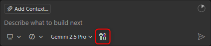
- the tool is used explicitly by mentioning it using a leading `#`
  ```
  #jokeFileCreator create a file that contains a joke in the folder test
  ```

For tools provided via MCP, the tool is also selected by name. Assuming you added the _fetch MCP server_, you can use the provided tool via `#fetch`. Unfortunately, this is not unique because there is also a built-in `fetch` tool in Visual Studio Code.

By default, you will be prompted before a _Language Model Tool_ is executed.

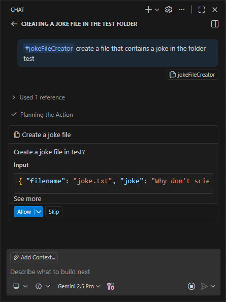

In the _Allow_ dropdown, you can choose whether to allow execution once, for the current session, or generally in the current workspace. This setting is not directly accessible at the time of writing this blog post. To reset saved tool approvals, run the _Chat: Reset Tool Confirmations_ command from the Command Palette (`Ctrl+Shift+P`).

In Visual Studio Code, it is also possible to configure [URL approval](https://code.visualstudio.com/docs/copilot/agents/agent-tools#_url-approval), which becomes active when a tool attempts to access a URL.

Further details about using tools in chat in Visual Studio Code can be found in [Use tools with agents](https://code.visualstudio.com/docs/copilot/agents/agent-tools).

#### Eclipse Theia

In Eclipse Theia, a _Tool_ is used by mentioning it with a leading `~`. There is no automatic tool resolution for prompts, so you always need to mention the tool explicitly.

```
@Universal create a file that contains a joke in the folder test. Use a file name that relates to the joke. ~jokeFileCreator
```

The name of an MCP server tool in Theia is derived from the server name and function name. It uses the following syntax:

```
~{mcp_<server-name>_<function-name>}
```

For example, to use the `fetch` function of the `fetch` MCP server, you could write a prompt like this:

```
@Universal show me the allowed directories ~{mcp_fetch_fetch}
```

By default, the _Tool Confirmation Mode_ is **Always Allow**. Users can change this setting.

- Open the _AI Configuration_ view via _Menu -> View -> AI Configuration_
- Switch to the _Tools_ tab  
  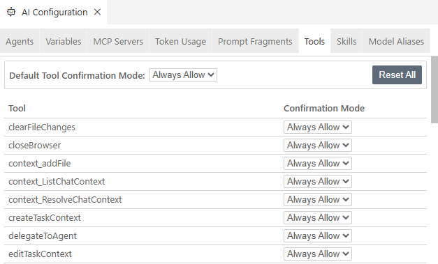
- Alternatively, edit _settings.json_ and configure `ai-features.chat.toolConfirmation`. For example, if you want to be prompted for approval for every tool call but allow `jokeFileCreator` to execute without confirmation:
  ```json
  "ai-features.chat.toolConfirmation": {
    "*": "confirm",
    "jokeFileCreator": "always_allow"
  },
  ```

The **URL approval feature** is currently not supported in Eclipse Theia.

Further details about using tools in chat in Eclipse Theia can be found in [Tool Functions](https://theia-ide.org/docs/theia_ai/#tool-functions), [Using MCP Server Functions](https://theia-ide.org/docs/user_ai/#using-mcp-server-functions), and [Tool Call Confirmation UI](https://theia-ide.org/docs/user_ai/#tool-call-confirmation-ui).

### Configuring MCP Servers

As a user, you typically add MCP servers to your development environment via a configuration file. There are two basic types of MCP servers:

- local MCP servers, which are software installed on your system
- remote MCP servers, which are hosted elsewhere and provide functionality without needing local system access.

#### Visual Studio Code

In Visual Studio Code, you typically add MCP servers via an _mcp.json_ file, either in the workspace _.vscode_ folder or in the user profile to configure MCP servers for all workspaces.
A _mcp.json_ file has two main sections:

- `"servers": {}` - Contains the list of MCP servers and their configurations
- `"inputs": []` - Optional placeholders for sensitive information like API keys

You can use predefined variables in the `servers` section and the variables defined in the `inputs` section.

```json
{
  "servers": {
    "filesystem": {
      "type": "stdio",
      "command": "npx",
      "args": ["-y", "@modelcontextprotocol/server-filesystem"]
    },
    "fetch": {
      "url": "https://remote.mcpservers.org/fetch/mcp",
      "type": "http"
    },
    "github": {
      "url": "https://api.githubcopilot.com/mcp/",
      "type": "sse",
      "headers": {
        "X-MCP-Toolsets": "gists",
        "Authorization": "Bearer ${env:GITHUB_TOKEN}"
      }
    }
  },
  "inputs": []
}
```

From the example above, you can see that you need to specify the `type` field to define whether it is a local or a remote MCP server.

You can manage the MCP server either via

- **MCP SERVERS - INSTALLED** section in the _Extensions_ view  
  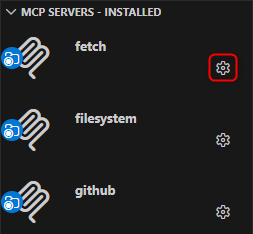
- Inline actions in the _mcp.json_ editor (codelenses)  
  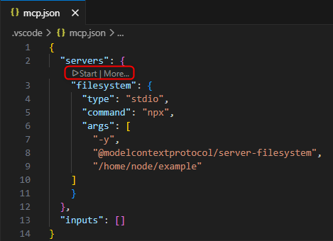
- **MCP: List Servers** command from the Command Palette  
  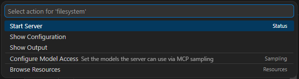

After the first start of an MCP server, the server's capabilities and tools are discovered and cached. The next time a tool is used in a prompt while the server is not running yet, Visual Studio Code can auto-start the server because of this cached information.

Using the `chat.mcp.autostart` setting, you can configure whether MCP servers should be restarted automatically when configuration changes are detected. This autostart setting is available only globally, not per server.

Further information can be found in [Use MCP servers in VS Code](https://code.visualstudio.com/docs/copilot/customization/mcp-servers).

#### Eclipse Theia

In Eclipse Theia, you typically add MCP servers via the general _settings.json_ file. There is currently no support for an _mcp.json_ file.

The _settings.json_ file contains many settings that can be applied in Theia, not just MCP-related configuration. There is no support for predefined variables or inputs like the `inputs` section in _mcp.json_.

Comparing Visual Studio Code _mcp.json_ and Eclipse Theia _settings.json_ MCP server configuration, there are a few differences:

- In Theia, you do not need to specify the `type` field.  
  For local servers, this is straightforward because only one type is available (`stdio`). For remote servers, Theia first tries to connect via `sse`, and if that fails, it falls back to `http`.
- In Eclipse Theia, there is an `autostart` field that lets you configure whether an MCP server should start automatically. The default is `true` if it is not set.
- For remote servers, the main URL is set as `url` in Visual Studio Code, while in Eclipse Theia the field is called `serverUrl`.
- In Eclipse Theia, you can specify the authentication token via `serverAuthToken`, which defaults to an _Authorization_ header with _Bearer_. You can change that via `serverAuthTokenHeader`.

```json
{
  "ai-features.mcp.mcpServers": {
    "filesystem": {
      "command": "npx",
      "args": [
        "-y",
        "@modelcontextprotocol/server-filesystem",
        "/home/node/examples"
      ],
      "autostart": false
    },
    "fetch": {
      "serverUrl": "https://remote.mcpservers.org/fetch/mcp",
      "autostart": false
    },
    "github": {
      "serverUrl": "https://api.githubcopilot.com/mcp/",
      "serverAuthToken": "<your-token>",
      "headers": {
        "X-MCP-Toolsets": "gists"
      }
    }
  }
}
```

You can manage the MCP server either via

- _AI Configuration_ view: _Menu_ -> _View_ -> _AI Configuration_ -> _MCP Servers_ tab  
  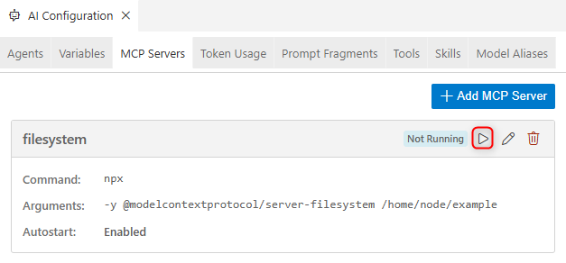
- Command palette: _F1_
  - _MCP: Start MCP Server -> filesystem_
  - _MCP: Stop MCP Server -> filesystem_

If an MCP server is not started, its capabilities and tools cannot be used. There is no auto-start based on cached information as in Visual Studio Code. However, you can configure auto-start behavior per server via the `autostart` field, which is enabled by default.

Further information can be found in [MCP Integration](https://theia-ide.org/docs/user_ai/#mcp-integration).

### Chat Variables

In Visual Studio Code and Eclipse Theia, it is possible, and usually recommended, to add specific context to your request. To do this explicitly, you can use the `#` syntax with some predefined options.

In Theia, it is also possible to implement and provide additional _Context Variables_ as _Global Variables_ or _Agent-Specific Variables_.

Further information for Visual Studio Code can be found in [Add context to your prompts](https://code.visualstudio.com/docs/copilot/chat/copilot-chat#_add-context-to-your-prompts).

Further information for Eclipse Theia can be found in [Context Variables](https://theia-ide.org/docs/user_ai/#context-variables).

### Prompt Files vs Prompt Fragments

Visual Studio Code and Eclipse Theia both allow users to define reusable prompts for recurring development tasks. Although the feature is similar, there are differences.

#### Visual Studio Code

In Visual Studio Code, you can create and use [Prompt Files](https://code.visualstudio.com/docs/copilot/customization/prompt-files) to define reusable prompts for recurring development tasks.

_Prompt Files_ are Markdown files with a _.prompt.md_ file extension. They are located either in the _.github/prompts_ folder in the workspace or in the _prompts_ folder in the user profile (for example on Windows, _C:\Users\\<username\>\AppData\Roaming\Code\User\prompts_).

In the optional YAML frontmatter header, the prompt behavior can be configured, for example:

- `agent` header to define the agent that should be used for running the prompt
- `tools` header to define the list of tools or tool sets that are available for the prompt

You can use variables in the prompt file using the syntax `${variableName}`. The following variables can be used:

- Workspace variables - `${workspaceFolder}`, `${workspaceFolderBasename}`
- Selection variables - `${selection}`, `${selectedText}`
- File context variables - `${file}`, `${fileBasename}`, `${fileDirname}`, `${fileBasenameNoExtension}`
- Input variables - `${input:variableName}`, `${input:variableName:placeholder}`

Arguments passed in chat via _key=value_ syntax (e.g. `_target=robin`) are available in the prompt via `${input:variableName}` or `${input:variableName:placeholder}`.

_Tools_ configured as available in the prompt via the `tools` frontmatter header can be referenced in the prompt via `#tool:<tool-name>`.

To use a _Prompt File_ in the Chat view, type _/_ followed by the prompt name. For example, if you created a _harley.prompt.md_ file, you could execute it via the slash command _/harley_.

Further information can be found in [Extending Copilot in Visual Studio Code - Further Customization - Prompt Files](vscode_copilot_extension.md#prompt-files).

#### Eclipse Theia

In Eclipse Theia, you can create and use [Prompt Fragments](https://theia-ide.org/docs/user_ai/#prompt-fragments) to define reusable prompts for recurring development tasks.

_Prompt Fragments_ are Markdown files with a _.prompttemplate_ file extension. They are located either in the _.prompts_ folder in the workspace or in user-wide local directories configured in the settings (_AI Features -> Prompt Templates_).

In the optional YAML frontmatter header, prompts can be configured as a _Slash Command_:

- `isCommand` header needs to be set to `true`
- `commandName` header specifies the name of the command
- `commandAgents` header can be used to limit the visibility of the command to the specified agents.

You can use any available [Context Variable](https://theia-ide.org/docs/user_ai/#context-variables) in the prompt.

Command arguments passed via chat can be used in the prompt via _Argument placeholders_ `$ARGUMENTS` or `$1`, `$2`, `$3` for arguments by position.

The tools that should be used inside the prompt do not need to be preconfigured in the YAML frontmatter and can be referenced in the prompt via `~<tool-name>`.

To use a _Prompt Fragment_ in the Chat view, you can use the special variable `#prompt:promptFragmentID`, for example `@Universal #prompt:harley joke about batgirl`. When configured as a _Slash Command_, type _/_ followed by the prompt name, for example `@Universal /harley batgirl`.

Further information can be found in [Getting Started with Theia AI - Further Customization - Prompt Fragments](theia_ai_getting_started.md#prompt-fragments) and [Getting Started with Theia AI - Further Customization - Slash Commands](theia_ai_getting_started.md#slash-commands).

### Custom Agents

_Custom Agents_ are a mechanism that allows users to create specialized assistants for specific tasks in the chat. For example, users can create different personas tailored to development roles and tasks such as planning, research, or specialized workflows.

_Custom Agents_ are similar to Visual Studio Code _Chat Participants_ or programmatically contributed _Custom Agents_ in Eclipse Theia. However, instead of contributing them programmatically, users define and configure them through dedicated agent files.

#### Visual Studio Code

In Visual Studio Code, [Custom Agents](https://code.visualstudio.com/docs/copilot/customization/custom-agents) are configured in custom agent files. _Custom Agent Files_ are Markdown files with a _.agent.md_ extension. They are located either in the _.github/agents_ folder in the workspace or in the user profile folder (interestingly, also in the _prompts_ folder). There is one dedicated _.agent.md_ file for each _Custom Agent_.

Similar to _Prompt Files_, _Custom Agents_ can be configured via an optional YAML frontmatter header. You can, for example:

- select the model that should be used when running the agent prompt via the `model` header
- select the tools or tool sets that can be used by the custom agent via the `tools` header
- select the agents that are available as subagents in the custom agent via the `agents` header
- configure handoffs for orchestrating multi-step workflows via the `handoffs` header

To use a _Custom Agent_, select it from the agents dropdown in chat and enter a prompt, for example `joke about alfred`.

  

Further information can be found in [Extending Copilot in Visual Studio Code - Further Customization - Custom Agents](vscode_copilot_extension.md#custom-agents).

While the usage of agents in Visual Studio Code and Eclipse Theia is quite similar, Visual Studio Code has some features that are currently not available in Eclipse Theia:

- You can select an [Agent type](https://code.visualstudio.com/docs/copilot/agents/overview#_types-of-agents) to control _where_ and _how_ an agent runs: [local](https://code.visualstudio.com/docs/copilot/agents/local-agents), [background](https://code.visualstudio.com/docs/copilot/agents/background-agents), [cloud](https://code.visualstudio.com/docs/copilot/agents/cloud-agents), or [third-party](https://code.visualstudio.com/docs/copilot/agents/third-party-agents).
- There is a distinction between calling a [Subagent](https://code.visualstudio.com/docs/copilot/agents/subagents), which spawns a child agent within a session to handle a subtask in its own isolated context window, and performing a [Hand off](https://code.visualstudio.com/docs/copilot/agents/overview#_hand-off-a-session-to-another-agent), which transfers a session from one agent type to another while carrying over the conversation history.

Further information can be found in [Using agents in Visual Studio Code](https://code.visualstudio.com/docs/copilot/agents/overview).

#### Eclipse Theia

In Eclipse Theia, multiple [Custom Agents](https://theia-ide.org/docs/user_ai/#custom-agents) are configured in a single custom agent configuration file. The _Custom Agent File_ is a YAML file named _customAgents.yml_. It is located either in the _.prompts_ folder in the workspace or in user-wide local directories configured in the settings (_AI Features -> Prompt Templates_).

Because there is only one file for multiple _Custom Agents_, there is no frontmatter configuration header. Instead, each _Custom Agent_ configuration has its own attributes. In addition to the obvious fields such as `id`, `name`, `description`, and `prompt`, you need to specify the model via the `defaultLLM` field.

You can use any available [Context Variable](https://theia-ide.org/docs/user_ai/#context-variables) in the prompt.

The tools that should be used inside the prompt do not need to be preconfigured in any way. They can be referenced in the prompt via `~<tool-name>`.

You can delegate to another agent by using the `delegateToAgent` _Tool Function_.

To use a _Custom Agent_, you need to use the `@` syntax in the chat view, just like for any other agent in Theia, e.g. `@Joker joke about alfred`.

If you use a specific agent most of the time and do not want to type the `@` syntax every time, you can configure a default agent via the preference `ai-features.chat.defaultChatAgent`, for example to use the _Universal_ agent whenever no agent is explicitly mentioned in the chat:

```
"ai-features.chat.defaultChatAgent": "Universal"
```

Further information can be found in [Getting Started with Theia AI - Further Customization - Custom Agents](theia_ai_getting_started.md#custom-agents) and [Getting Started with Theia AI - Further Customization - Agent-to-Agent Delegation (function)](theia_ai_getting_started.md#agent-to-agent-delegation-function).

### Agent orchestration

When talking about AI agents, we now often refer to _Agentic AI workflows_, where multiple agents collaborate to achieve complex goals. When creating _Custom Agents_, you need to consider collaboration options, especially if you design your agents for dedicated tasks rather than having one agent do everything. This is important because you should keep the context of your agent or prompt as small as possible while still providing enough information to achieve the desired results. Creating agents for dedicated tasks with a limited scope or context is similar to the encapsulation principle in object-oriented programming, and likewise, you need to consider processing or orchestration patterns.

Apart from a _Single Agent_ that does all the work alone, you currently have two options:

- _Delegate Pattern_  
  Create guided sequential workflows that transition between agents. The agents are called one after the other.
- _Coordinator and Worker Pattern_  
  The main/coordinator agent receives the task, delegates subtasks to subagents, and combines the subagent results into the final result.

You can also combine these patterns to have multiple "main" agents that use worker agents for specific tasks. Each "main" agent can delegate to the next "main" agent once it is done, creating a sequential workflow of main tasks.

While the patterns are generally the same, technically there are differences between Visual Studio Code and Eclipse Theia.

#### Visual Studio Code

The _Delegate Pattern_ is supported via [Handoffs](https://code.visualstudio.com/docs/copilot/customization/custom-agents#_handoffs) when creating _Custom Agents_ in Visual Studio Code.
A handoff is configured in the YAML frontmatter header. The user needs to actively proceed with the handoff by clicking a button in the chat UI.
The token usage with a handoff is similar to having a single agent that processes all the tasks itself, as the whole context is passed from one agent to the next.

The [Coordinator and Worker Pattern](https://code.visualstudio.com/docs/copilot/agents/subagents#_coordinator-and-worker-pattern) is supported through [Subagents](https://code.visualstudio.com/docs/copilot/agents/subagents).
To call a subagent, the built-in `agent/runSubagent` tool needs to be enabled for the coordinator agent.
Using a subagent means spawning a child agent within a session to handle a subtask in its own isolated context window. This reduces the token usage, as subagents are not called with the whole context compared to a _Handoff_.

Each subagent call is sequential (the coordinator waits for that call to return), but the coordinator can spawn multiple subagent calls in parallel.

Further information can be found in [AI Agent Orchestration - Visual Studio Code](ai_agent_orchestration.md#visual-studio-code).

#### Eclipse Theia

Theia does not provide a feature like [Handoffs](https://code.visualstudio.com/docs/copilot/customization/custom-agents#_handoffs) in Visual Studio Code. Instead, Theia provides the built-in _Tool Function_ `delegateToAgent` to support [Agent-to-Agent Delegation](https://theia-ide.org/docs/user_ai/#agent-to-agent-delegation), which is comparable to [Subagents](https://code.visualstudio.com/docs/copilot/agents/subagents). Whether you implement the _Delegate Pattern_ or the _Coordinator and Worker Pattern_ depends on how you use the `delegateToAgent` tool in the prompt.

Using a subagent means spawning a child agent within a session to handle a subtask in its own isolated context window. Because Theia has no _Handoff_ concept that forwards processing to another agent, but only the concept of subagents, you do not see the same token-usage difference there.

Each subagent call via `delegateToAgent` is sequential (the coordinator waits for that call to return), but the coordinator can spawn multiple subagent calls in parallel.

Further information can be found in [AI Agent Orchestration - Eclipse Theia](ai_agent_orchestration.md#eclipse-theia).

### Context Monitoring / Token Usage

In Visual Studio Code, it is possible to [monitor context window usage](https://code.visualstudio.com/docs/copilot/chat/copilot-chat-context#_monitor-context-window-usage). This helps indicate how much context a conversation uses. Theia does not yet support such context-window monitoring, but this feature has been requested via [Context window inspection / analysis command](https://github.com/eclipse-theia/theia/issues/16779).

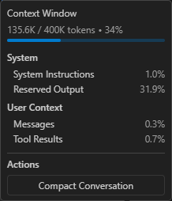

In Theia, token usage can be inspected via _AI Configuration_ by switching to the _Token Usage_ tab, at least for LLMs that provide usage metadata for a request. Token usage is accumulated within a session, so you do not get the information per request. Token usage is not persisted and is reset when restarting the application. Visual Studio Code does not support tracking token usage at that level.

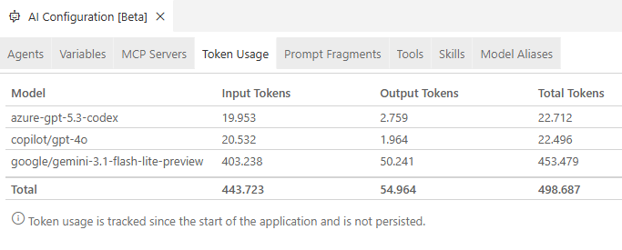

### Agent Skills

[Agent Skills](https://agentskills.io/home) is a simple, open format for giving agents new capabilities and expertise. Basically, a skill is a folder containing a _SKILL.md_ file that includes metadata in the form of a YAML frontmatter header and instructions that tell an agent how to perform a specific task. It can also contain subfolders with scripts, templates, and referenced materials. Because it is an open format, it is supported in various AI tools.

_Agent Skills_ are a fairly new format, and both Visual Studio Code and Eclipse Theia support it, although in Eclipse Theia the feature is still in alpha. There are some differences in where skills are stored and how they are used, which I list in the following sections. If you are interested in examples, have a look at [awesome-agent-skills](https://github.com/heilcheng/awesome-agent-skills).

#### Visual Studio Code

- The location of the skills folder for a project in your repository is _.github/skills/_, _.claude/skills/_ or _.agents/skills/_.
- The location for personal skills in the user home is _~/.copilot/skills/_, _~/.claude/skills/_ or _~/.agents/skills/_.
- You can configure additional locations for skills via the `chat.agentSkillsLocations` setting to share skills across projects or keep them in a central location.
- You can use skills directly in the chat via a slash command. For example, if you created a skill with the name _webapp-testing_, you can use it directly in the chat via `/webapp-testing for the login page`.
- Copilot discovers the skills to use automatically by matching the user prompt with the skill description. Only the body of a matching skill will be loaded into the context. Additional resources will only be added if they are referenced in the instructions.
- You can create a new skill manually by creating the required folder and a _SKILL.md_ file in that folder
- You can create a new skill with the help of AI by using the `/create-skill` slash command in the chat
- You can use _Configure Chat_ in the Copilot chat window by clicking the gear icon in the upper-right corner and selecting the _Skills_ item to guide you through the initial creation.  
  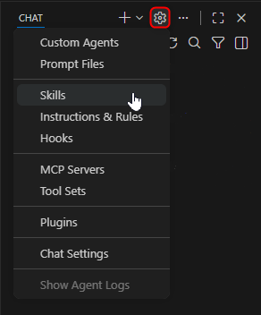

You can learn more about the use of _Agent Skills_ in Visual Studio Code in [Use Agent Skills in VS Code](https://code.visualstudio.com/docs/copilot/customization/agent-skills) and [Extending Copilot in Visual Studio Code - Further Customization - Agent Skills](vscode_copilot_extension.md#agent-skills).

#### Eclipse Theia

Support for _Agent Skills_ in Eclipse Theia is still in alpha and currently has known limitations. For example, in Theia 1.70.0, automatic skill discovery is not working reliably. Automatic execution and tool calls can also fail. These issues are likely to improve in upcoming releases.

- The location of the skills folder for a project in your repository is _.prompts/skills/_.
- The location for personal skills in the user home is _~/.theia/skills/_.
- You can configure additional locations for skills via the `ai-features.skills.skillDirectories` setting to share skills across projects or keep them in a central location.
- You can use skills directly in the chat as a slash command. For example, if you created a skill with the name _webapp-testing_, you can use it directly in the chat via `/webapp-testing for the login page`.
- You can enable agents to load skills on demand by using the `{{skills}}` variable in an agent's prompt to list all available skills, and use the `~getSkillFileContent` function to load a selected skill on demand.
- You can create a new skill manually by creating the required folder and a _SKILL.md_ file in that folder
- You can create a new skill with the help of AI by using the built-in `@CreateSkill` agent in the chat
- There is a [Skills and Slash Commands View](https://theia-ide.org/docs/user_ai/#skills-and-slash-commands-view) available via the _AI Configuration_ via the _Skills_ tab, which provides a convenient overview of the discovered skills and a button to directly open the corresponding _SKILL.md_ file in an editor.  
  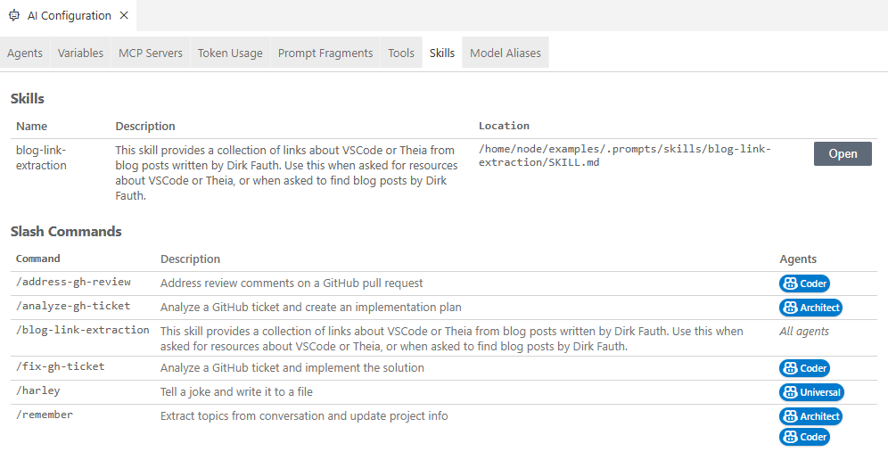

You can learn more about the use of _Agent Skills_ in Eclipse Theia via [Agent Skills (Alpha)](https://theia-ide.org/docs/user_ai/#agent-skills-alpha) and [Getting Started with Theia AI - Further Customization - Agent Skills](theia_ai_getting_started.md#agent-skills).

## Conclusion

As you can see, the AI capabilities of Visual Studio Code GitHub Copilot and Eclipse Theia AI are very similar. Both ecosystems evolve quickly, and while writing this post, I had to update findings and screenshots several times to keep it current.

At a high level, both platforms support the same core building blocks: tools, MCP integration, custom agents, reusable prompts, and skills. The main differences are in product strategy and developer control:

- Visual Studio Code with GitHub Copilot gives you a polished product with strong built-in workflows and broad adoption.
- Eclipse Theia gives you an open platform you can own and shape deeply for your own product and domain.

From a practical perspective, your choice usually depends less on feature checklists and more on your goals:

- Choose Visual Studio Code GitHub Copilot if you want fast adoption, familiar UX, and minimal platform-level ownership.
- Choose Eclipse Theia if you need full control, deeper integration into your own application, and an open customization model.

It is also worth noting that AI customization now offers multiple overlapping mechanisms for similar outcomes. Deciding whether to use a _Custom Agent_, a _Prompt File/Fragment_, or an _Agent Skill_ is not always straightforward and often depends on scope, reuse, and ownership.

If you want to dive deeper into that topic, there is a valuable discussion in the Theia repository: [Agent vs PromptTemplate vs Skill](https://github.com/eclipse-theia/theia/discussions/17087#discussioncomment-15970074). The response by [Jonas Helming](https://www.linkedin.com/in/jonas-helming-76303b28/) provides useful guidance on how these mechanisms differ and when each is a good fit.

In short: both platforms are strong, modern foundations for AI-assisted development. If you optimize for ready-to-use productivity, Visual Studio Code is a strong choice. If you optimize for extensibility and product ownership, Eclipse Theia is compelling.
